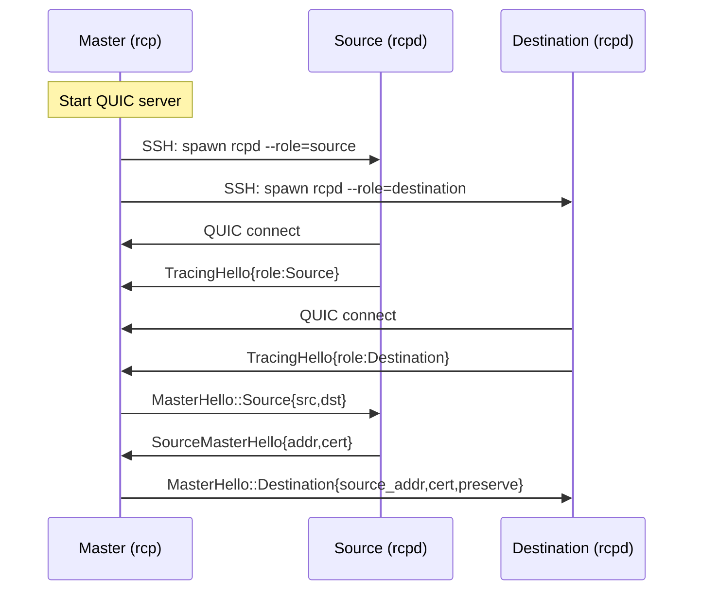
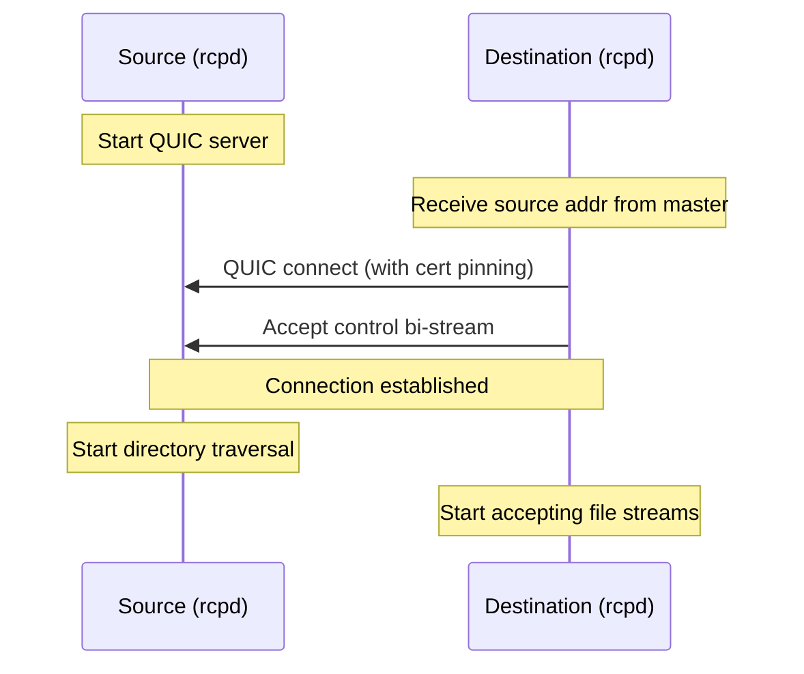
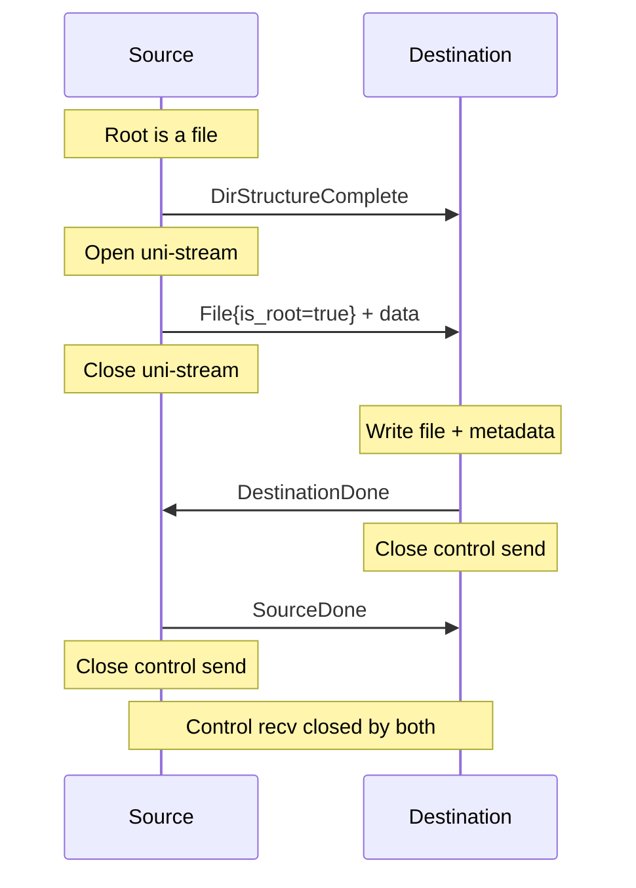
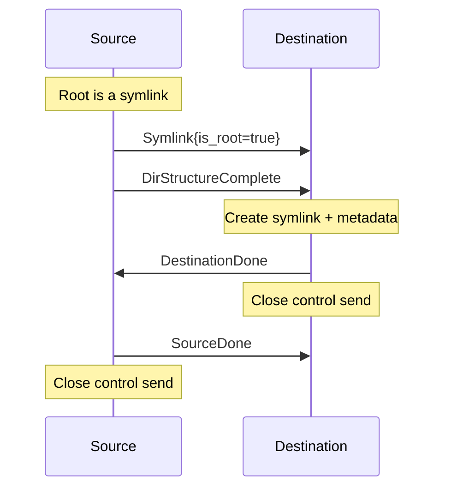
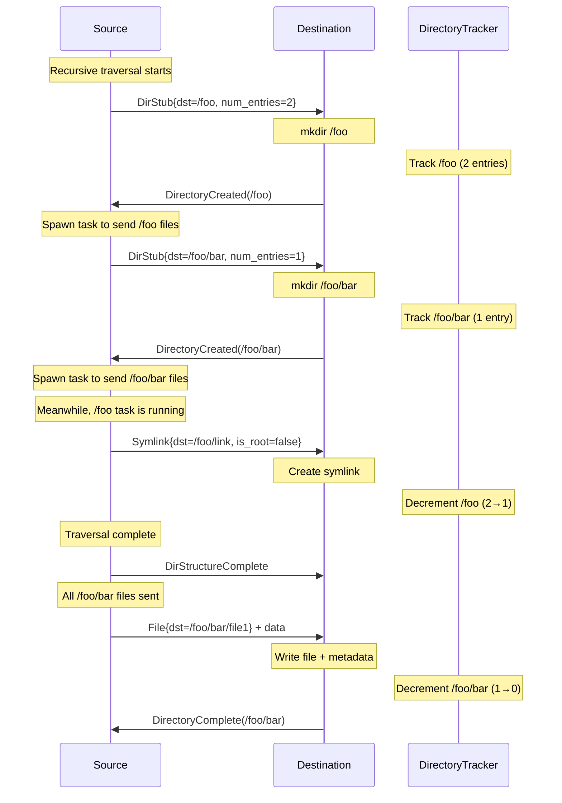
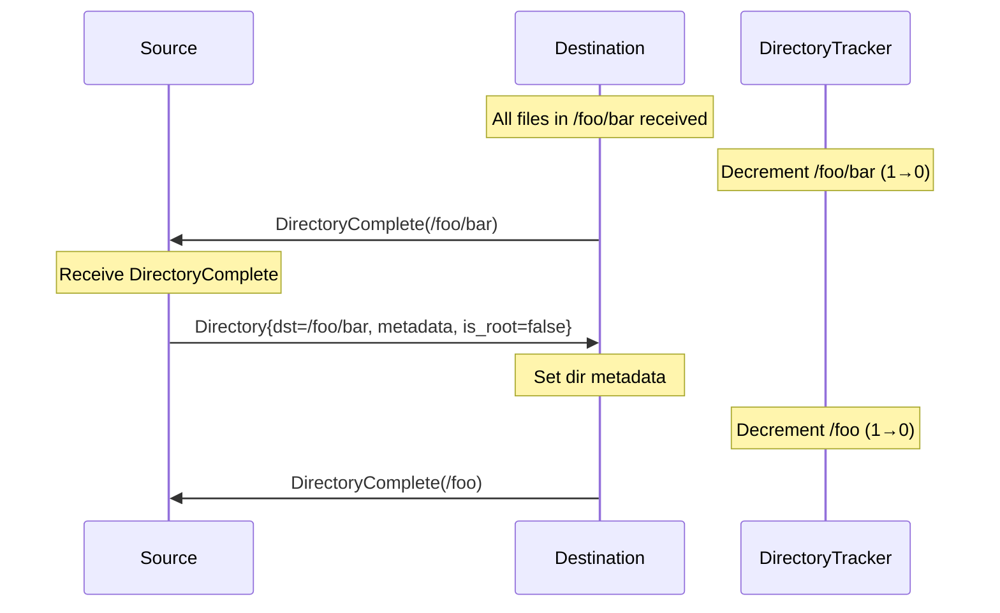
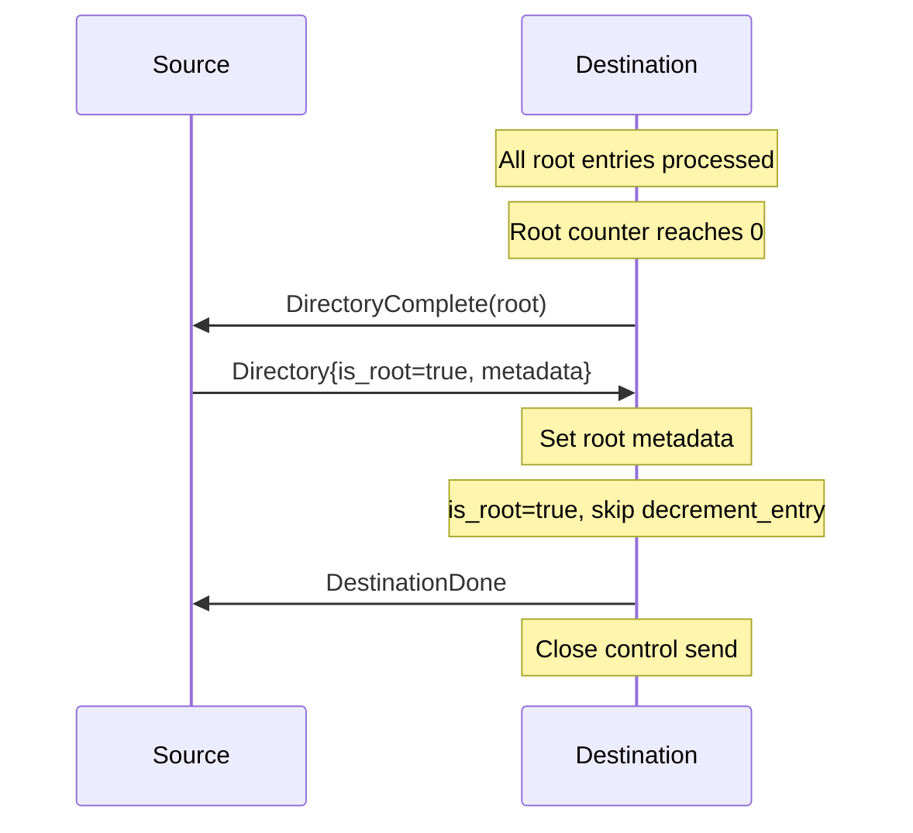
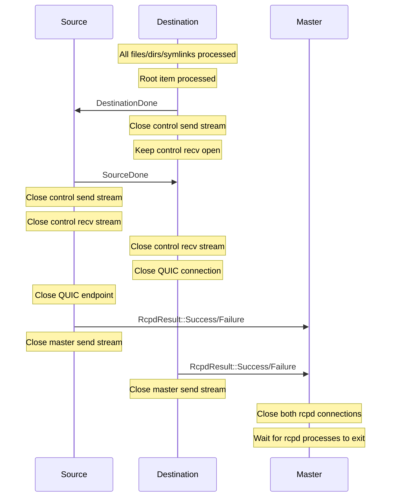

# Remote Copy Protocol Design Document

## 1. Architecture Overview

### 1.1 Three-Component Architecture

The remote copy system consists of three distinct components:

1. **Master (rcp)**: Coordinates the entire operation, runs on the client machine where the user invokes `rcp`
2. **Source (rcpd)**: Runs on the source host, responsible for reading and sending files
3. **Destination (rcpd)**: Runs on the destination host, responsible for receiving and writing files

### 1.2 Component Spawning and Lifecycle

**Spawning Sequence:**

1. User invokes `rcp user@host1:/src user@host2:/dst`
2. Master creates a QUIC server endpoint and waits for connections
3. Master spawns source rcpd via SSH: `ssh user@host1 rcpd --master-addr=... --role=source ...`
4. Master spawns destination rcpd via SSH: `ssh user@host2 rcpd --master-addr=... --role=destination ...`
5. Both rcpd processes connect to master via QUIC
6. Master identifies them by their declared role (sent via `TracingHello`)

**Special Case - Same Host Copies:**
When source and destination are on the same host, the master:
- Deploys rcpd only once (if needed)
- Starts two separate rcpd processes with different roles
- Both processes share the same SSH session but have distinct connections

### 1.3 Connection Topology

The system uses a **triangle topology** with three QUIC connections:

```
         Master (rcp)
           /    \
          /      \
    (QUIC)      (QUIC)
        /          \
       /            \
Source (rcpd)-----(QUIC)----Destination (rcpd)
```

**Connection Details:**

1. **Source → Master**: Bidirectional, used for handshake and result reporting
2. **Destination → Master**: Bidirectional, used for handshake and result reporting
3. **Destination → Source**: Bidirectional + multiple unidirectional
   - Control stream (bidirectional): Directory metadata and coordination
   - File streams (unidirectional): One per file transfer

**Connection Establishment Order:**

1. Both rcpd processes connect to master (order undefined)
2. Master sends `MasterHello::Source` to source rcpd with src/dst paths
3. Source rcpd starts QUIC server, sends `SourceMasterHello` back to master with address and certificate fingerprint
4. Master sends `MasterHello::Destination` to destination rcpd with source address and certificate
5. Destination rcpd connects to source rcpd

### 1.4 Certificate Pinning

All connections use certificate pinning to prevent MITM attacks:

- **Master → rcpd**: rcpd validates master's certificate using `master_cert_fingerprint`
- **Destination → Source**: Destination validates source's certificate using `source_cert_fingerprint` provided by master

## 2. Protocol Messages

### 2.1 Handshake Messages

**`TracingHello`** (rcpd → Master, unidirectional stream)
- **Purpose**: Identify the role of the connecting rcpd
- **Fields**: `role: RcpdRole` (Source or Destination)
- **Timing**: First message sent after connecting to master

**`MasterHello`** (Master → rcpd, bidirectional stream)
- **Purpose**: Provide configuration and connection details
- **Variants**:
  - `Source { src, dst }`: Tells source rcpd what to copy
  - `Destination { source_addr, server_name, source_cert_fingerprint, preserve }`: Tells destination where to connect

**`SourceMasterHello`** (Source → Master, bidirectional stream)
- **Purpose**: Provide source's QUIC server details for destination to connect
- **Fields**: `source_addr`, `server_name`, `cert_fingerprint`

**`RcpdResult`** (rcpd → Master, bidirectional stream)
- **Purpose**: Report final success/failure status and statistics
- **Variants**:
  - `Success { message, summary }`
  - `Failure { error, summary }`

### 2.2 Source → Destination Messages

All sent on the **control stream** (bidirectional):

**`DirStub`**
- **Purpose**: Pre-announce directory creation with entry count
- **Fields**: `src`, `dst`, `num_entries`
- **Usage**: Sent during directory tree traversal, before any directory contents

**`Directory`**
- **Purpose**: Send directory metadata after all contents processed
- **Fields**: `src`, `dst`, `metadata`, `is_root`
- **Usage**: Sent when `DirectoryComplete` received from destination

**`DirStructureComplete`**
- **Purpose**: Signal that all directory stubs have been sent
- **Usage**: Sent after recursive directory traversal completes, even for single files (to open control stream)

**`Symlink`**
- **Purpose**: Send symlink information
- **Fields**: `src`, `dst`, `target`, `metadata`, `is_root`
- **Usage**: Sent during directory traversal when symlink encountered

**`FileSkipped`**
- **Purpose**: Notify destination that a file failed to send
- **Fields**: `SrcDst { src, dst }`
- **Usage**: Sent when file open fails, allows destination to decrement directory counter

**`SymlinkSkipped`**
- **Purpose**: Notify destination that a symlink failed to send
- **Fields**: `SrcDst { src, dst }`
- **Usage**: Sent when symlink read fails, allows destination to decrement directory counter

**`SourceDone`**
- **Purpose**: Signal all transfers complete
- **Usage**: Last message sent by source on control stream, triggers stream closure

### 2.3 Destination → Source Messages

All sent on the **control stream** (bidirectional):

**`DirectoryCreated`**
- **Purpose**: Confirm directory created, request file transfers
- **Fields**: `SrcDst { src, dst }`
- **Usage**: Sent after successfully creating directory (or finding existing one with --overwrite)
- **Triggers**: Source starts sending files from this directory

**`DirectoryFailed`**
- **Purpose**: Report directory creation failure
- **Fields**: `SrcDst { src, dst }`
- **Usage**: Sent when directory creation fails
- **Effect**: Source skips sending contents of this directory

**`DirectoryComplete`**
- **Purpose**: Signal all contents of directory received
- **Fields**: `SrcDst { src, dst }`
- **Usage**: Sent when directory entry counter reaches zero
- **Triggers**: Source sends `Directory` message with metadata

**`DestinationDone`**
- **Purpose**: Signal destination has finished all operations
- **Usage**: Last message sent by destination, triggers `SourceDone` response

### 2.4 File Transfer Messages

**`File`** (Source → Destination, unidirectional stream)
- **Purpose**: File header followed by raw file data
- **Fields**: `src`, `dst`, `size`, `metadata`, `is_root`
- **Format**: Serialized header, then raw bytes via `tokio::io::copy`
- **Stream**: Each file gets its own dedicated unidirectional stream

## 3. Connection Lifecycle

### 3.1 Initial Handshake (Master ↔ rcpd)



### 3.2 Source ↔ Destination Connection



### 3.3 Stream Types and Ownership

**Control Stream (Bidirectional)**
- **Owner**: Source opens, destination accepts
- **Lifetime**: Entire copy operation
- **Usage**:
  - Source → Destination: Directory stubs, symlinks, file skip notifications, completion signals
  - Destination → Source: Directory confirmations, completion notifications
- **Closure**: Source closes send side after receiving `DestinationDone`, destination closes send side after sending `DestinationDone`

**File Streams (Unidirectional)**
- **Owner**: Source opens per-file
- **Lifetime**: Single file transfer
- **Usage**: File header + raw data
- **Closure**: Source closes immediately after file sent, destination drains and closes after processing
- **Concurrency**: Multiple file streams can be active simultaneously

## 4. Single File/Symlink Copy Flow

### 4.1 Root File Copy



**Key Points:**
- `is_root=true` indicates this file is not tracked by DirectoryTracker
- Destination calls `send_root_done()` after processing root file
- `DirStructureComplete` sent even though there are no directories (to open control stream)

### 4.2 Root Symlink Copy



**Key Points:**
- Symlink sent during directory traversal phase (before `DirStructureComplete`)
- `is_root=true` prevents decrement_entry call
- Destination calls `send_root_done()` immediately after creating symlink

## 5. Directory Copy Flow

### 5.1 Interleaved Directory Creation and File Transfer

**Critical Understanding:** Directory creation and file transfer happen **in parallel and interleaved**, not as separate sequential phases.

**Process:**
1. Source performs depth-first directory traversal, sending `DirStub` messages
2. Destination creates directories and sends `DirectoryCreated` responses
3. Source receives `DirectoryCreated` and immediately spawns tasks to send files from that directory
4. File sending happens concurrently with ongoing directory traversal
5. Directory metadata is sent after receiving `DirectoryComplete` for that directory

**Ordering Guarantees:**
- Directory stubs are sent and processed in **traversal order** (depth-first)
- This guarantees that when destination receives a request to create `foo/bar`, it has already received and processed the request to create `foo`
- All messages on the control stream are ordered (QUIC stream guarantee)
- File transfers (on separate uni-streams) may complete in any order



### 5.2 Directory Completion and Metadata



**Completion Flow:**
- When all entries in a directory are processed, DirectoryTracker counter reaches 0
- Destination sends `DirectoryComplete` to source
- Source sends back `Directory` message with metadata
- Destination applies metadata and decrements parent directory counter
- Process cascades up the directory tree until root is complete

### 5.3 DirectoryTracker Mechanism

The `DirectoryTracker` on the destination side:

**Data Structure:**
- `HashMap<PathBuf, usize>`: Maps directory path → remaining entry count
- Shared via `Arc<Mutex<DirectoryTracker>>`

**Key Operations:**

1. **`add_directory(src, dst, num_entries, failed)`**
   - If `failed=true`: Send `DirectoryFailed`, do NOT track
   - If `num_entries > 0`: Insert into map with count
   - If `num_entries == 0`: Immediately send `DirectoryComplete`
   - Always send `DirectoryCreated` (unless failed)

2. **`decrement_entry(src, dst)`**
   - Get parent directory from `dst.parent()`
   - Decrement counter for parent directory
   - If counter reaches 0: Remove from map, send `DirectoryComplete`

**Root Handling:**
- Root directories/files/symlinks have `is_root=true`
- Root items do NOT call `decrement_entry`
- Root items call `send_root_done()` instead
- Root directories are NOT tracked in the HashMap

**Example Tracking:**

```
DirStub /a (2 entries)     → Track: {/a: 2}
DirStub /a/b (1 entry)     → Track: {/a: 2, /a/b: 1}
File /a/b/file1 received   → Decrement /a/b: {/a: 2, /a/b: 0}
                             Send DirectoryComplete(/a/b)
Directory /a/b received    → Decrement /a: {/a: 1}
Symlink /a/link received   → Decrement /a: {/a: 0}
                             Send DirectoryComplete(/a)
```

### 5.4 Root Directory Completion



**Critical Detail:** Root directories are treated specially:
- Source sends `Directory{is_root=true}` when it receives the final `DirectoryComplete`
- Destination recognizes `is_root=true` and calls `send_root_done()` instead of `decrement_entry()`
- This prevents attempting to decrement a non-existent parent directory

## 6. Shutdown Sequence

### 6.1 Normal Shutdown Flow



### 6.2 Stream Closure Order

**Destination Side:**
1. Send `DestinationDone` on control send stream
2. Close control send stream (`stream.close().await`)
3. **Keep control recv stream open** to receive `SourceDone`
4. Receive `SourceDone` from source
5. Exit message loop
6. Close control recv stream (`recv_stream.close().await`)
7. Close QUIC connection to source
8. Send `RcpdResult` to master
9. Close master connection

**Source Side:**
1. Receive `DestinationDone` on control recv stream
2. Send `SourceDone` on control send stream
3. Close control send stream
4. Exit dispatch loop
5. Close control recv stream
6. Wait for QUIC endpoint to idle
7. Send `RcpdResult` to master
8. Close master connection

**Critical Ordering:**
- Destination must NOT close recv stream before sending `DestinationDone`
- Source must receive `DestinationDone` before sending `SourceDone`
- Both sides close send before recv
- This prevents deadlocks and ensures clean shutdown

### 6.3 Process Termination

**Master Orchestrates Shutdown:**
1. Receives `RcpdResult` from both source and destination
2. Closes QUIC connections to both rcpd processes
3. Waits for QUIC endpoint to idle (with 500ms timeout)
4. Waits for rcpd SSH processes to exit
5. Reports combined results to user

**rcpd Lifecycle Management:**
- **stdin watchdog**: Monitors stdin for EOF to detect master disconnection
- **QUIC idle timeout**: Secondary mechanism if stdin unavailable
- If master dies unexpectedly, rcpd detects EOF and exits immediately
- No orphaned processes remain on remote hosts

## 7. Design Rationale and Considerations

### 7.1 Root Item Tracking Design

The protocol distinguishes between root items (the initial copy target) and child items (contents of directories) using the `is_root` flag in three message types:
- `SourceMessage::Directory`
- `SourceMessage::Symlink`
- `remote::protocol::File`

**Design Decision:** Root items bypass the DirectoryTracker mechanism entirely.

**Rationale:**
- Root items have no parent directory to decrement in the tracker
- Explicit `is_root` flag makes the special case handling clear and self-documenting
- Avoids path manipulation edge cases (e.g., computing parent of "/")
- Simplifies completion detection: root items trigger `DestinationDone` directly

**Alternative Considered:** Using a sentinel parent path (e.g., empty string) to track root items in DirectoryTracker.

**Rejected Because:** Would complicate the tracker logic with special-case handling and make the code less obvious.

### 7.2 Concurrent Source Modification

**Current Approach:** The source performs directory traversal in two passes:
1. First pass: Count entries to send `DirStub` with accurate `num_entries`
2. Second pass: Actually send the entries

**Limitation:** If a directory is modified between these passes, the entry count becomes incorrect and the copy operation fails with an assertion panic.

**Design Trade-off:**
- **Current behavior:** Fail-fast with a clear error message indicating which directory was modified
- **Advantage:** Prevents silent data loss or incomplete copies without user awareness
- **Disadvantage:** Cannot handle live filesystems that change during copy

**Future Enhancement:** A more robust implementation could:
- Continue the copy operation when modification is detected
- Log a clear error indicating which directory was modified
- Report that the directory may be incomplete
- Allow users to re-run the copy to capture any missed files
- This would improve usability when copying from active systems while maintaining data integrity guarantees

### 7.3 Error Reporting Paths

**Skip Notifications for Child Items:**
When the source fails to read a child file or symlink within a directory, it sends `FileSkipped` or `SymlinkSkipped` messages to the destination. This allows:
- DirectoryTracker to properly decrement the parent directory
- Destination to know the operation completed (even though it failed)
- Protocol to continue processing other items

**Root Item Error Handling:**
Root items do not send skip notifications. Instead, errors are reported through a different path:
- Root items send `DirStructureComplete` first to establish the control stream
- If a root file fails to open, the source sets its `error_occurred` flag
- The master receives `RcpdResult::Failure` from the source at completion
- This design choice reflects that root item failures are terminal to the operation's success

**Design Rationale:** The asymmetry is intentional - child item failures can be partial (some succeed, some fail), while root item failure means the primary operation target failed.

### 7.4 Message Batching Strategy

The protocol uses two sending primitives with different buffering behavior:

**`send_batch_message()`:** Serializes and sends without flushing the underlying buffer.
- Used for: Directory stubs, symlinks during traversal
- Benefit: Multiple messages can be batched in a single network packet
- Improves throughput when sending many small control messages sequentially

**`send_control_message()`:** Serializes, sends, and explicitly flushes.
- Used for: `DirStructureComplete`, directory metadata, all destination→source messages
- Critical for correctness: Ensures the peer receives the message immediately

**Why Flushing is Required for Correctness:**

Destination messages like `DirectoryCreated` and `DirectoryComplete` create synchronization points in the protocol. Consider this sequence:
1. Destination receives `DirStub{/foo, num_entries=10}`
2. Destination creates directory `/foo`
3. Destination sends `DirectoryCreated(/foo)` — **must flush here**
4. Source waits for `DirectoryCreated` before spawning file-sending task
5. Without flush, message sits in buffer, source never proceeds, destination waits forever for files

**Design Principle:** Batch aggressively during traversal (source→destination), but flush immediately for synchronization messages (destination→source and boundaries).

### 7.5 Concurrency Control

**Parallel File Transfer Design:**
Files are sent concurrently from multiple directories:
- Each `DirectoryCreated` response spawns an independent async task on the source
- Multiple tasks run in parallel, each sending files from its directory
- Each file transfer uses a dedicated QUIC unidirectional stream
- This design maximizes throughput by overlapping I/O operations

**Resource Limits:**
QUIC supports many concurrent streams (tens of thousands), but practical limits are imposed through the throttle mechanism:

**Source-side throttling:**
- `throttle::get_ops_token()` acquired before spawning file-sending tasks
- Limits number of concurrent operations (configurable via `--ops-throttle`)
- Prevents overwhelming the system with too many concurrent tasks

**Destination-side throttling:**
- `throttle::open_file_permit()` acquired before opening destination files
- Limits number of concurrent file handles (configurable via `--max-open-files`)
- Prevents "too many open files" errors on the destination

**Scaling Behavior:** The throttle mechanism automatically handles scenarios with thousands of small files, preventing resource exhaustion while maintaining high throughput.

### 7.6 Summary Statistics Authority

Both source and destination track errors via the `error_occurred` flag and report final status through `RcpdResult`. However, only the destination tracks and reports summary statistics (files copied, bytes transferred, directories created).

**Design Decision:** The destination is the authoritative source for operation statistics.

**Rationale:**
- The destination knows definitively what landed on disk
- Source may send files that destination rejects (e.g., file already exists without `--overwrite`)
- Source may successfully send data that destination fails to write (e.g., permission errors)
- Destination counters reflect actual filesystem state changes

**Implementation:** The source always reports an empty summary in its `RcpdResult`. The master uses only the destination's summary when reporting results to the user. This design ensures statistics accurately reflect the outcome rather than the attempt.

### 7.7 Directory Metadata Timing

**Two-Phase Directory Processing:**
1. **Creation phase:** Directory is created with default permissions/timestamps
2. **File writing phase:** Files are written into the directory (updates directory mtime)
3. **Metadata phase:** Directory metadata is set from source after all contents are written

**Why Metadata Comes Last:**

On POSIX filesystems, writing files into a directory automatically updates the directory's modification time. The protocol handles this correctly:
1. Source captures original directory metadata before traversal
2. Destination creates directory and writes all files (mtime changes)
3. Source sends `Directory` message with original metadata after receiving `DirectoryComplete`
4. Destination's `set_dir_metadata()` restores the original mtime

**Design Correctness:** This is intentional, not a race condition. The final metadata application overwrites any intermediate filesystem updates, ensuring the destination directory has the same timestamps as the source had at the start of the copy operation.

### 7.8 Message Ordering Guarantees

**QUIC Stream Semantics:**
QUIC provides in-order, reliable delivery within a single stream. All control messages on the bidirectional control stream are received in the exact order they were sent.

**Protocol Dependency:**
The protocol design fundamentally relies on this ordering guarantee:
- `DirStub` arrives before any child entries or `DirectoryComplete`
- `DirectoryComplete` arrives before the `Directory` metadata message
- Parent directory stubs arrive before child directory stubs (depth-first traversal order)
- `DestinationDone` is the final message on the control stream

**Design Simplification:** Because ordering is guaranteed, the protocol does not need:
- Explicit sequence numbers on messages
- Out-of-order message handling logic
- Message reordering buffers

This simplifies implementation and reduces complexity while maintaining correctness.

### 7.9 Transport Channel Selection

The protocol uses different transport channels for different item types:

**Files → Unidirectional streams:**
- Each file gets its own dedicated QUIC unidirectional stream
- Allows parallel transfer of multiple files
- Stream lifetime matches file transfer duration
- Provides natural flow control and backpressure

**Symlinks → Control stream:**
- Sent as control messages on the bidirectional stream
- Grouped with directory structure messages (`DirStub`)
- Processed synchronously during traversal phase

**Directories → Control stream (two-phase):**
- `DirStub` during traversal
- `Directory` metadata after completion

**Design Rationale for Symlink Placement:**

Symlinks are sent on the control stream rather than dedicated streams for several reasons:

1. **Size:** Symlinks are tiny (just a path string), creating a dedicated stream would be overhead
2. **Semantic grouping:** Symlinks are part of directory structure, not data transfer
3. **Synchronous processing:** Symlinks decrement DirectoryTracker immediately, fitting naturally with structure creation
4. **Simplicity:** Avoids stream creation/teardown overhead for small metadata-like items

This design optimizes for the common case while keeping the protocol simple.

### 7.10 Shutdown Handshake Design

**QUIC Stream Independence:**

In QUIC, a bidirectional stream has independent send and receive sides:

```
Bidirectional Control Stream (from Destination's perspective)
├── Send side (Destination → Source): Can be closed independently
└── Receive side (Source → Destination): Remains open after send side closes
```

**Closure Semantics:**
- Closing the send side signals "I won't send more data"
- The receive side remains open and continues to receive data
- The peer can still send messages even after observing send-side closure
- Each side must be closed independently for full stream shutdown

**Shutdown Protocol Implementation:**

The destination uses this independence to implement a clean shutdown handshake:

```rust
async fn send_root_done(control_send_stream: SharedSendStream) -> Result<()> {
    let mut stream = control_send_stream.lock().await;
    stream.send_control_message(&DestinationMessage::DestinationDone).await?;
    stream.close().await?;  // Close send side only
    Ok(())
}
```

**Handshake Sequence:**
1. Destination sends `DestinationDone` message
2. Destination closes **send side** (no more destination→source messages)
3. Source receives `DestinationDone` on its receive side
4. Source sends `SourceDone` to destination's **receive side** (still open)
5. Destination receives `SourceDone` and exits message loop
6. Destination closes receive side
7. Shutdown complete

**Design Benefit:** This two-phase handshake ensures both sides agree on completion before fully tearing down the connection. The source acknowledges the destination's completion signal, preventing race conditions where one side might still have pending operations.

**Stream Ownership:** The `SharedSendStream` type (`Arc<Mutex<SendStream>>`) wraps only the send side. The receive side is owned separately by the message dispatch loop, allowing independent lifecycle management.

## 8. Test Coverage Analysis

The codebase has comprehensive test coverage for the remote copy protocol across multiple test suites:

### 8.1 Core Functionality Tests (`remote_tests.rs`)

**Root item handling:**
- ✅ Single file copy (`test_remote_copy_basic`, `test_remote_copy_localhost`)
- ✅ Single symlink copy (`test_remote_copy_symlink_no_dereference`)
- ✅ Directory copy with files (`test_remote_copy_directory`)

**Complex scenarios:**
- ✅ Nested directories with mixed content (`test_remote_copy_comprehensive`)
- ✅ Symlink chains and dereferencing (`test_remote_symlink_chain_dereference`, `test_remote_symlink_chain_no_dereference`)
- ✅ Metadata preservation (`test_remote_copy_with_preserve`)
- ✅ Overwrite scenarios (9 different test cases covering all combinations)

**Error handling:**
- ✅ Unreadable source files with continue (`test_remote_copy_directory_with_unreadable_files_continue`)
- ✅ Unreadable source files with fail-early (`test_remote_copy_directory_with_unreadable_files_fail_early`)
- ✅ Nested unreadable files (`test_remote_copy_nested_directories_with_unreadable_files`)
- ✅ Mixed success/failure (`test_remote_copy_mixed_success_with_symlink_errors`)
- ✅ All operations fail (`test_remote_copy_all_operations_fail`)
- ✅ Unwritable destination (`test_remote_copy_unwritable_destination`)

**Lifecycle management:**
- ✅ rcpd exit when master killed (`test_remote_rcpd_exits_when_master_killed`)
- ✅ rcpd exit with throttling (`test_remote_rcpd_exits_when_master_killed_with_throttle`)
- ✅ No zombie processes (`test_remote_rcpd_no_zombie_processes`)
- ✅ Custom QUIC timeouts (`test_remote_rcpd_with_custom_quic_timeouts`, `test_remote_rcpd_aggressive_timeout_configuration`)

**Auto-deployment:**
- ✅ Binary deployment and caching (`test_remote_auto_deploy_*` - 5 test cases)

### 8.2 Multi-Host Tests (`docker_multi_host*.rs`)

**Network scenarios:**
- ✅ Basic multi-host copy between containers
- ✅ Overwrite protection across hosts
- ✅ Directory copy across hosts
- ✅ Role assignment and logging
- ✅ Nonexistent source handling
- ✅ Role ordering scenarios (destination connects first, bidirectional copies, rapid operations)

### 8.3 Additional Coverage (Added)

The following edge cases have been added to the test suite:

**Empty directory handling:** ✅ (remote_tests.rs)
- `test_remote_copy_empty_directory_root` - Empty directory as root (directory with `num_entries=0`)
- `test_remote_copy_empty_nested_directories` - Empty nested directories
- Tests DirectoryTracker behavior with zero-entry directories and proper completion cascading

**Deep nesting stress test:** ✅ (remote_tests.rs)
- `test_remote_copy_very_deep_nesting` - 100+ levels of directory nesting
- Tests stack depth, recursion limits, and DirectoryTracker cascade over many levels

**Remote protocol edge cases:** ✅ (remote_tests.rs)
- `test_remote_copy_empty_file_root` - Single empty file as root (zero-byte file transfer)
- `test_remote_copy_broken_symlink_root` - Root symlink pointing to nonexistent target
- `test_remote_copy_circular_symlink_root` - Circular symlink references
- Tests `is_root=true` handling for files and symlinks

### 8.4 Remaining Coverage Gaps

The following scenarios are documented for future test development:

**Large fileset stress tests:** (Deferred to performance test suite)
- Very wide directories (10,000+ files in single directory)
- Large directory trees (100,000+ total files)
- Rationale: Resource-intensive, better suited for dedicated performance/stress testing

**Concurrent modification scenarios:** (Challenging to test reliably)
- Directory modified during copy (currently causes panic)
- File modified between stat and read
- Symlink changed during traversal
- Rationale: Difficult to trigger reliably in integration tests; current fail-fast behavior is documented

**Network resilience:** (Requires infrastructure)
- QUIC connection interruption and recovery
- Partial stream failures
- Maximum concurrent stream limits
- Rationale: Requires network simulation framework (toxiproxy, tc/netem) not currently available

### 8.5 Coverage Assessment

**Overall:** Test coverage is excellent for common use cases, error scenarios, and edge cases. The protocol has been validated across:
- Local copies (localhost→localhost)
- Remote copies (client→remote host)
- Multi-host copies (remote→remote via Docker containers)
- Error conditions and lifecycle management

**Recommendation:** Current coverage is sufficient for production use. The identified gaps are primarily edge cases and stress scenarios that could be added incrementally to further harden the implementation.

## 9. Future Work

The following improvements and test scenarios are documented for future development:

### 9.1 Graceful Concurrent Modification Handling

**Current Behavior:** Directory modification during copy causes assertion panic and aborts the entire operation.

**Future Enhancement:**
- Detect directory modification without aborting
- Continue copy with clear error message indicating which directory was modified
- Report potentially incomplete directory in final summary
- Allow users to re-run copy to capture missed files

**Benefits:**
- Improved robustness when copying from live filesystems
- Better user experience with partial success rather than complete failure
- Maintains data integrity by clearly reporting incomplete operations

### 9.2 Performance and Stress Testing

**Large Fileset Tests:**
- Very wide directories: 10,000+ files in single directory
- Large directory trees: 100,000+ total files across multiple levels
- Mixed workload: combination of large files, small files, and many symlinks

**Purpose:**
- Validate resource usage at scale
- Identify memory or file descriptor leaks
- Verify throttle mechanism effectiveness under extreme load
- Measure throughput characteristics

**Implementation:** Should be added to separate performance/stress test suite with appropriate timeouts and resource monitoring.

### 9.3 Network Resilience Testing

**Scenarios:**
- QUIC connection interruption during transfer
- Partial stream failures (some file streams fail while others succeed)
- Maximum concurrent stream limits reached
- High latency and packet loss simulation
- Bandwidth constraints

**Requirements:**
- Network simulation framework (e.g., toxiproxy, tc/netem)
- Fault injection infrastructure
- Multi-machine test environment

**Benefits:**
- Validates protocol behavior under adverse network conditions
- Identifies edge cases in error handling and recovery
- Improves reliability for WAN deployments

### 9.4 Additional Edge Cases

**File Descriptor Exhaustion:**
- Test behavior when `--max-open-files` limit is reached
- Verify graceful degradation rather than crash

**Filesystem-Specific Features:**
- Extended attributes (xattrs) preservation
- Access Control Lists (ACLs) handling
- Special filesystem features (CoW, deduplication, compression)

**Platform-Specific Scenarios:**
- macOS resource forks
- Windows file attributes (if cross-platform support added)
- Different filesystem types (NFS, CIFS, FUSE)

### 9.5 Observability Improvements

**Enhanced Metrics:**
- Per-directory transfer statistics
- Real-time throughput monitoring
- QUIC connection statistics (packet loss, RTT, congestion window)
- Detailed error categorization

**Progress Reporting:**
- Estimated time remaining based on transfer rate
- Current directory being processed
- Number of pending file streams

**Benefits:**
- Better user visibility into long-running operations
- Easier troubleshooting of performance issues
- Foundation for future optimization work
