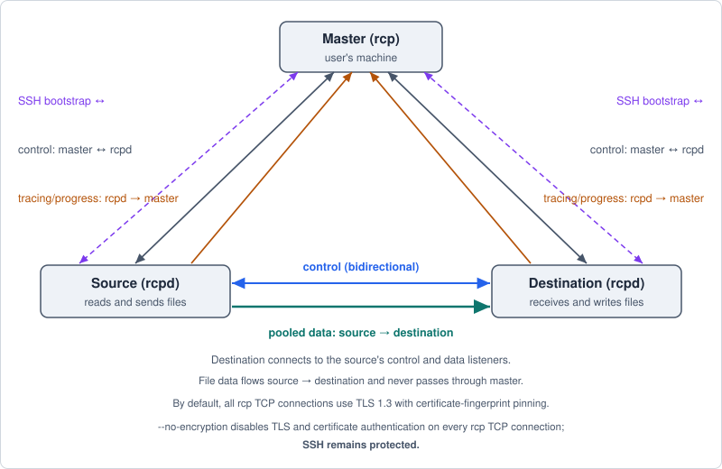
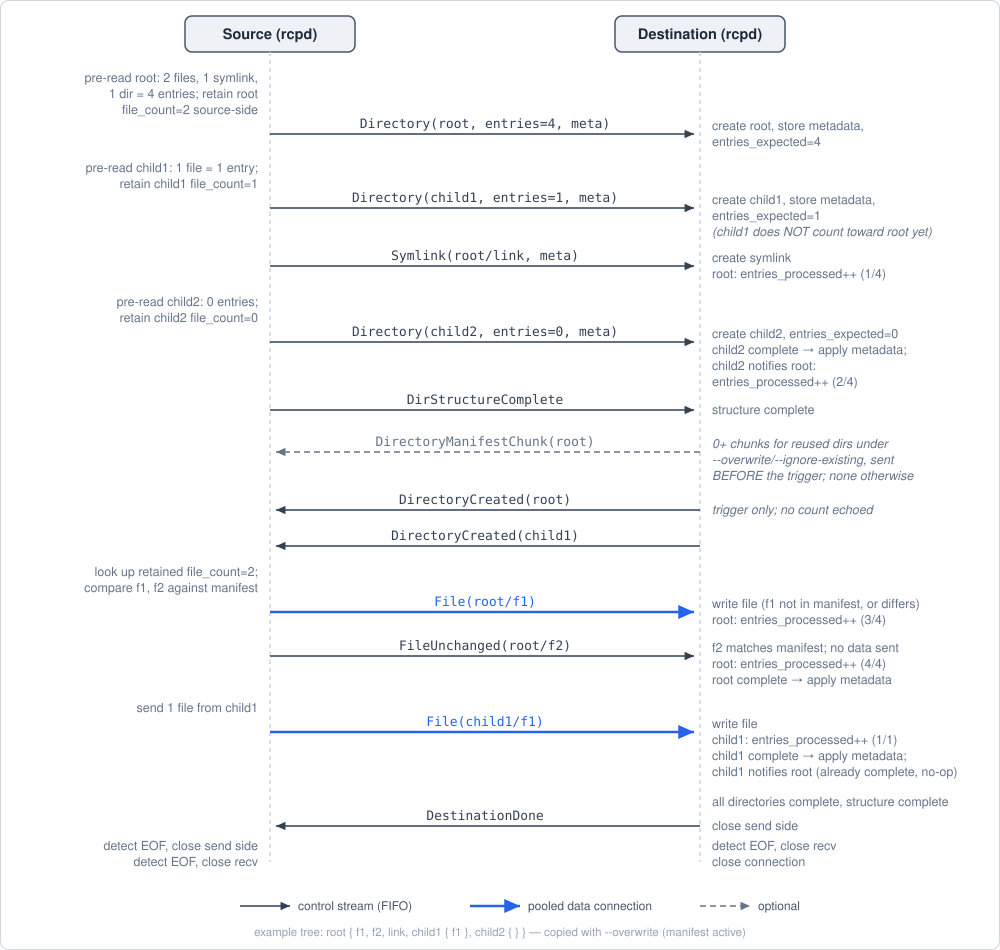
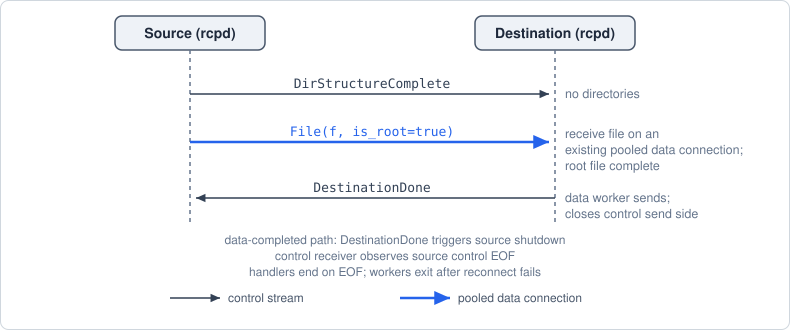
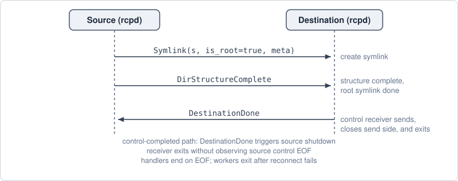
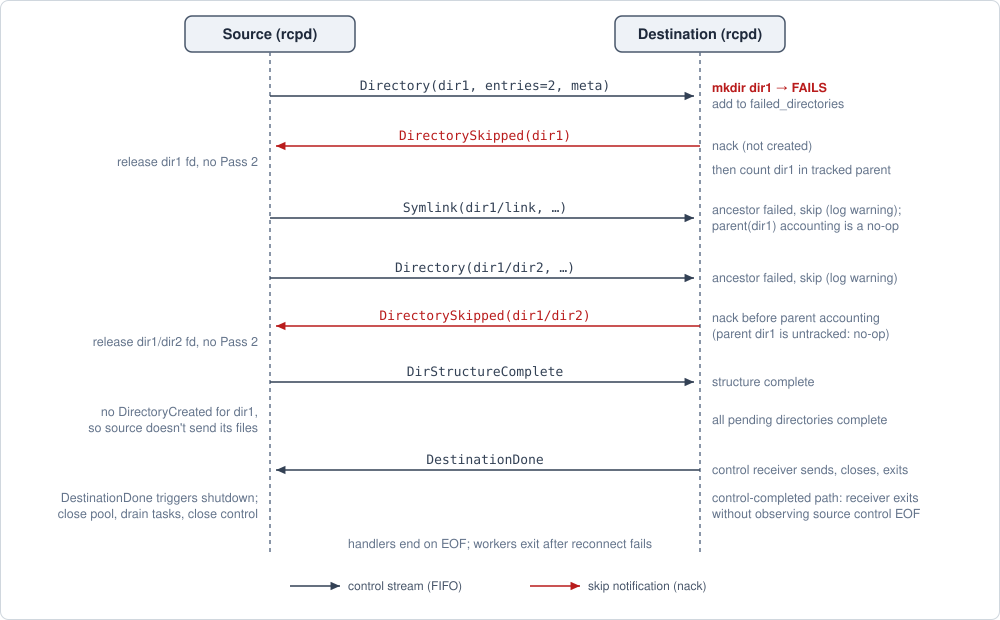
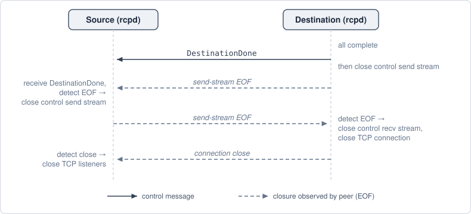

# Remote Copy Protocol Design Document

## 1. Architecture Overview

### 1.1 Three-Component Architecture

The remote copy system consists of three distinct components:

1. **Master (rcp)**: Coordinates the entire operation, runs on the client machine where the user
   invokes `rcp`
2. **Source (rcpd)**: Runs on the source host, responsible for reading and sending files
3. **Destination (rcpd)**: Runs on the destination host, responsible for receiving and writing files

### 1.2 Component Spawning and Lifecycle

**Spawning Sequence:**

1. User invokes `rcp user@host1:/src user@host2:/dst`
2. Master validates pure configuration, then prepares compatible source and destination rcpd
   endpoints. Equal `SshSession` values share one preparation; distinct endpoints may prepare
   concurrently.
3. Master spawns source rcpd via SSH: `ssh user@host1 rcpd --role=source --master-cert-fp=... ...`
4. Source creates a TCP listener and prints `RCP_TLS <addr> <fingerprint> <F> <E>` (or
   `RCP_TCP <addr> <F> <E>` when encryption is disabled) as the first stderr record. The master
   immediately opens source control and tracing connections.
5. Master constructs the destination configuration from source readiness, spawns destination rcpd,
   verifies its readiness reports the same `F/E`, and opens destination control and tracing
   connections.

**Propagated security flags:** When the master runs with `--require-toctou-safe`, it mirrors the
flag into each rcpd's spawn arguments (via `RcpdConfig::to_args()`). Each rcpd then arms strict
operand resolution before any filesystem work: its operand root/parent opens resolve with
`openat2(RESOLVE_NO_SYMLINKS)`, and it refuses to run on kernels without `openat2` (Linux 5.6+) —
the refusal is printed as a single line on stderr, where the master's handshake reader surfaces it.
The operands still travel as before — the master lints their strict form (absolute as written,
lexically normal; `~`-relative forms are rejected) before spawning. Note the asymmetry: the source's
`MasterHello::Source` carries both `src` and `dst`, so the source `rcpd` opens+validates its source
parent up front, but `MasterHello::Destination` carries **no path** — the destination `rcpd` learns
the destination only from the source's per-entry messages, so it validates its prefix only when it
actually opens the destination to write (a `--dry-run` or fully-filtered source writes nothing and
therefore does not separately validate it; see the strict-operand residual in
[tocttou.md](tocttou.md)). This is a spawn-argument change, not a wire-format change;
version-matched rcpd binaries (see binary discovery in [remote_copy.md](remote_copy.md)) understand
the flag.

**Source-owned file-work ceiling:** Let `F` be the logical file ceiling, `M` the configured
`--max-connections`, and `E = min(F, M)`. When `--max-files-in-flight` is omitted, the source `rcpd`
selects `F` from its own CPU availability; the source readiness record makes that decision
authoritative for the destination. An explicit finite `F` remains master-authoritative and becomes
`--max-files-in-flight=N` on both roles. Finite and unlimited legacy input use a hidden typed
forwarding argument, never the deprecated spelling; this preserves `--max-open-files` provenance for
clamp notices without repeating its deprecation warning. Legacy unlimited yields `E = M`. The
automatic destination uses a hidden resolved-automatic argument that preserves automatic provenance
while carrying source `F`.

The resolved `E` and pending capacity `P = E × pending-writes-multiplier` use checked arithmetic,
must be nonzero, and must not exceed `tokio::sync::Semaphore::MAX_PERMITS`. Explicit capacity can be
validated before remote-home expansion or SSH. For automatic capacity, the master validates the
configured connection upper bound before remote side effects; the source resolves and validates the
actual CPU-selected capacity before it announces readiness and before destination spawn.
`MasterHello` and data-message schemas remain unchanged. Wire revision 4 protects the extended
readiness record, typed internal spawn arguments, and source-first bootstrap contract.

**Special Case - Same Host Copies:** When source and destination are on the same host, the master:

- Discovers, verifies, and deploys rcpd only once (if needed)
- Starts two separate rcpd processes with different roles
- Both processes share the same SSH session but have distinct connections

**Auto-deployment compatibility:** Auto-deployment applies the same exact compatibility policy as
normal remote discovery at both boundaries. The master runs `--protocol-version` on each local
candidate in search order (beside `rcp`, then `PATH`) and continues to later candidates when one is
stale, stalls its two-second version probe, or is otherwise unusable. A timed-out local candidate
has its pipes released and receives a kill request; reaping gets a one-second grace, after which an
owned, runtime-scoped background reaper permits the search to continue without immediately losing
child ownership. Remote version probes, including post-deployment verification, use the initiating
`rcp` process's `--remote-copy-conn-timeout-sec` deadline so slow-but-healthy hosts can be given an
appropriate budget without allowing a hanging SSH channel to block fallback indefinitely. The master
names the cache target with the accepted version's compatibility tag, transfers and publishes the
binary, then probes that deployed remote path before constructing either role's spawn command. Thus
neither co-location nor a current-looking cache filename is treated as proof that the binary
implements the current serialized and rcpd spawn contract. For distinct hosts, the first preparation
failure cooperatively cancels its peer without dropping owned work or replacing the original error.
SSH control-socket readiness uses the same configured deadline and one cancellation-aware filesystem
worker for its whole polling lifetime. Every read-only remote bootstrap command — HOME lookup,
executable checks, PATH discovery, and version probes — goes through one helper that requires that
per-stage timeout; expiry aborts and joins its local SSH-channel task. Cleanup is best effort and
uses the same bounded helper. Binary deployment uses the timeout for its HOME lookup, SSH command,
readiness marker, and each payload-write idle period, but not as a wall-clock limit on transmitting
the binary. Post-EOF checksum verification and publication use a bounded stage of at least 60
seconds. On peer cancellation, the transfer gets a bounded grace to close stdin and finish before
its local SSH-channel task is aborted and joined.

The SSH multiplex master runs as a retained foreground `ssh -M -N` process; explicit
`ForkAfterAuthentication=no` and `ControlPersist=no` command-line overrides prevent user or system
SSH configuration from forking it away from its owner. Cancelling setup aborts that owner and
`kill_on_drop` terminates the actual connecting process. The configured SSH executable is resolved
inside a known-local shell child. After setup, commands open channels with the native OpenSSH
multiplex protocol over the retained control socket rather than synchronously spawning another local
`ssh`, so their configured deadline also covers exec-channel creation. A preparation guard owns the
foreground child and private control directory together until success transfers both to a cloneable
managed session through prepared and running daemon states. Whichever owner exits signals the master
before returning. Process reaping and directory removal move together to a worker in the command's
cleanup scope, so neither can block or depend on a Tokio runtime that may already be shutting down.
Nested cleanup runs inside its parent worker, and separate invocations cannot drain one another's
workers. Before process exit, the CLI closes that scope and gives the whole worker group one bounded
join; a filesystem operation still blocked after that grace is abandoned with the process. Daemon
waits run concurrently across endpoints while tracing receivers stay live, then any remaining
receiver tasks share one final drain deadline.

Deployment stages, verifies, and publishes through one remote `sh` transaction. Before anything can
create the unique temp path, that shell installs an `EXIT` trap which removes it. After directory
creation and opening the staging file on descriptor 3, it emits `RCP_DEPLOY_READY` on stdout. The
master bounds and validates that marker before sending payload bytes; bounded stdout preamble and
stderr are retained when setup fails. Checksum mismatch, transfer failure, SSH-channel disconnect,
and handled `HUP`/`INT`/`TERM` therefore all clean up in the same process that owns the writer. Only
a checksum-verified file reaches the final same-directory rename. Cancellation closes staging stdin
and waits briefly for the command while its owner drains both pipes; after that grace the local
SSH-channel task is aborted and joined. The configured timeout limits idle payload writes, not total
binary-transmission duration. The remote shell retains durable cleanup ownership independently of
the local Tokio task. A temp name surviving an unhandled remote termination is private to that
deployment and is never discovered, executed, or adopted by a retry.

**Startup stderr ownership and notices:** A successfully started daemon reserves its first stderr
line for exactly one readiness record. The master bounds both SSH exec-channel creation and that
read by `--remote-copy-conn-timeout-sec`, and rejects a record larger than 64 KiB. Chrome-trace,
flamegraph, Tokio-console, legacy-option, and explicit concurrency-clamp announcements are collected
until tracing is installed and emitted through the default-visible `rcp::notice` target. Remote
tracing queues daemon notices until the master connects, so they reach master output without
becoming readiness preamble. An intentional fatal startup refusal instead emits one
`RCP_ERROR <diagnostic>` record and exits, including configuration failures found before tracing is
installed. The master treats that typed record as a nested failure cause, closes its stdin, and
gives an owned reaper a bounded grace before returning; if the grace expires, the detached reaper
retains child ownership while the runtime remains active. If startup fails without a typed record,
captured stdout and remaining stderr are attached to the handshake error. Arbitrary stderr remains
an invalid readiness record. After readiness, bounded stdout/stderr collectors are joined on daemon
completion, so a nonzero exit retains diagnostics without allowing unbounded output to grow in
memory or leaving collector tasks detached. An explicit `F` reduced by `M`, an explicit `M` reduced
by the source's `F`, or an explicit limit reduced by endpoint descriptor safety produces a notice
naming the requested and effective values. The ordinary automatic/default intersection remains
quiet. The master retains the source process before attempting its control/tracing connections and
waits for daemon cleanup if either connection fails. It starts the source tracing receiver as soon
as its tracing connection is established, before destination configuration or startup. Every later
startup and protocol exit closes the control streams, waits for owned daemon processes, and gives
tracing receivers a bounded drain, so already-queued source notices remain visible alongside a
destination failure rather than being dropped during unwinding.

### 1.3 Connection Topology

The system uses a **triangle topology** with TCP connections:



<details>
<summary>Text transcript</summary>

The diagram distinguishes the SSH bootstrap from the rcp TCP connections and shows every
application-data direction:

1. Master uses SSH to start source rcpd. It reports its listener address, optional TLS fingerprint,
   logical file ceiling `F`, and effective stream count `E` back to master on SSH stderr.
2. Master opens source rcpd's bidirectional control TCP connection and separate tracing/progress
   connection, dropping the tracing send half.
3. Master starts destination rcpd with source `F/E`, verifies its readiness, and opens destination's
   control and tracing/progress connections in the same way.
4. Master sends `MasterHello::Source`; source returns `SourceMasterHello` and later `RcpdResult`.
5. Master sends `MasterHello::Destination`; destination later returns `RcpdResult`.
6. Destination opens the source/destination bidirectional control connection. Directory and symlink
   messages flow source → destination; manifests, directory acknowledgements, and `DestinationDone`
   flow destination → source.
7. Destination also opens the pooled data connections to source. File headers and bytes flow only
   source → destination and never through master.

By default every rcp TCP connection uses TLS 1.3 and certificate-fingerprint authentication. The
`--no-encryption` option disables TLS and certificate authentication on every rcp TCP connection;
SSH remains protected and still launches rcpd and carries its listener announcement.

</details>

**Connection Details:**

1. **Master ↔ Source**: Two TCP connections (master connects to source rcpd's listener twice):
   - **Control**: Bidirectional, used for handshake and result reporting
   - **Tracing/progress**: One-way rcpd → master; master drops this connection's send half
2. **Master ↔ Destination**: Two TCP connections (master connects to destination rcpd's listener
   twice):
   - **Control**: Bidirectional, used for handshake and result reporting
   - **Tracing/progress**: One-way rcpd → master; master drops this connection's send half
3. **Source ↔ Destination**: Two TCP ports on source (destination connects to both):
   - **Control port**: Bidirectional TCP for directory metadata and coordination
   - **Data port**: A pool of TCP connections for file transfers (each connection is reused for
     multiple files)

**Connection Establishment Order:**

1. Source rcpd reports readiness; master opens its control connection and then its separate
   tracing/progress connection immediately.
2. Destination rcpd is configured from source `F/E`, reports matching readiness, and receives the
   corresponding two master connections.
3. Master sends `MasterHello::Source` to source rcpd with src/dst paths.
4. Source rcpd starts TCP listeners (control + data), sends `SourceMasterHello` back to master with
   both addresses
5. Master sends `MasterHello::Destination` to destination rcpd with source addresses
6. Destination rcpd connects to source's control port
7. Destination opens a pool of connections to source's data port; files are streamed over these
   pooled connections (the `size` field in each header delimits file boundaries)

### 1.4 Security Model

All TCP connections are encrypted and authenticated using TLS 1.3 with self-signed certificates and
fingerprint pinning. TLS 1.3 is pinned in the config (TLS 1.2 is never negotiated) — see the
[Cipher Suites](security.md#cipher-suites) section of security.md.

**Security Architecture:**

- SSH is used for authentication and rcpd deployment
- Each party generates an ephemeral self-signed certificate
- rcpd outputs its certificate fingerprint to stderr (read by master via SSH)
- Master distributes fingerprints to source/destination for mutual TLS authentication
- All TCP connections use TLS with certificate fingerprint verification

**Security Properties:**

- **Confidentiality**: All data encrypted with AES-256-GCM or ChaCha20-Poly1305
- **Authentication**: Certificate fingerprint verification prevents unauthorized connections
- **Forward secrecy**: TLS 1.3 ephemeral key exchange
- **Integrity**: AEAD ensures data cannot be tampered with

**Opt-out:**

- Use `--no-encryption` for trusted networks where performance is critical. It disables TLS and
  certificate authentication on every rcp TCP connection; SSH remains protected.
- See [security.md](security.md) for detailed threat model and best practices

## 2. Protocol Messages

### 2.1 Handshake Messages

**`MasterHello`** (Master → rcpd, bidirectional stream)

- **Purpose**: Provide configuration and connection details. This is the ONLY message the master
  ever sends on this connection; it then holds the connection open to await `RcpdResult`, and each
  rcpd keeps a reader on it as a liveness watchdog for the whole operation (§6.3).
- **Variants**:
  - `Source { src, dst, dest_cert_fingerprint, filter, dry_run, capture }`: Tells source rcpd what
    to copy
    - `filter`: Optional filter settings for include/exclude patterns (source-side filtering reduces
      network traffic)
    - `dry_run`: Optional dry-run mode (brief, all, or explain) for previewing operations without
      transferring files
    - `capture: ExtendedMetadataCapture { file_acl, dir_acl, root_acl_notice }`: what EXTENDED
      metadata the source must read beyond the `stat` it already does — currently POSIX ACLs. The
      first two are per-entry reads whose bytes are sent; `root_acl_notice` buys one read on the
      ROOT whose only product is a log line. See §2.5.
  - `Destination { source_control_addr, source_data_addr, server_name, preserve, source_cert_fingerprint }`:
    Tells destination where to connect (both control and data addresses). Note: empty directory
    cleanup decisions are communicated per-directory via `keep_if_empty` in `Directory` messages
    rather than a global flag.

**`SourceMasterHello`** (Source → Master, bidirectional stream)

- **Purpose**: Provide source's TCP server details for destination to connect
- **Fields**: `control_addr`, `data_addr`, `server_name`

**`RcpdResult`** (rcpd → Master, bidirectional stream)

- **Purpose**: Report final success/failure status and statistics
- **Variants**:
  - `Success { message, summary, runtime_stats }`
  - `Failure { error, summary, runtime_stats }`

### 2.2 Source → Destination Messages (Control Stream)

**`Directory`**

- **Purpose**: Create directory, store metadata, and declare the entry count for completion tracking
- **Fields**: `src`, `dst`, `metadata`, `is_root`, `entry_count`, `keep_if_empty`
- **Usage**: Sent during directory tree traversal in depth-first order. Source pre-reads the
  directory children before sending this message, so `entry_count` is known at send time.
  Destination creates the directory, stores metadata, and uses the entry count for completion
  tracking.
- **`entry_count`**: Total number of child entries (files + directories + symlinks) that will be
  sent for this directory. Used by DirectoryTracker to know when all children have been processed.
- **`keep_if_empty`**: Whether to keep the directory if it ends up empty after filtering. `true`
  when no filter is active, when it is the root, or when the directory directly matches an include
  pattern. `false` when the directory was only traversed to look for potential matches and should be
  removed if it ends up empty on disk.
- **No `file_count`**: the source retains the child-file count it computed during the pre-read (in
  its fd-map entry under hardened reads, or in a path-keyed Pass-1 entry under `-L`), so it is not
  sent on the wire and not echoed back. See §7.1.

**`Symlink`**

- **Purpose**: Create symlink with metadata
- **Fields**: `src`, `dst`, `target`, `metadata`, `is_root`
- **Usage**: Sent during directory traversal when symlink encountered

**`DirStructureComplete`**

- **Purpose**: Signal that all directories and symlinks have been sent
- **Fields**: `has_root_item` (bool) - whether a root file/directory/symlink will be sent
- **Usage**: Sent after recursive directory traversal completes. Required before destination can
  send `DestinationDone`. When `has_root_item` is false (dry-run mode or filtered root), destination
  marks root as complete immediately.

**`FileSkipped`**

- **Purpose**: Notify destination that an entry its parent already counted will not be sent
- **Fields**: `src`, `dst`
- **Usage**: Sent when a file open fails (before any data connection is used), and — with no file
  involved — for any child a parent's `entry_count` already tallied that the source can no longer
  send: one whose `open_dir` failed, or that vanished, changed type, or stopped matching the filter
  between its parent's pre-read and the walk's descent into it (§7.1). It is the right message for
  all of them because the source has no trustworthy type left to assert. Counts as a processed entry
  for the parent directory's completion tracking. Transport failures after connection is established
  are fatal.

**`FileUnchanged`**

- **Purpose**: Notify destination that the source skipped transferring a file because the
  destination already holds a matching entry (per the directory manifest in
  `DirectoryManifestChunk`s).
- **Fields**: `src`, `dst`
- **Usage**: Sent on the control stream like `FileSkipped`, but signals a *successful* skip (the
  destination copy is already identical) rather than a failure. Counts as a processed entry for the
  parent directory and as `files_unchanged` (the destination is authoritative for that count). No
  file data is sent for the skipped file.

**`SymlinkSkipped`**

- **Purpose**: Notify destination that a symlink failed to read
- **Fields**: `src_dst: {src, dst}`, `is_root`
- **Usage**: Sent when symlink read fails. If `is_root` is true, destination sets `root_complete` to
  signal root processing is done (even if failed).

### 2.3 Destination → Source Messages (Control Stream)

**`DirectoryManifestChunk`**

- **Purpose**: Carry a chunk of the reused destination directory's pre-existing-entry manifest, used
  by the source to skip transferring identical files.
- **Fields**: `dst`, `entries: Vec<ExistingEntry>` (each `ExistingEntry` carries `name`, `is_file`,
  `metadata`, `size`)
- **Usage**: A directory's manifest is split into one or more chunks, each well under the control
  stream's frame limit (`LengthDelimitedCodec`, 8 MiB), and **all** of them are sent **before** that
  directory's `DirectoryCreated` — the two stay contiguous under one send-stream lock hold, so the
  control stream's FIFO gives the source the complete manifest by the time it processes
  `DirectoryCreated`. That guarantee is **per-directory** only: the destination builds each reused
  directory's manifest in a per-directory task (one build at a time) so its control **receive** loop
  keeps draining the socket during a long build — otherwise a multi-million-entry enumeration would
  close the receive window for minutes and the `TCP_USER_TIMEOUT` on the source's control socket
  (§"vanished hosts") would abort a healthy copy. Messages for **different** directories may
  therefore interleave with a directory's chunks; the source accumulates chunks keyed by `dst`, so
  the interleaving is invisible to it. No chunks are sent when the directory was freshly created
  (not reused), when neither `--overwrite` nor `--ignore-existing` is active, or when the
  directory's entry count exceeds the manifest cap (`--overwrite-manifest-max-entries`, default
  5,000,000) — in which case that directory falls back to transferring-and-draining (the baseline
  behavior). Chunking the manifest (rather than inlining it in `DirectoryCreated`) ensures the cap
  stays meaningful without any single control frame exceeding the frame limit. See §7.9. On a
  source-initiated teardown (control EOF before `DestinationDone`), outstanding manifest builds are
  **aborted**, not drained: their directories can never receive files, and a queued build would only
  scan a complete directory to fail its announce against the closed peer. The `-L` replacement
  credit bounds how many builds can be outstanding, but one build may still enumerate up to five
  million entries or stall indefinitely in filesystem I/O, so draining can stall failure shutdown.

**`DirectoryCreated`**

- **Purpose**: Confirm directory created, request file transfers
- **Fields**: `src`, `dst`
- **Usage**: Sent after successfully creating directory, and after any `DirectoryManifestChunk`s for
  it. This is purely the Pass-2 trigger: it tells the source the destination created the directory
  and is ready to receive its files. The source already retains the authoritative child-file count
  it computed during the Pass-1 pre-read (hardened: in the fd-map entry; `-L`: in a path-keyed
  Pass-1 entry), so no count is echoed back. Triggers source to send files. See §7.1. On the
  destination it is also the directory's **completion gate**: child entries processed off Pass-1
  messages (symlinks/subdirectories) never complete a directory before its own announce is on the
  wire (§5.2) — a directory completes at the LATER of its last processed entry and its announce.

**`DirectorySkipped`**

- **Purpose**: Acknowledge a `Directory` message the destination did NOT create (create failed,
  ancestor failed, or `--ignore-existing` skipped a non-directory), so no files will be requested
  for it.
- **Fields**: `src`, `dst`
- **Usage**: The destination sends **exactly one** of `DirectoryCreated` / `DirectorySkipped` per
  `Directory` message. The source uses this to release the matching hardened directory-fd entry or
  `-L` owned credit. Without this nack a skipped directory's permit would never be released, so a
  no-ack subtree larger than the budget would block the source's Pass-1 walk and hang the copy. Does
  not affect completion accounting: skipped directories were never added to `pending_directories`.
- **Exception — hard abort.** Most failure paths still send `DirectorySkipped` — an ancestor failed,
  the create was converted to `Failed`, or `--ignore-existing` skipped a non-directory — even under
  `--fail-early`, and the accounting rule ("exactly one per directory") holds for them. The
  exception is any **fatal abort** that tears the connection down before the ack/nack is sent: a
  directory-create error that propagates as `Err` under `--fail-early` (e.g. a
  `--require-toctou-safe` lockdown that cannot secure a reused directory, or an I/O failure), a
  transport failure on either stream, or the destination closing its control stream. So the source
  MUST NOT depend on receiving an ack/nack for every directory: it releases the **entire** dir-fd
  budget (`close_fd_budget`) — and, under `-L`, closes the outstanding-directory credit that
  replaces it. The path-based walk retains no pinned directory fd, although each `ReadDir`
  enumeration owns a transient descriptor. Under `-L`, one credit is owned by every sent
  `Directory`: `DirectoryCreated` transfers it into that directory's Pass-2 task and releases it
  when the task finishes, while `DirectorySkipped` releases it immediately. This bounds directories
  waiting on a slow acknowledgement/manifest and those with active direct-file Pass-2 work. It is
  not a total directory-fd bound: a zero-file Pass 2 releases immediately, so destination fds
  retained for recursive ancestors and directory-only trees can outlive the credit. After every
  normal dispatch-loop result — control-stream close, transport-task error, or a child-task panic
  surfaced as `JoinError` — the source explicitly closes the applicable gate before draining tasks.
  Once installed at dispatch entry, an RAII closer also closes the gate if cancellation drops the
  future or a panic unwinds before that point. Thus, after dispatch starts, a Pass-1 walk parked on
  the budget unblocks on every path that runs destructors, and the source tears down cleanly instead
  of hanging. On such an abort the top-level cause depends on which side detected it. A
  **source-side** cause (e.g. a source file's `Permission denied` on read) is published to a shared
  slot before the budget is released, and the teardown surfaces it in place of the synthetic
  budget-closed wakeup (a typed `FdBudgetClosed` marker, detected by type) that unblocks the parked
  walk. A recursive source walk treats that marker as teardown control flow in either read mode,
  even under collect-errors: it neither sends a compensating `FileSkipped` nor continues into later
  siblings. A **destination-side** cause (e.g. the destination cannot create a file) is not visible
  to the source — its slot stays empty, so the source reports only a benign teardown symptom (a
  meaningful "destination closed the control connection before the source finished sending" message,
  or a broken-pipe Pass-2 send error — never the internal `FdBudgetClosed` marker, which is
  substituted), while the **destination** reports the real cause, preferring its own recorded
  operation error over the connection-teardown symptom, and the master prefixes it `Destination:`.
  So a destination-side abort still fails the copy with the real cause named — on the destination's
  half of the aggregated error — while the source adds only the benign teardown symptom alongside
  it. (Fully suppressing that source-side symptom is deferred: once the peer has aborted, the
  source's own Pass-2 sends genuinely fail, and a benign peer-abort is not reliably distinguishable
  there from a real transport fault.)
  - **A data-path abort is signaled by closing the control stream.** A fatal error on a *data*
    connection — a `--fail-early` file/metadata failure, or a corrupted data stream — propagates out
    of the data worker; the destination records it and closes its control send stream (the
    `destination closing its control stream` trigger above) so the source observes the close,
    releases its applicable Pass-1 pacing gate (the hardened dir-fd budget or `-L`
    outstanding-directory credit), and tears down. This close is required because the source may
    have no failing operation of its own to notice: an all-empty-file transfer carries no data body
    (its sends never break with a broken pipe), and a source that has finished its walk or is parked
    on that gate is otherwise idle — it would wait forever for a `DestinationDone` an aborting
    destination can never send. The close is issued PROMPTLY — the moment the abort is observed, not
    after the worker pool finishes draining: the pool only drains once the source has closed the
    data connections, which happens only after the source has torn down, so deferring the close
    would deadlock. (The destination funnels this through one `signal_source_teardown` step —
    invoked eagerly on the first worker abort, and again in `run_destination` after its two futures
    finish racing, run CONCURRENTLY with awaiting the loser via `tokio::join!` so the loser can
    release the tracker lock it may hold mid-send — rather than at each worker exit, so no exit path
    can forget it and no inline signal can deadlock against a suspended peer.)
  - **A file-header-boundary close is fatal UNLESS the transfer already completed.** An end-of-
    stream at a file-header boundary reaches the destination in TWO shapes, and they are decided
    identically. A socket that died without a clean shutdown surfaces as a transport-level
    *peer-closure* error (under TLS, rustls's missing `close_notify`; empirically `UnexpectedEof` or
    `ConnectionReset`, any connection-ended kind by timing); a peer that shut the stream down
    cleanly surfaces as a graceful `Ok(None)`. Neither is self-evidently benign — the source closes
    a data stream gracefully while it keeps running (it discards a stream whose send failed, and the
    pool drain closes returning streams), and on plain TCP a graceful FIN is the ordinary shape — so
    the shape carries no information about whether the transfer finished. COMPLETION STATE decides,
    through ONE gate consulted by both: an end-of-stream is benign ONLY when the transfer already
    completed (`is_done()`) or teardown has begun; otherwise it is a mid-transfer TRUNCATION or
    dropped link and is FATAL — recorded (a fixed message so duplicate truncations dedup and cannot
    mask a real cause), it signals the source and fails the copy. Tolerating a pre-completion
    closure made the worker reconnect and block on an idle socket while the source waited for a
    `DestinationDone` that could never come — an indefinite hang. This also closes the
    MITM-tail-truncation residual: a truncation the source does not notice is fatal at the header
    boundary. Teardown is read from the data pool (lock-free) as well as the tracker's
    `is_closing()`, because the latter is set behind the tracker mutex, which a suspended future can
    hold for an unbounded window — reading it alone would let a worker record a spurious truncation
    that masks the real cause. A framing/decode fault — an oversized length prefix (`InvalidData`),
    a TLS protocol fault, or a frame that does not deserialize to a `File` — is always fatal.
  - **The destination fails closed if the transfer is incomplete.** After both its futures finish
    racing, `run_destination` reads the tracker's `is_done()` once; if it is NOT done and no
    per-operation error was recorded, the copy is reported as an incomplete-transfer FAILURE, never
    a success — naming the actual cause when one is available: the FIRST genuine data-`connect()`
    failure to the source port (e.g. "connection refused" / "TLS handshake timed out"), which the
    worker stashes for exactly this; else a stream teardown symptom; else a synthetic message. This
    is the backstop for a premature `connect()` failure that leaves queued files unsent; without it
    such a state would exit 0 with files missing, because the source reads the control-stream close
    as graceful regardless of whether `DestinationDone` preceded it. A benign LATE reconnect that
    fails after `DestinationDone` also stashes a cause, but the transfer completed (`is_done()`), so
    the gate never fires and it is dropped. (A destination-side gate failure is sufficient: the
    master fails the copy if EITHER rcpd fails. The source now DOES distinguish a close with vs.
    without a prior `DestinationDone` — it warns on the latter, naming the abort-or-death, since a
    reader of the source's log would otherwise see the early close reported as a clean finish. Only
    the failing half remains deferred: the source still returns success for that branch, because the
    master's read of the destination's `RcpdResult` is mandatory and fails the copy either way.)
  - **Every TLS handshake is bounded.** All of them go through `remote::tls::accept_bounded` /
    `connect_bounded`, which apply the timeout and are the only place a handshake is performed; a
    bare `TlsAcceptor::accept`/`TlsConnector::connect` elsewhere is rejected by
    `scripts/check-tls-handshake-timeout.sh`. Each data `connect()` additionally races the TCP
    connect + TLS handshake against a teardown cancellation token (fired by `data_pool.close()`), so
    a worker stuck mid-handshake cannot keep the file-handler future waiting forever. The CONTROL
    connection's handshake (destination connect, source accept), each source-side DATA-accept
    handshake, the source's DRY-RUN control accept, and both master↔rcpd accepts (control and
    tracing) are bounded by `conn_timeout_sec` — a peer that establishes TCP then stalls the
    handshake can no longer hang any of them. (Two of these bounds matter most: the data-accept and
    the rcpd accepts run inline in a sequential accept loop, so a single stall would otherwise block
    every further connection — for rcpd, including the legitimate master's.)

**`DestinationDone`**

- **Purpose**: Signal destination has finished all operations
- **Usage**: Final message sent by destination. Initiates graceful shutdown.

### 2.4 File Transfer Messages (Data Connections)

**`File`** (Source → Destination, on data connections)

- **Purpose**: File header followed by raw file data
- **Fields**: `src`, `dst`, `size`, `metadata`, `is_root`
- **Format**: Length-delimited serialized header, then raw bytes (exactly `size` bytes)
- **Connection model**: Connections are pooled and reused for multiple files. The `size` field
  delimits file boundaries within a connection. Destination reads headers in a loop until EOF.

### 2.5 Entry Metadata and POSIX ACLs

Every message that describes an entry (`Directory`, `Symlink`, `File`, and each `ExistingEntry` in a
`DirectoryManifestChunk`) carries a `Metadata`:

```rust
struct Metadata {
    mode: u32, uid: u32, gid: u32,
    atime: i64, mtime: i64, atime_nsec: i64, mtime_nsec: i64,
    acls: WireAcls,
}

enum WireAcls {
    /// No ACL information at all: not captured, or unreadable at the source.
    Unknown,
    /// Read from the source entry: authoritative, including the "has none" case.
    Captured {
        access:  Option<Vec<u8>>,   // system.posix_acl_access
        default: Option<Vec<u8>>,   // system.posix_acl_default (directories only)
    },
}
```

**The ACL fields carry the SOURCE kernel's bytes verbatim.** They are never parsed, rebuilt or
reordered in flight. POSIX.1e requires canonical entry order (`USER_OBJ`, named users by ascending
uid, `GROUP_OBJ`, named groups by ascending gid, `MASK`, `OTHER`) and the kernel rejects anything
else with `EINVAL`, so passing through what the source kernel already validated sidesteps the
problem entirely. The on-disk format is defined little-endian (`__le16`/`__le32`), so it is portable
across hosts as-is; the destination kernel validates on `fsetxattr`. rcp requires an exact rcp/rcpd
version match (see [remote_copy.md](remote_copy.md)), so adding these fields has no back-compat
cost.

**`Captured` with `None` means "the source has no such ACL", which the destination reproduces by
REMOVING the attribute — not by leaving the destination alone.** A destination directory's default
ACL is inherited by every entry created beneath it, including ones rcp creates itself, so "do
nothing when the source has no ACL" would hand the copy permissions the source never granted.

**`Unknown` means the wire carries no ACL information, and the destination must NOT touch the
destination entry's ACLs.** It arrives in exactly two situations: the master never asked for ACLs
(`capture.file_acl` / `capture.dir_acl` both false — the destination's `preserve` then never applies
them either; `capture.root_acl_notice` is irrelevant here, since it buys a log line and never
populates a `Metadata`), or the source COULD NOT read them (a committed directory that failed to
open — that entry's copy is already recorded as an error on the source). The distinction from
`Captured` all-`None` is load-bearing: collapsing the two turns a source-side read failure into an
authoritative clear, permanently stripping a REUSED destination directory's access and default ACLs
on a copy that is already failing. The destination implements `Unknown` by disabling ACL
preservation for that one entry's metadata application; for a strict-mode locked reused directory
that restores the directory's ORIGINAL default ACL (the lockdown snapshot) — the same outcome as
`d:acl` off.

**Which messages actually carry ACLs:**

| message                                                              | carries                    | why                                                                                                                           |
| -------------------------------------------------------------------- | -------------------------- | ----------------------------------------------------------------------------------------------------------------------------- |
| `File`                                                               | access only, when captured | read from the SAME fd whose bytes are sent, so permissions and contents cannot desync                                         |
| `Directory`                                                          | both, when captured        | read from the held `O_NOFOLLOW` fd whose children were enumerated; the default ACL is what the destination's children inherit |
| a committed-but-unreadable directory whose ENUMERATION failed (§7.1) | both, when captured        | the directory itself was reachable — only `getdents` failed — so it answers the probe like any other                          |
| a committed directory that could not be OPENED at all (§7.1)         | `Unknown`                  | no fd to read them from and no honest answer to give: the destination leaves the destination directory's ACLs untouched       |
| `Symlink`                                                            | nothing                    | the kernel has no symlink ACL; the settings parser rejects `l:acl`                                                            |
| `ExistingEntry` (manifest)                                           | `Unknown`                  | the manifest answers `--overwrite-compare`, which has no `acl` term — see the hole below                                      |

Reading a source entry's ACL from the same fd as its payload is the same read-side fidelity rule the
rest of the source walk follows (Guarantee 2 in [tocttou.md](tocttou.md)): a probe by path could be
answered by a different inode than the one whose bytes and metadata are on the wire, pairing one
entry's permissions with another's contents. The `-L`/`--dereference` walk does not retain its
transient enumeration descriptor for the later directory ACL capture, so that read opens by path —
the same intentionally-unhardened choice that walk already makes everywhere else. That path ACL open
is also outside remote leaf OpenFile admission and its cancellation-lifetime guarantee.

**A failed ACL read FAILS the entry; it never degrades to "no ACL".** Because `None` means CLEAR,
sending it for an ACL the source could not read would make an `EMFILE`, `EACCES` or `ENOENT` STRIP
the destination's ACLs — including a directory's default ACL, which then governs everything created
beneath it. That is strictly worse than failing, and it mirrors the destination's rule for the same
situation in the other direction (a destination that cannot HOLD an ACL fails the entry rather than
dropping it quietly).

Because that failure happens BEFORE the entry's message is sent, the destination is never told to
expect it, and the source compensates on both exit paths — otherwise the destination's parent
directory never reaches `entries_expected`, `DestinationDone` is never sent, and the copy HANGS with
both peers alive, which no keepalive or timeout ends:

- **A nested entry** is accounted with a `FileSkipped` (§2.2), exactly as for any other counted
  child the source can no longer process.
- **A root entry** fails the copy outright, before `DirStructureComplete` — the Root Item Failure
  Invariant in §3.3. Continuing would announce `has_root_item: true` with no root message ever
  committed.

Both walks follow this rule, and the file path inherits it from the same accounting: an ACL read
failure on a file takes the same `FileSkipped` route as a failed open.

**`MasterHello::Source { capture: ExtendedMetadataCapture { file_acl, dir_acl, root_acl_notice } }`.**
Only `MasterHello::Destination` carries `preserve`, so without this field the source could not know
whether ACLs are wanted and would have to probe unconditionally — a syscall per entry that `stat`
cannot fold in, on every remote copy including ones that do not want ACLs. With every field false
the source issues no xattr syscall at all — except under `--require-toctou-safe`, which arms the
root notice from the source's own mirrored flag rather than from here, so a strict run still pays
the one root `listxattr` on an all-false capture. Nothing per-entry is reachable that way: only
`file_acl` and `dir_acl` open that door.

`root_acl_notice` arms the one-per-run source-root probe behind the notice in
[acls.md](acls.md#the-source-root-warning), and is independent of the two per-entry flags in both
directions: it is set when the master's `preserve` asks for metadata fidelity **at all**, whereas
they are set when it asks for `acl` specifically — which is exactly the case where there is nothing
to warn about. A remote copy left at the shipped default clears all three. `--require-toctou-safe`
arms the notice too but does not travel here: it reaches the source `rcpd` as its own mirrored flag
and is read from the process-global strict state on the host that runs the probe.

`capture` is deliberately NOT the whole `preserve` struct. The source decides only what to **read**;
the destination remains the sole authority on what is **applied**. Handing the source a `preserve`
would invite a later reader to act on, say, `preserve.file.mode_mask` source-side, which would be a
bug. The master derives `capture` from the same `preserve` it sends the destination, at one call
site, so the two cannot disagree — which matters, because the destination reads an all-`None`
`Metadata` as "clear", so a capture that said `false` under a `preserve` that said `true` would
strip every ACL instead of copying it. This is a wire-format change, not a spawn-argument one.

**Application (destination).** File ACLs are applied through the created file's own fd in
`process_single_file`, directory ACLs through the directory's own held fd when it completes
(`DirectoryTracker::complete_directory_single`). Both go through the shared appliers
(`common::safedir::set_file_metadata_fd` / `set_reused_dir_metadata_fd`), so the remote path
inherits the local one's ordering rule: an access ACL is the step that WIDENS the destination from
its owner-only create mode, so it runs last and the `fchmod` before it is narrowed to carry only the
special bits (see the create-mode note in §5.1 and [tocttou.md](tocttou.md)). Neither is a new
protocol message: the wire change is confined to the two `Metadata` fields and the `capture` field.

**Not on the wire: the destination's own containment.** Under `--require-toctou-safe` the
destination `rcpd` also strips the ACLs of every directory it creates and snapshots/restores the
default ACL of every directory it reuses, so nothing created beneath one inherits. That is
destination-local behavior driven by the mirrored flag, not by any message, and it applies whether
or not `capture` asked the source for anything. See [acls.md](acls.md) and [tocttou.md](tocttou.md).

**Known hole (unchanged by ACL transport):** a file the manifest shows as identical under
`--overwrite-compare` (default `size,mtime`) is not transferred and keeps its old destination ACL.
This is the same shape as `mode`, which the default comparison also ignores.

The whole ACL model — both widening directions, the measured costs, the apply ordering and the
strict-mode invariant — lives in [acls.md](acls.md); this section covers only what crosses the wire.

## 3. Error Communication Design

### 3.1 Asymmetric Error Reporting

The protocol uses asymmetric error communication between source and destination:

**Source → Destination: MUST communicate failures**

- Source must notify destination of skipped files (`FileSkipped`) so destination can track entry
  counts correctly
- Source must notify destination of skipped symlinks (`SymlinkSkipped`) for logging purposes
- Source must notify destination of skipped-identical files (`FileUnchanged`) so destination can
  track entry counts correctly — an optimization notification (the destination already matched), not
  a failure, but it serves the same count-tracking role as `FileSkipped`
- Without these notifications, destination would hang waiting for entries that will never arrive
- **Note**: `FileSkipped` covers every counted-but-unsendable entry, not only failed file opens
  (§2.2). Transport failures (send errors after connection established) are fatal and abort the
  entire transfer

**Destination → Source: Does NOT communicate failures (one exception: directory acks)**

- Destination handles its own failures locally (logging, error flags)
- Source continues sending the complete directory structure regardless of destination failures
- This simplifies the protocol and reduces round-trips
- Destination metadata errors (file, directory, symlink) are handled locally: logged with
  `tracing::error!`, the error recorded in the `ErrorCollector`, and processing continues unless
  `--fail-early` is set. This applies to both file metadata (via `DataConsumed` stream state) and
  directory metadata (in `DirectoryTracker::complete_directory_single`)
- **Exception — directory acks:** the destination DOES tell the source the outcome of every
  `Directory` message, sending exactly one of `DirectoryCreated` (success/reuse) or
  `DirectorySkipped` (not created). This is not failure reporting for its own sake — the source
  needs it to consume the matching Pass-1 entry: the hardened entry owns a directory fd, while the
  `-L` entry owns its pacing credit. It does not change what the source sends next (a skipped
  directory's children still arrive and are skipped via `failed_directories`). (Sole exception: a
  **hard abort** may close the control stream in place of a final ack/nack — see `DirectorySkipped`
  §2.2, "Exception — hard abort".)

### 3.2 Rationale

This asymmetry reflects the producer-consumer relationship:

- **Source is the producer**: It must tell destination what to expect so destination knows when it's
  done
- **Destination is the consumer**: It processes what it receives and handles its own problems

If destination fails to create a directory:

- It tracks this locally in `failed_directories`
- It sends `DirectorySkipped` (not `DirectoryCreated`), so source won't send files for it but does
  release the matching hardened fd-map entry or `-L` owned credit. The same `DirectorySkipped` is
  sent when a directory is skipped because an ancestor failed, or `--ignore-existing` skips a
  non-directory.
- It skips any descendant directories/symlinks that arrive (checking `failed_directories`)
- Source continues sending the full structure (it releases only the skipped directory's hardened
  fd-map entry or `-L` owned credit)

### 3.3 Root Item Failure Invariant

Root items require special handling to prevent protocol hangs:

**Source side:** If metadata reading fails for a root item (directory or symlink), source MUST
return an error rather than silently continuing. Otherwise, no messages would be sent for the root
item, leaving destination waiting forever for `root_complete` to be set.

**One classification, no re-stat.** The root is classified ONCE, and that single snapshot drives
`has_root_item`, the file-vs-directory dispatch, and the walk — which is handed the classification
rather than taking one of its own. Two reads would let the two answers disagree: a root that is a
directory at the first and a regular file at the second announces `has_root_item: true` and then
sends no root message at all, which is exactly the hang above, with both peers alive. The hardened
walk classifies through the trusted parent's fd; `-L` uses the one path stat it already takes.

A root that changes AFTER that classification is not a classification failure, and outside
`--fail-early` it is not fatal either: the open/enumeration fails (`ENOTDIR`/`ENOENT`) and the root
takes the committed-but-unreadable-directory route of §7.1 — a 0-entry `Directory`, which sets
`root_complete` — with the error recorded, so the copy reports the failure and still terminates.
Under `--fail-early` that same failure returns `Err` before the 0-entry `Directory` is sent, which
is fatal per the invariant above; nothing has been committed for the root at that point, so the
destination is torn down rather than left waiting for it.

**Empty source case:** When no root item will be sent (dry-run mode or filtered root item), source
sets `DirStructureComplete { has_root_item: false }`. Destination uses this flag to immediately mark
root as complete, allowing graceful shutdown without waiting for a root message that will never
arrive.

**Destination side:** If a root item fails to process (directory creation fails, symlink creation
fails), destination MUST set `root_complete = true` before continuing. This ensures `is_done()` can
eventually return true and `DestinationDone` can be sent.

## 4. Protocol Flow

### 4.1 Directory Copy Flow



<details>
<summary>Text transcript</summary>

The destination has already opened its reusable pool of data connections before this trace begins.
The source root has five entries: two files, one symlink, and two directories; `child1` contains one
file and `child2` is empty. The reused destination root initially contains only `f2`, and in that
root only `f2` already matches. In this manifest-active example, `--overwrite` is enabled and the
reused root's pre-existing entry count is within the `--overwrite-manifest-max-entries` cap.
Control-stream and pooled-data work can overlap, so this is one valid interleaving:

1. Source pre-reads the root, retains its two-file count, and sends
   `Directory(root, entries=5, meta)`. Destination reuses the root and sends one or more
   `DirectoryManifestChunk(root)` messages including `f2`, then sends `DirectoryCreated(root)`.
2. Source sends `Symlink(root/link, meta)` before recursing into child directories; destination
   creates it and advances the root to 1/5.
3. Source pre-reads `child1`, sends `Directory(child1, entries=1, meta)`, and immediately receives
   `DirectoryCreated(child1)`.
4. Source pre-reads the empty `child2`, sends `Directory(child2, entries=0, meta)`, and immediately
   receives `DirectoryCreated(child2)`. The destination completes `child2` and propagates that
   completion upward, advancing the root to 2/5.
5. Source sends `DirStructureComplete`. On existing pooled data connections it then sends
   `File(root/f1)`, advancing the root to 3/5, and reports matching `root/f2` as `FileUnchanged`,
   advancing the root to 4/5.
6. Source sends `File(child1/f1)` on an existing pooled data connection. `child1` reaches 1/1,
   applies its metadata, and propagates completion upward. Only then does the root reach 5/5 and
   apply its metadata.
7. Once the structure and root are complete and no directories remain pending, destination sends
   `DestinationDone` from the data worker that processed the last file. This is the data-completed
   path: `DestinationDone` triggers source shutdown, the destination control receiver remains active
   and later observes source control EOF. Destination data-stream handlers end on EOF; their outer
   workers exit after reconnect attempts fail. Data-stream EOF and source control EOF have no
   guaranteed ordering. See [section 6.1](#61-shutdown-sequence).

</details>

### 4.2 Single File Copy



<details>
<summary>Text transcript</summary>

Destination pre-opens the pooled data connections. Source sends
`DirStructureComplete { has_root_item: true }`, then sends the root `File` header and bytes over an
existing pooled data connection. Destination writes the file and marks the root item complete. It
then sends `DestinationDone` from that data worker. This is the data-completed path:
`DestinationDone` triggers source shutdown, the destination control receiver later observes source
control EOF, destination data-stream handlers end on EOF, and their outer workers exit after
reconnect attempts fail. Data-stream EOF and source control EOF have no guaranteed ordering. See
[section 6.1](#61-shutdown-sequence).

</details>

### 4.3 Single Symlink Copy



<details>
<summary>Text transcript</summary>

Destination pre-opens the pooled data connections, although a single-symlink copy does not use them.
Source sends `Symlink(s, is_root=true, meta)` on the control stream; destination creates it and
marks the root item complete. Source then sends `DirStructureComplete`, and destination sends
`DestinationDone` from its control receiver. This is the control-completed path: that receiver exits
without observing source control EOF. `DestinationDone` triggers source shutdown; the idle
destination data-stream handlers end on EOF, and their outer workers exit after reconnect attempts
fail. See [section 6.1](#61-shutdown-sequence).

</details>

### 4.4 Failed Directory Handling

When a directory fails to be created, destination tracks it locally and skips descendants. The
parent directory's entry count still includes failed children, so `process_child_entry` is called
even for skipped entries to ensure the parent can complete.



<details>
<summary>Text transcript</summary>

Destination has already opened the pooled data connections, but no data connection is used for the
failed subtree. Source sends `Directory(dir1, entries=2, meta)`. Creation fails, so destination
records `dir1` in `failed_directories` and immediately sends `DirectorySkipped(dir1)`; this nack
releases the source's held directory fd and prevents Pass 2 file sends for `dir1`. Only after the
nack does destination update parent accounting: it counts the failed directory in its successfully
tracked parent. Source still sends the complete structure, sending `Symlink(dir1/link, …)` before
recursing to `Directory(dir1/dir2, …)`. Destination skips the symlink locally. For the descendant
directory it immediately sends `DirectorySkipped(dir1/dir2)` before attempting parent accounting, so
that fd is also released. After `DirStructureComplete`, the destination control receiver can send
`DestinationDone` once the remaining completion conditions are met. This is the control-completed
path: the receiver then exits without observing source control EOF. `DestinationDone` triggers
source shutdown; destination data-stream handlers end on EOF, and their outer workers exit after
reconnect attempts fail. See [section 6.1](#61-shutdown-sequence).

</details>

## 5. DirectoryTracker

The `DirectoryTracker` on the destination side manages completion state using unified entry
counting. Every child entry (file, directory, or symlink) counts toward the parent directory's
completion, ensuring metadata is only applied after all children finish.

### 5.1 Data Structures

The completion-tracking core, abridged — the full struct in `rcp/src/directory_tracker.rs`
additionally holds the destination-side directory fd-map (`dirs`, plus the root's parent fd) through
which child writes resolve, `created_directories` (for empty-directory cleanup), the control send
stream, preserve/fail-early settings, and an error collector:

```rust
struct DirectoryTracker {
    /// Directories waiting for entries (entries_expected known, entries_processed < entries_expected)
    pending_directories: HashMap<PathBuf, DirectoryState>,

    /// Directories that failed to create - their descendants are skipped
    failed_directories: HashSet<PathBuf>,

    /// Stored metadata for each directory (applied when complete)
    metadata: HashMap<PathBuf, Metadata>,

    /// Have we received DirStructureComplete?
    structure_complete: bool,

    /// Is the root item complete?
    root_complete: bool,
}

struct DirectoryState {
    entries_expected: usize,    // set from Directory message's entry_count
    entries_processed: usize,   // incremented for each child (file, dir, symlink)
    keep_if_empty: bool,        // whether to keep directory if it has no content
    restore_owner: Option<(u32, u32)>, // original (uid, gid) to restore at completion for a reused
                                        // directory locked down under --require-toctou-safe; None
                                        // otherwise. Destination-local — never sent on the wire.
}
```

**File creation mode.** The destination creates each file at `0o600` (`O_CREAT|O_EXCL|O_NOFOLLOW`
relative to the parent's pinned fd) and only applies the source mode through the file's own fd once
every byte of the transfer has arrived and been flushed, so a file is never reachable at its final —
possibly setuid — mode before its contents exist. This mirrors the local engine exactly (both go
through `Dir::create_file`) and is destination-local: no protocol message carries a creation mode.

**Reused-directory lockdown (`--require-toctou-safe`).** When the destination REUSES an existing
directory under strict operand resolution (the `AlreadyExisted` outcome of directory creation), it
takes the directory over before any child is written: it inode-rechecks the opened fd against the
just-classified entry, `fchown`s its uid to the copier (pinning the group to the captured value for
a setgid directory), `fchmod`s it to `0o700` (preserving setgid), and re-stats to verify the
takeover landed. The directory's original `(uid, gid)` is captured into `restore_owner`. At
completion (§5.2), before the source metadata is applied, that original owner is restored
component-wise (only the components the copy is not preserving to the source), so a successful copy
leaves the directory byte-identical to a run without this hardening. This is entirely
destination-side: no protocol message carries `restore_owner`, and the wire format is unchanged. A
lockdown failure (recheck mismatch, an `fchown`/`fchmod` `EPERM`, or a failed post-takeover
verification) is a directory-create failure, handled exactly like any other (§7): `DirectorySkipped`
in collect mode, or an abort under `--fail-early`.

### 5.2 Completion Conditions

**Directory is complete when:**

- `entries_processed >= entries_expected` (all children processed)

Note: `entries_processed` may exceed `entries_expected` when directory contents change during the
copy (see Section 7.1 for handling of source modifications).

**Root is complete (`DestinationDone` can be sent) when:**

- `structure_complete == true` (all directories/symlinks sent)
- `pending_directories.is_empty()` (all directories complete)
- `root_complete == true` (root item processed)

A directory leaves `pending_directories` only when BOTH its entries are all processed AND its
announce — manifest chunks, then `DirectoryCreated` — is on the wire. Without the announce gate, a
directory whose children are all symlinks/subdirectories could complete straight off Pass-1 messages
while its manifest is still being built (§2.3); `DestinationDone` would then overtake the queued
announce, close the very control send stream the announce task still needs (failing a healthy copy
with a broken pipe), and reach the source with a `Directory` message still unanswered — violating
the one-response-per-`Directory` contract (§2.2).

### 5.3 Key Operations

**On `Directory` message:**

- If ancestor in `failed_directories`: skip, log warning; call `process_child_entry(parent)` to
  count this entry (directory won't have children to process)
- Try to create directory (see directory creation semantics below)
- If success: REGISTER the directory synchronously — add to `pending_directories` with
  `entries_expected` from message, `entries_processed = 0`, store metadata and the held fd — before
  the next message is processed (children resolve their parent through the fd-map). The ANNOUNCE —
  manifest chunks, then `DirectoryCreated { src, dst }` (the Pass-2 trigger; no count is echoed —
  the source retains its own file count) — follows separately: inline for a directory with no
  manifest to build, from a per-directory task otherwise (§2.3). The announce is the directory's
  completion gate (§5.2): the directory completes at the LATER of its last processed entry and its
  announce, so marking it announced also completes it when its entries already all arrived — always
  for a 0-entry directory, and whenever every child landed off Pass-1 messages during the manifest
  build. An announce-time completion runs the `DestinationDone` check itself, exactly as a data
  worker does after the last file — the announce may run after the receive loop's final per-message
  check. Do NOT notify parent on registration — parent is notified when this directory completes
  (via `complete_directory`), ensuring bottom-up completion order.
- If failure: add to `failed_directories`; if `is_root`, set `root_complete = true` to avoid hang;
  if not root, call `process_child_entry(parent)` (directory won't go through `complete_directory`)

**Directory creation semantics:**

- If directory doesn't exist: create it
- If directory already exists: reuse it (success, no `--overwrite` needed)
- If something else exists (file, symlink) and `--overwrite`: remove it and create directory
- If something else exists and no `--overwrite`: fail

This means existing directories are always reusable - the `--overwrite` flag only controls whether
non-directory items can be replaced.

**On directory completion (`complete_directory_single`):**

- Apply stored metadata (permissions, owner, timestamps)
- If metadata application fails (e.g., `fchownat` EPERM): log error, push the error to the
  `ErrorCollector`, return error only if `fail_early`. Otherwise continue — the directory is still
  marked complete and parent notification still happens.

**On `File` message:**

- If `is_root`: write file, set `root_complete = true`
- Otherwise: call `process_file(parent)` which increments `entries_processed`
- If `entries_processed >= entries_expected`: apply stored metadata, remove from
  `pending_directories`

**On `FileSkipped` message:**

- Call `process_file(parent)` which increments `entries_processed`
- If `entries_processed >= entries_expected`: apply stored metadata, remove from
  `pending_directories`

**On `Symlink` message:**

- If ancestor in `failed_directories`: skip, log warning; call `process_child_entry(parent)` to
  count this entry
- Create symlink; if `is_root`, set `root_complete = true` (regardless of success/failure)
- If not root: call `process_child_entry(parent)` to count this symlink

**On `SymlinkSkipped` message:**

- If `is_root`: set `root_complete = true` to avoid hang
- If not root: call `process_child_entry(parent)` to count this entry
- Log the skip

**On `DirStructureComplete { has_root_item }`:**

- Set `structure_complete = true`
- If `has_root_item` is false: set `root_complete = true` (no root messages will follow)
- Check if ready to send `DestinationDone`

## 6. Connection Lifecycle

### 6.1 Shutdown Sequence

Shutdown is initiated by the protocol message and completed through stream closure:



<details>
<summary>Text transcript</summary>

After directory structure, root-item, and pending-directory completion, destination sends
`DestinationDone` and closes its control send stream. `DestinationDone` triggers source shutdown;
the source does not wait for control EOF before starting that shutdown. It cancels the pooled-data
shutdown token, which closes the pooled data send streams, drains its file-send tasks, then closes
its control send stream and joins its control-receive task.

EOF ends each current data-stream handler. The enclosing destination worker then loops back to
`DataConnectionPool::connect`.

After source pool/listener shutdown, the next connection attempt fails. The worker then exits.
Data-stream EOF and source control EOF have no guaranteed ordering at the destination.

Two destination-side paths are valid. In the **data-completed path**, the data worker that processes
the final file sends `DestinationDone`; the destination control receiver remains active and later
observes source control EOF. In the **control-completed path** (for example, a single symlink or a
failed-directory-only flow), the destination control receiver sends `DestinationDone` and exits
without observing source control EOF. Thus source control EOF is not a universal destination-side
application event, and there is no application-level `SourceDone` message or universal bidirectional
EOF handshake.

</details>

**Key Points:**

- Destination sends `DestinationDone` and closes its control send side when completion conditions
  are met
- `DestinationDone`, not EOF, triggers the source to cancel/close the data pool before draining file
  tasks, closing its control send side, and joining its control-receive task
- EOF ends each current data-stream handler; after pool/listener shutdown, the outer worker's next
  connection attempt fails and the worker exits
- Data-stream EOF and source control EOF have no guaranteed ordering at the destination
- Only the data-completed path keeps the destination control receiver active to observe source
  control EOF; the control-completed path exits that receiver earlier
- No explicit `SourceDone` or universal bidirectional EOF handshake is required

### 6.2 Connection Types and Ownership

**Control Connection (Bidirectional TCP)**

- **Owner**: Destination connects to source's control port
- **Lifetime**: Entire copy operation
- **Usage**:
  - Source → Destination: Directory/symlink metadata, skip notifications, structure complete
  - Destination → Source: Directory confirmations, done signal

**Data Connections (Pooled TCP)**

- **Model**: Destination opens pool of connections to source's data port; source accepts and sends
  multiple files per connection
- **Lifetime**: Entire copy operation (reused for multiple files)
- **Usage**: Length-prefixed file headers + raw data (size from header determines bytes to read per
  file)
- **Pool size**: Effective streams are `min(--max-files-in-flight, --max-connections)`.
  `--max-connections` remains a separately configurable ceiling with a default of 100.

### 6.3 Process Termination

**Master Orchestrates Shutdown:**

1. Receives `RcpdResult` from both source and destination
2. Closes TCP connections to both rcpd processes
3. Waits for rcpd SSH processes to exit
4. Reports combined results to user

**rcpd Lifecycle Management:**

- **stdin watchdog**: Monitors stdin for EOF to detect master disconnection (SSH-level: fires when
  the SSH connection itself closes)
- **master-control watchdog**: After `MasterHello`, the master sends nothing further on the control
  connection — it holds it open to await `RcpdResult` — so each rcpd keeps a reader on it for the
  entire operation. An EOF (master exited or aborted) or a transport error (the keepalive +
  `TCP_USER_TIMEOUT` on that socket marking a vanished master HOST dead) cancels the in-flight
  operation and reports a failure. This bounds vanished-master detection by `--remote-keepalive-sec`
  even when SSH's own liveness settings are slower — or when stdin is unavailable and the stdin
  watchdog cannot fire at all. Any post-hello frame is a protocol violation: a stray re-sent
  `MasterHello` is logged and ignored, while a frame that does not decode as one is treated as a
  connection failure — deliberately, since version-matched binaries mean no legitimate master sends
  post-hello traffic.
- If master dies unexpectedly, rcpd detects it and winds down through the normal return path (so
  strict-mode lockdown guards restore reused-directory ACLs)
- No orphaned processes remain on remote hosts

## 7. Design Rationale

### 7.1 Unified Entry Counting and Source-Retained File Count

The protocol uses a two-layer counting scheme for directory completion:

**Entry count (traversal-time, source → destination):** The `entry_count` in the `Directory` message
counts all child entries (files, directories, and symlinks) visible during source's pre-read of the
directory. This count is set at traversal time and used by DirectoryTracker to determine when all
children have been processed. Since directories, symlinks, and files all count, a parent directory
only completes after all its children are done — preventing premature metadata application.

**File count (source-retained, no round-trip):** The number of child files in a directory is
computed by the source during the Pass-1 pre-read and **retained on the source side** — it is not
sent on the wire and not echoed back. The destination only signals readiness:

- **Hardened reads (default):** the count is stored in the directory's source-side fd-map entry
  (alongside the held `O_NOFOLLOW` directory fd) keyed by source path.
- **`-L`/`--dereference`:** the source holds no directory fd-map, so a separate path-keyed entry
  stores the Pass-1 contents and one owned pacing credit.

`DirectoryCreated { src, dst }` is purely the **Pass-2 trigger**: when it arrives the source looks
up the directory's retained count and begins sending its files. This still decouples traversal
(Pass 1) from file sending (Pass 2) — the source pre-reads children during traversal but only sends
files after the `DirectoryCreated` confirmation — but without a file-count round-trip. Under
hardened reads a `DirectoryCreated` whose directory has no retained entry is a TOCTOU-safety /
protocol-invariant violation and **fails closed** (the source refuses to re-resolve the directory by
path); under `-L` a missing entry defaults to 0 with a debug log and carries no credit (that path is
not hardened, so a miss is not a fail-closed condition and cannot inflate admission).

**Committed-but-unreadable directory (tombstone):** When the source commits a directory to the wire
(the `is_dir` pre-check passed) but then cannot open or enumerate it, it sends a 0-entry `Directory`
so the destination creates an empty directory and completes its tracking. To keep the fail-closed
rule from mis-firing on this legitimate case, the source registers a matching retained entry before
sending:

- Hardened mode records either a real 0-file fd-map entry (if the directory fd was opened) or a
  **tombstone** (no held fd, no fd-budget permit, file count 0).
- `-L` records empty contents with a real owned credit, exactly like a readable path-based
  directory. `DirectoryCreated` transfers it into the zero-file Pass-2 task, which returns
  immediately and releases the credit.

Either way the destination's `DirectoryCreated` ack consumes a real entry instead of hitting the
mode-specific missing-entry path, and Pass 2 sends zero files. This preserves the "unreadable
directory → continue as an empty directory unless `--fail-early`" behavior for both root and
non-root directories. In hardened mode, a *true* miss — a directory that was never committed, or
whose entry was already consumed — still fails closed. Under `-L`, the same miss deliberately
becomes an empty zero-file Pass 2 with no credit because that path is not fd-hardened.

**Counted-but-unsendable child (Pass 1):** A directory's `entry_count` is fixed when its `Directory`
message goes out, but the walk descends into its children only afterwards. A child that vanished,
changed type, or stopped matching the filter in between produces no message of its own — nor does
one whose descent returns `Err`, or one the hardened walk fails to `open_dir` — so the source sends
a `FileSkipped` (§2.2) to close its slot. Without it the parent never reaches `entries_expected`,
`DestinationDone` is never sent, and the copy hangs with both peers alive, which no keepalive or
timeout ends. Both walks do this; the `-L` walk routes every "sent nothing" exit through a single
funnel, so the compensation cannot be forgotten when another such exit is added.

**The two passes are mutually exclusive BY NAME.** Pass 2 does not inherit Pass 1's classification —
it re-enumerates the directory — so the names Pass 1 counted as directories or symlinks are retained
alongside the file count and **skipped** by Pass 2, whatever they look like by then. Without that,
one name can take TWO of the parent's entry slots: Pass 1 accounts for it (its own message, or the
compensating `FileSkipped` above) and Pass 2 counts it again as a file, because it is one now. The
`files_found > file_count` rule then drops a genuinely counted sibling to keep the total at
`file_count` — the destination completes, and the copy exits `0` with a source file silently
missing, which is strictly worse than the hang. The retained set has to be complete when the
`Directory` message is sent, and it is: the destination can ack that message, and Pass 2 can begin,
before Pass 1 has even descended into those children.

**Handling source modifications during copy:** Directory contents may change between the source's
pre-read (during traversal) and the actual file sending (after receiving `DirectoryCreated`):

- **Files disappeared:** source sends synthetic `FileSkipped` for missing files, so destination's
  `entries_processed` still reaches `entries_expected`
- **A counted directory or symlink is now a file:** ignored by Pass 2 — that name belongs to Pass 1
  (above)
- **Extra files appeared:** the destination expects exactly the traversal-time count, so the source
  can only send that many and the surplus is dropped. Which ones is `readdir` order, so a counted
  file can be the casualty; this is therefore recorded as an **error** (the copy exits non-zero
  naming the directory), not a warning
- **Extra directories/symlinks appeared:** source ignores them (already sent during traversal)
- **Directory unreadable at send time:** source sends one synthetic `FileSkipped` per retained
  expected file so destination can still complete
- With `--fail-early`: abort on any discrepancy

The destination uses `>=` comparison (`entries_processed >= entries_expected`) rather than `==` to
handle edge cases gracefully — if extra entries are somehow processed, the directory still completes
rather than hanging.

### 7.2 Root Item Handling

Root items (the initial copy target) use the `is_root` flag:

- Root items do not decrement any parent directory counter
- Root items trigger `root_complete = true` directly
- This avoids special-case path handling for items without parents

### 7.3 Failed Directory Tracking

Failed directories are tracked in a simple set:

- No entry counting needed for failed directories themselves
- Descendants are detected via ancestor lookup and skipped
- Skipped descendants still call `process_child_entry(parent)` so the parent's entry count is
  correctly maintained — even when a child directory fails, it counts as a processed entry
- Failed directories are not added to `pending_directories`; a `DirectorySkipped` nack is sent in
  place of `DirectoryCreated` (exactly one of the two is sent per `Directory`, except on a hard
  abort that closes the control stream in place of the ack/nack — see `DirectorySkipped` §2.2)

### 7.4 Message Batching

The protocol uses two sending primitives:

**`send_batch_message()`:** Serializes one framed message and flushes it before returning.

- Used for: Directories, symlinks during traversal
- Despite the historical name, its `SinkExt::send` call includes `poll_flush`; this flush is
  load-bearing when a budget-one source must receive a directory acknowledgement before it can send
  the next directory

**`send_control_message()`:** Sends through `send_batch_message()` and then explicitly flushes
again.

- Used for: `DirStructureComplete`, `DestinationDone`, `DirectoryCreated`, `DirectorySkipped`
- The second flush is normally redundant today, but keeps the synchronization intent explicit at
  control boundaries

### 7.5 Data Connection Pooling

Data connections are pooled for efficiency:

- The configured pool ceiling defaults to 100 connections (`--max-connections`), while the effective
  pool size is `min(max-files-in-flight, max-connections)`
- Unlimited legacy file input leaves the configured connection ceiling in force
- Destination opens connections to source's data port up to pool size
- Source accepts connections into a shared pool of available send streams; each file-send task
  borrows the next free connection and returns it for reuse (RAII)
- Tasks borrow connections, send files, return them via RAII
- `size` field in headers delimits file boundaries within a connection
- Avoids connection creation overhead per file

**Connection lifecycle:**

1. Destination opens N connections to source's data port
2. Each connection handles multiple files (loop reading headers + data)
3. Source sends file header (length-prefixed) + raw data (`size` bytes)
4. After all files sent, source closes connections (destination sees EOF)

**Trade-offs:**

- Efficient reuse avoids TCP handshake per file
- Natural backpressure via pool size limiting
- Slightly more complex error recovery (need to track stream state)

### 7.6 Stream Error Recovery

When processing a file fails, the destination must determine if the connection can continue
receiving more files:

| State            | Cause                                                 | Recovery                                               |
| ---------------- | ----------------------------------------------------- | ------------------------------------------------------ |
| **NeedsDrain**   | Error before reading data (e.g., can't create file)   | Drain `size` bytes, continue with next file            |
| **DataConsumed** | Error after reading all data (e.g., metadata failure) | Stream at clean boundary, continue immediately         |
| **Corrupted**    | Error during data transfer                            | Close connection (other pooled connections unaffected) |

This distinction matters for pool efficiency:

- `NeedsDrain`: Connection recoverable by draining, pool benefits preserved
- `DataConsumed`: Connection already at clean boundary, can read next header immediately
- `Corrupted`: Connection unusable, must close (source will accept new connection if needed)

Directory metadata errors are handled analogously in `DirectoryTracker::complete_directory_single`:
the error is logged, pushed to the `ErrorCollector`, and processing continues (unless
`--fail-early`). The directory is still marked complete and parent notifications still propagate.

### 7.7 Summary Statistics Authority

The master merges source and destination summaries based on mode:

- **Normal mode**: destination is authoritative for copy/create/unchanged/remove counts (it knows
  what actually landed on disk). Source is authoritative for skip counts (filtered and special-file
  skips happen before items reach the destination).
- **Dry-run mode**: source is authoritative for all counts (destination is idle).

Skip counts (`files_skipped`, `symlinks_skipped`, `directories_skipped`, `specials_skipped`) always
come from the source regardless of mode.

### 7.8 Backpressure

The source implements backpressure to prevent unbounded resource usage when the destination is
slower than the source (slow disk, congested network, etc.).

**Problem without backpressure:**

- Source spawns file-sending tasks for all files in a directory
- Each task opens files and allocates buffers while waiting for a connection
- With large directories, this leads to unbounded memory and file descriptor usage

**Solution:**

Three source-side mechanisms work together:

1. **Pending task limit**: A semaphore limits the total number of file-sending tasks that can be
   active at once. Its capacity is `effective streams × pending-writes-multiplier`, where effective
   streams are `min(max-files-in-flight, max-connections)`; the product uses checked arithmetic and
   invalid zero, overflow, or above-Tokio-maximum configurations fail before semaphore construction.
   Explicit policy is checked by the master before daemon preparation; automatic policy is checked
   by the source before readiness and destination spawn. A directly launched daemon also validates
   before announcing its listener. Tasks wait on this semaphore before being spawned.

2. **Connection backpressure**: A file task borrows a pooled data connection before taking
   file-specific resources, so queued tasks do not open files or allocate data buffers while the
   destination is slower.

3. **Leaf descriptor admission**: After borrowing the connection, a source task acquires OpenFile
   admission before its IOPS reservation, source open, buffer allocation, and send. The destination
   has an independent OpenFile pool: after reading a file header, it acquires admission before
   resolving the destination parent, creating/opening the file, and writing its data.

**Resource acquisition order:**

```
1. Acquire pending task permit       ← Blocks if too many source tasks are queued
2. Borrow connection from pool       ← Blocks if all connections are busy
3. Acquire source OpenFile admission ← Blocks before opening the source leaf
4. Acquire source IOPS reservation
5. Open file and allocate buffer     ← Only after connection and admission are available
6. Send data
7. Release connection + admissions
```

On the destination the corresponding order begins after the header is consumed: acquire destination
OpenFile admission, take the operations gate, resolve/plan the parent and entry, acquire IOPS, then
remove/create/write as required. The two rcpd processes do not share a pool.

**Effect with defaults (100 configured connections, source-owned automatic file ceiling, 4×
multiplier):**

- At most `4 × min(automatic file ceiling, 100)` pending tasks
- Up to `min(automatic file ceiling, 100)` simultaneous source file-data transfers at the stream
  layer, possibly fewer under source OpenFile admission. Destination leaf work is admitted
  independently; directory, socket, and process-support descriptors are additional.
- Each destination directory registered for completion retains its directory fd until completion;
  these recursive-descent descriptors are outside leaf admission.
- Up to 16 MiB per effective datacenter-profile stream in each rcpd, plus protocol and runtime
  overhead.

**Configuration:**

- `--max-connections=N`: Separately configurable data-connection ceiling (default: 100). Effective
  streams are `min(max-files-in-flight, max-connections)`.
- `--pending-writes-multiplier=N`: Pending capacity is effective streams × this multiplier (default:
  4).
- `--max-files-in-flight=N`: Set an explicit, master-authoritative ceiling for file-like work on
  both rcpds. When omitted, the source chooses available CPU parallelism with a floor of four and
  the destination adopts that source-selected value. The same ceiling also clamps data streams,
  while unlimited legacy input leaves `--max-connections` as their ceiling. Each endpoint separately
  intersects the file ceiling with its own unchanged current soft `RLIMIT_NOFILE` descriptor-safety
  heuristic (80% / five modeled units, capped at 4096) for its local OpenFile and PendingMeta
  admission. Those local pools remain independent and are not wire state. The hidden forwarded
  legacy value `0` removes only the user ceiling; descriptor safety remains active.

The multiplier ensures work is always queued when connections become available, avoiding idle time
between file transfers.

**Cancellation-lifetime residual:** admitted remote source and destination payload-leaf streaming
currently uses `tokio::fs::File`. A private Tokio blocking read or write job can retain an
`Arc<StdFile>` that owns the same regular-file fd; it does not clone or duplicate the fd. Cancelling
the high-level future can therefore drop its OpenFile guard while that job still retains the fd.
Such jobs do not inherit the repository's weak admission scope. This residual is limited to admitted
remote payload-leaf streaming: local copy's synchronous data move and filegen's bounded synchronous
chunks use the admitted blocking runner, which retains a strong lease through cancellation and drops
abandoned outputs before releasing it. Closing the remote residual requires a separate fd-owning
bounded-I/O abstraction; it does not change the wire protocol described here or describe every Tokio
filesystem operation.

### 7.9 Skipping identical files (destination manifest + source decision)

When `--overwrite` or `--ignore-existing` is active, the destination can supply the source with a
manifest of the reused directory's pre-existing entries so the source can skip transferring files
that are already up to date.

**Mechanism:**

1. **Pass 1 (directory creation):** When the destination reuses an existing directory and the
   feature is active, it enumerates the directory's children fd-relatively (using the same
   `read_entries()` + `child()` pattern as the source's TOCTOU-safe walk — the directory is pinned
   via an `O_NOFOLLOW` handle and names are never re-resolved by path). The resulting manifest
   (`Vec<ExistingEntry>`) is split into one or more `DirectoryManifestChunk` messages, each kept
   well under the control stream's `LengthDelimitedCodec` frame limit (8 MiB), and sent **before**
   that directory's `DirectoryCreated`. The control stream is FIFO, so the source has the complete
   manifest in hand when it processes `DirectoryCreated`. Chunking keeps the entry cap (default
   5,000,000) meaningful without ever producing a single oversized control frame.

2. **Pass 2 (file sending):** For each file the source would normally transfer, it looks up the
   file's name in the manifest. If a matching `ExistingEntry` is found, the source applies the same
   comparison logic as the local `--overwrite` path (`--overwrite-compare`, default `size,mtime`;
   `--overwrite-filter=newer` is also honored). Under `--ignore-existing`, any name collision causes
   a skip regardless of entry type. When the comparison determines the destination copy is already
   identical (or should be left alone), the source sends `SourceMessage::FileUnchanged { src, dst }`
   on the control stream instead of opening a data connection and transferring the file.

3. **Accounting:** `FileUnchanged` counts as a processed entry for the parent directory's completion
   tracking (identical to `FileSkipped`) and increments `files_unchanged` on the destination. The
   destination is authoritative for `files_unchanged` (consistent with §7.7). No filesystem mutation
   occurs for a skipped file.

**When the manifest is empty (fallback to baseline behavior):**

- The directory was freshly created (not reused).
- Neither `--overwrite` nor `--ignore-existing` is active.
- The directory's pre-existing entry count exceeds `--overwrite-manifest-max-entries` (default
  5,000,000). This cap bounds memory usage for pathological cases; it is a backstop, not a normal
  limit. When exceeded, the manifest is omitted for that directory and the source
  transfers-and-drains all its files as usual.

**TOCTOU/safety:** The manifest is built fd-relatively on the pinned directory handle, so names are
never re-resolved. A skip performs no filesystem mutation; the destination's existing
`process_single_file` overwrite path still runs for files the source does send. The design's
containment and permission-fidelity guarantees are therefore unchanged.

**Point-in-time observation (not a re-validation at send time):** the skip decision compares two
snapshots captured during the *scan* — the source entry from the Pass-2 directory enumeration and
the destination entry from the Pass-1 manifest build — rather than re-fstatting at the moment of the
decision. This differs from the transfer path, which re-derives the source metadata from the opened
fd (`docs/tocttou.md` Guarantee 2 — the wire header must describe the bytes actually sent) and
re-checks the destination entry at receipt in `process_single_file`. The consequence is purely about
freshness, not safety: a file the manifest shows as identical is left untouched even if the source
or destination entry is concurrently modified (or the destination entry removed) between the scan
and the end of the copy. This is consistent with rcp's point-in-time, non-atomic copy semantics —
concurrent external modification of the source or destination *during* a copy is never guaranteed to
be reflected (even the transfer path stops re-checking a file once it has handled it; the skip
path's observation point is simply earlier). Crucially, because a skip reads and writes nothing and
emits no header describing un-sent bytes, it cannot violate the containment or permission-fidelity
guarantees — Guarantee 2 governs the data path and does not apply when no data is sent. If a copy
must reflect an actively-changing source or destination, do not rely on the skip optimization for
that run (e.g. quiesce writers, or omit `--overwrite`/`--ignore-existing`).

**Limitation — single root-file copy:** When copying a single file (e.g.
`rcp h1:/a/file
h2:/b/file --overwrite`), there is no parent-directory `DirectoryCreated` message to
carry a manifest. This case is not optimized: the source always transfers the file and the
destination drains it.

## 8. TCP Configuration

### 8.1 Connection Settings

Both `rcp` and `rcpd` accept CLI arguments for TCP connection behavior:

- `--remote-copy-conn-timeout-sec=N` (default: 15; 60 with auto-deployment) - Timeout for SSH
  session setup, remote binary discovery, tilde-expansion HOME lookup, remote version probes,
  deployment command/readiness, each deployment payload-write idle period, cleanup commands, daemon
  SSH exec/readiness, and TCP connection setup; it does not cap total binary-transfer duration, and
  post-EOF deployment verification gets at least 60 seconds
- `--remote-keepalive-sec=N` (default: 120, `0` disables) - Liveness budget for every rcp TCP
  connection
- `--port-ranges=RANGES` (optional) - Restrict TCP to specific port ranges (e.g., "8000-8999")
- `--max-connections=N` (default: 100) - Separately configurable data-connection ceiling; effective
  streams are `min(max-files-in-flight, max-connections)`
- `--max-files-in-flight=N` - Explicit master-authoritative file-work ceiling; when omitted, the
  source resolves the automatic ceiling and the destination adopts it. Finite values also clamp
  effective data connections, while legacy unlimited input does not
- `--pending-writes-multiplier=N` (default: 4) - Pending capacity is effective streams × this
  multiplier, checked before pending file tasks are admitted
- `--network-profile=PROFILE` (default: datacenter) - Buffer sizing profile

Old-version cleanup is idempotent, best-effort cache hygiene. Its deadline bounds the master's local
SSH wait; a remote cleanup command that has already started may finish independently after that
channel is closed.

For explicit policy, the master validates the pending-task product before remote-home lookup or SSH
and configures the source. For automatic policy, the master validates the configured connection
upper bound before remote side effects; source readiness then supplies `F/E`, the source validates
its actual product before readiness, and the master gives the destination the same values and
rejects a mismatch in destination readiness. A directly launched daemon validates before announcing
its listener. This configuration travels only in version-sensitive rcpd spawn arguments and
readiness: no `MasterHello` or data-message field changed. Compatibility revision 4 protects this
contract.

### 8.2 Network Profiles

**Datacenter Profile (default):**

- Larger TCP buffer sizes (16 MiB)
- Optimized for low-latency, high-bandwidth networks

**Internet Profile:**

- Smaller TCP buffer sizes (2 MiB)
- More conservative settings for higher-latency networks

### 8.3 Tuning Guidelines

- **Datacenter**: Use default settings for best performance
- **Internet/WAN**: Use `--network-profile=internet` for better behavior on higher-latency links
- **Firewall-restricted**: Use `--port-ranges` to specify allowed ports
- **More remote parallelism**: To exceed the CPU-derived file-work default, increase both
  `--max-files-in-flight` and `--max-connections`; increasing either ceiling alone may leave the
  effective stream count unchanged.

### 8.4 Connection Liveness

Every rcp TCP connection — master↔rcpd (control and tracing), source↔destination control, and each
pooled data connection — is configured through one entry point (`remote::configure_tcp_socket`) that
applies `TCP_NODELAY`, the profile's buffer sizes, and dead-peer detection. A peer whose HOST
vanishes (power loss, severed link, destroyed VM) sends neither `FIN` nor `RST`, so without
detection a read on it never completes: the master awaits `RcpdResult` with no timeout of its own,
and the source↔destination control reads behave the same way, so all three processes hang.

`--remote-keepalive-sec=N` is the budget for noticing this. It arms two options, and **which ones
apply depends on what the connection carries** — the entry point takes a `ConnectionKind` (`Control`
or `Data`) precisely so each call site declares that:

|                                                                                  | control connections                                         | data connections                         |
| -------------------------------------------------------------------------------- | ----------------------------------------------------------- | ---------------------------------------- |
| what they carry                                                                  | master↔rcpd (control + tracing), source↔destination control | pooled source→destination file transfers |
| `SO_KEEPALIVE` (`TCP_KEEPIDLE` = N/2, `TCP_KEEPINTVL` = N/12, `TCP_KEEPCNT` = 6) | yes                                                         | yes                                      |
| `TCP_USER_TIMEOUT` = N                                                           | yes                                                         | **no**                                   |

`SO_KEEPALIVE` probes an **idle** connection — the awaiting-`RcpdResult` case, the control streams
generally, and a data connection between transfers. `TCP_USER_TIMEOUT` bounds how long
**unacknowledged** data may stay outstanding, which keepalive cannot cover because it never fires
while data is in flight.

**Why data connections are excluded.** `TCP_USER_TIMEOUT` cannot distinguish a dead peer from a live
one that has stopped reading: with the receiver's window at zero and every zero-window probe ACKed,
the sender is still aborted when the budget expires. The destination does exactly that — it awaits
its per-file iops reservation *after* reading a file header and *before* reading any of the file's
bytes, so `--iops-throttle 50` on a 10 GiB file at 1 MiB chunks leaves that socket unread for
minutes. Applying the budget there would turn a copy that merely ran slow into a copy that
**fails**.

The consequence is stated rather than glossed: a host that vanishes **mid-transfer** on a data
connection is detected only by the kernel's retransmission limit (`tcp_retries2`, roughly 15
minutes) — the behavior that predates this option, so no regression, but not a 2-minute detection
either. An **idle** data connection is still caught by keepalive after idle + retries × interval.
Note also that on Linux `TCP_USER_TIMEOUT` overrides the keepalive probe count, so `TCP_KEEPCNT` is
inert on control connections and is what actually ends a dead data connection.

Control connections are not entirely backpressure-free: the destination's control dispatch loop
takes one ops token per message, so a pathological `--ops-throttle` could in principle stall a
control read toward the budget. That is one token against the data path's thousands per file — a
known residual, not a claim of immunity.

The sub-values are derived from the single budget rather than configured individually, so their
relationship stays correct by construction. `N = 0` disables both, leaving no-delay and buffer
sizing.

The master mirrors its value into each rcpd's spawn arguments (via `RcpdConfig::to_args()`, like
`--require-toctou-safe` in §1.2); without that the master would recover from a vanished host while
both rcpds kept hanging. This is a spawn-argument change, not a wire-format change. Setting an
option is best effort — one that a platform or container policy refuses is logged and tolerated, not
a copy failure.
