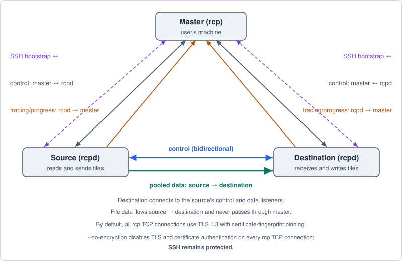
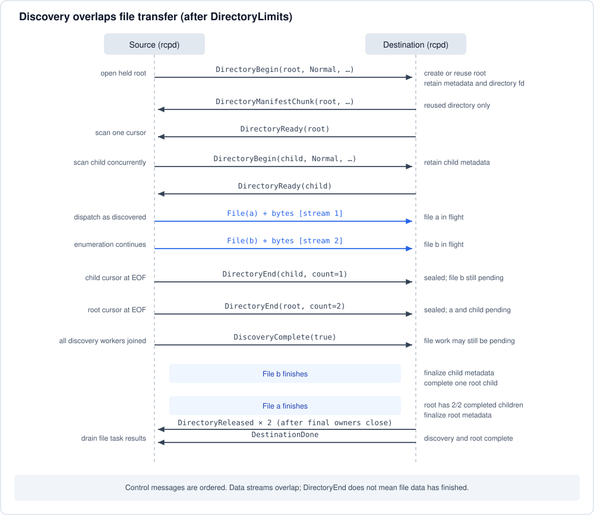
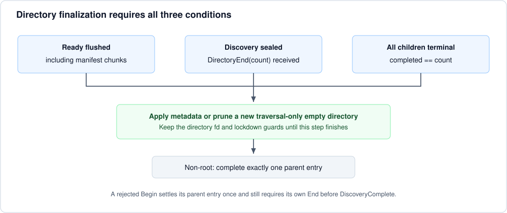
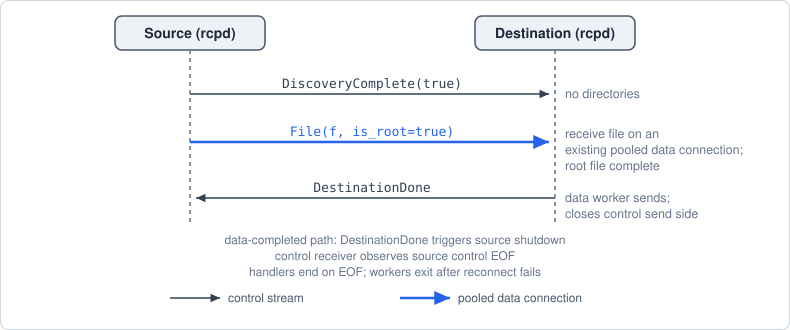
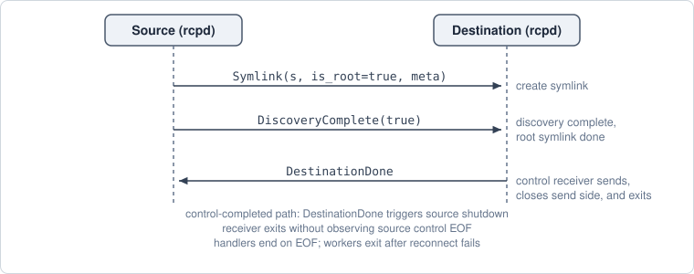
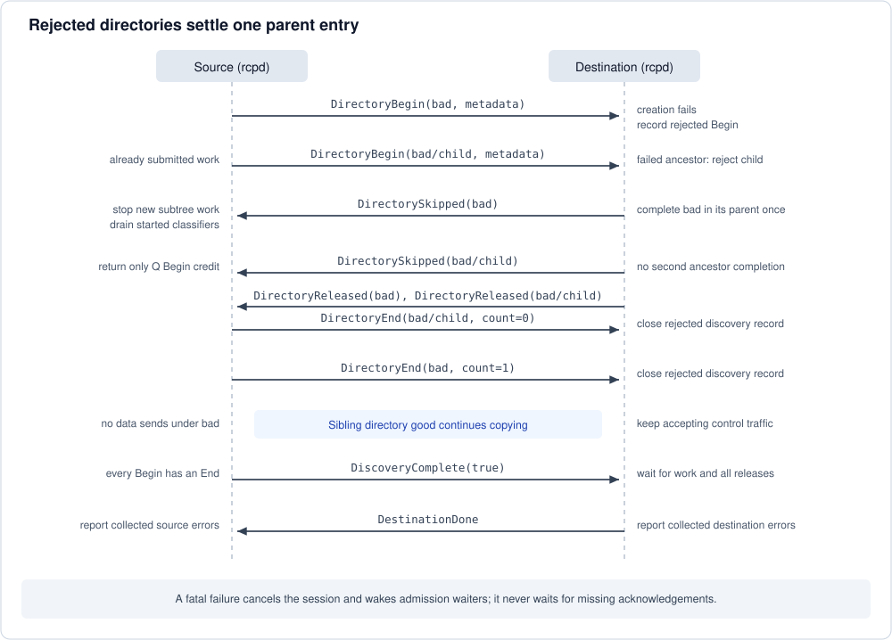
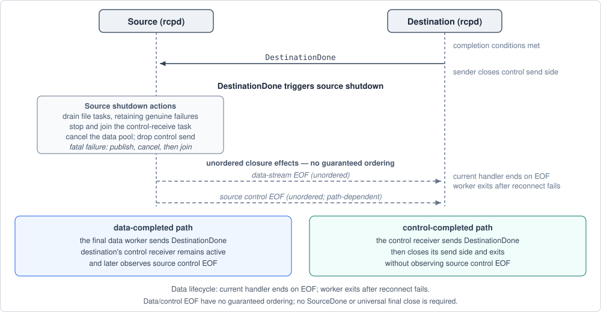
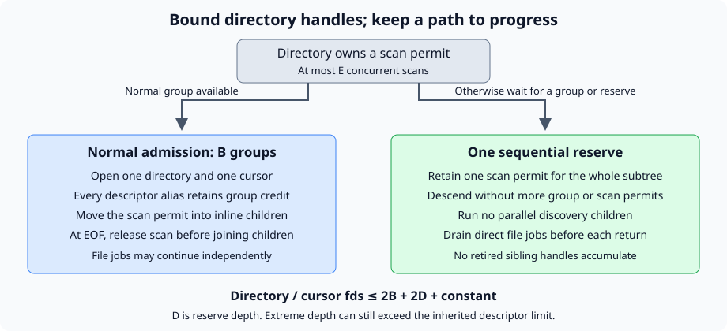

# Remote Copy Protocol Design Document

## 1. Architecture Overview

### 1.1 Three-Component Architecture

The remote copy system consists of three distinct components:

1. **Master (rcp)**: Coordinates the entire operation, runs on the client machine where the user
   invokes `rcp`
2. **Source (rcpd)**: Runs on the source host, responsible for reading and sending files
3. **Destination (rcpd)**: Runs on the destination host, responsible for receiving and writing files

### 1.2 Component Spawning and Lifecycle

**Spawning Sequence:**

1. User invokes `rcp user@host1:/src user@host2:/dst`
2. Master validates pure configuration, then prepares compatible source and destination rcpd
   endpoints. Equal `SshSession` values share one preparation; distinct endpoints may prepare
   concurrently.
3. Master spawns source rcpd via SSH: `ssh user@host1 rcpd --role=source --master-cert-fp=... ...`
4. Source creates a TCP listener and prints `RCP_TLS <addr> <fingerprint> <F> <E>` (or
   `RCP_TCP <addr> <F> <E>` when encryption is disabled) as the first stderr record. The master
   immediately opens source control and tracing connections.
5. Master constructs the destination configuration from source readiness, spawns destination rcpd,
   verifies its readiness reports the same `F/E`, and opens destination control and tracing
   connections.

**Propagated security flags:** When the master runs with `--require-toctou-safe`, it mirrors the
flag into each rcpd's spawn arguments (via `RcpdConfig::to_args()`). Each rcpd then arms strict
operand resolution before any filesystem work: its operand root/parent opens resolve with
`openat2(RESOLVE_NO_SYMLINKS)`, and it refuses to run on kernels without `openat2` (Linux 5.6+) —
the refusal is printed as a single line on stderr, where the master's handshake reader surfaces it.
The master lints the operands' strict form (absolute as written, lexically normal; `~`-relative
forms are rejected) before spawning. Note the asymmetry: the source's `MasterHello::Source` carries
both `src` and `dst`, so the source `rcpd` opens+validates its source parent up front, but
`MasterHello::Destination` carries **no path** — the destination `rcpd` learns the destination only
from the source's per-entry messages, so it validates its prefix only when it actually opens the
destination to write (a `--dry-run` or fully-filtered source writes nothing and therefore does not
separately validate it; see the strict-operand residual in [tocttou.md](tocttou.md)).
Version-matched rcpd binaries (see binary discovery in [remote_copy.md](remote_copy.md)) understand
the spawn argument.

**Source-owned file-work ceiling:** Let `F` be the logical file ceiling, `M` the configured
`--max-connections`, and `E = min(F, M)`. When `--max-files-in-flight` is omitted, the source `rcpd`
selects `F = max(std::thread::available_parallelism(), 4)` on the source host; the source readiness
record makes that decision authoritative for the destination. An explicit `F` remains
master-authoritative and becomes `--max-files-in-flight=N|unlimited` on both roles. Finite and
unlimited legacy input use a hidden typed forwarding argument, never the deprecated spelling; this
preserves `--max-open-files` provenance for clamp notices without repeating its deprecation warning.
Explicit or legacy unlimited yields `E = M`. The automatic destination uses a hidden
resolved-automatic argument that preserves automatic provenance while carrying source `F`.

The resolved `E` and pending capacity `P = E × pending-writes-multiplier` use checked arithmetic,
must be nonzero, and must not exceed `tokio::sync::Semaphore::MAX_PERMITS`. Explicit capacity can be
validated before remote-home expansion or SSH. For automatic capacity, the master validates the
configured connection upper bound before remote side effects; the source resolves and validates the
actual CPU-selected capacity before it announces readiness and before destination spawn. Wire
revision 10 covers directory discovery, pipelined directory lifetime admission, and preview-only
daemon startup. It requires exact-version rcp/rcpd binaries.

For normal copies, each daemon installs one joint leaf/directory resource plan before readiness
(§7.8). Insufficient known descriptor headroom produces a typed `RCP_ERROR` startup refusal with the
observed limit, stream count, and remedies; neither endpoint increases its inherited limit.

For dry runs, the master passes hidden `--preview-only` to both roles. Before readiness, each daemon
selects local leaf/metadata admission without reserving E data streams or N/R directory lifetimes.
Both roles validate that `MasterHello` carries the same preview policy before dispatching work.

**Special Case - Same Host Copies:** When source and destination are on the same host, the master:

- Discovers, verifies, and deploys rcpd only once (if needed)
- Starts two separate rcpd processes with different roles
- Both processes share the same SSH session but have distinct connections

**Auto-deployment compatibility:** Auto-deployment applies the same exact compatibility policy as
normal remote discovery at both boundaries. The master runs `--protocol-version` on each local
candidate in search order (beside `rcp`, then the local shell's POSIX `command -v rcpd`) and
continues to later candidates when one is stale, stalls its two-second version probe, or is
otherwise unusable. An ordinary local PATH miss is retained in the final searched-candidates
diagnostic. A timed-out local candidate has its pipes released and receives a kill request; the
invocation cleanup supervisor retains child ownership and reaps it while the search continues. The
selected local deployment payload is read on a cleanup-owned disposable OS worker under the same
configured bootstrap deadline and peer cancellation. A blocked filesystem syscall can finish later
on that worker, but it cannot retain Tokio runtime or remote-resource ownership. Remote discovery
uses the remote shell's `command -v rcpd` rather than an external `which`. Remote version probes,
including post-deployment verification, use the initiating `rcp` process's
`--remote-copy-conn-timeout-sec` deadline so slow-but-healthy hosts can be given an appropriate
budget without allowing a hanging SSH channel to block fallback indefinitely. The master names the
cache target with the accepted version's compatibility tag, transfers and publishes the binary, then
probes that deployed remote path before constructing either role's spawn command. Thus neither
co-location nor a current-looking cache filename is treated as proof that the binary implements the
current serialized and rcpd spawn contract. For distinct hosts, the first preparation failure
cooperatively cancels its peer without dropping owned work or replacing the original error. SSH
control-socket readiness uses the same configured deadline and one cancellation-aware filesystem
worker for its whole polling lifetime. Every read-only remote bootstrap command — HOME lookup,
executable checks, PATH discovery, and version probes — goes through one helper that requires that
per-stage timeout; expiry aborts and joins its local SSH-channel task. Remote cache cleanup is best
effort and uses the same bounded helper. Binary deployment uses the timeout for its HOME lookup, SSH
command, readiness marker, and each payload-write idle period, but not as a wall-clock limit on
transmitting the binary. Post-EOF checksum verification and publication use a bounded stage of at
least 60 seconds. On peer cancellation, the transfer gets a bounded grace to close stdin and finish
before its local SSH-channel task is aborted and joined.

The SSH multiplex master runs as a retained foreground `ssh -M -N` process; explicit
`ForkAfterAuthentication=no` and `ControlPersist=no` command-line overrides prevent user or system
SSH configuration from forking it away from its owner. Cancelling setup aborts that owner and
`kill_on_drop` terminates the actual connecting process. The configured SSH executable is resolved
inside a known-local shell child. Brackets that delimit IPv6 in an rcp operand are removed from the
direct OpenSSH host argument; leaving them in argv makes OpenSSH resolve the brackets as literal
hostname characters. After setup, commands open channels with the native OpenSSH multiplex protocol
over the retained control socket rather than synchronously spawning another local `ssh`, so their
configured deadline also covers exec-channel creation. A preparation guard owns the foreground child
and private control directory together until success transfers both to a cloneable managed session
through prepared and running daemon states. Whichever owner exits signals the master before
returning. The cleanup supervisor is created before any remote resource is accepted. Process reaping
is queued there, so it cannot block or depend on a Tokio runtime that may already be shutting down.
The supervisor normally dispatches blocking cleanup to a worker; worker-creation failure runs the
job on the supervisor rather than the original resource-owning submitter. A failed supervisor
channel tries an isolated worker and, if no worker can be created, leaks the job so the OS reclaims
its owned resources at process exit. Every reaper for an SSH master or an interrupted local
candidate must receive the cleanup scope's typed budget; its effective deadline is the earlier of
its per-job deadline and the invocation's shared final deadline. The common poll helper therefore
cannot spin forever on a child that never becomes reapable. The control directory is removed only
after the retained master is confirmed exited; expiry preserves it rather than deleting the socket
from under a possibly-live master. The master threads actual local operand roots through remote-HOME
lookup and endpoint preparation; canonical control-directory candidates inside those trees are
rejected, while remote-to-remote copies do not infer an exclusion from the working directory. The
filesystem root cannot exclude candidates because every absolute socket path lies beneath it. Nested
cleanup runs inside its parent cleanup worker, and separate invocations cannot drain one another's
workers. Before process exit, the CLI gives the scope one bounded budget to wait for its last
resource owner, supervisor, and every cleanup job; work still blocked after that grace is abandoned
with the process. Daemon waits run concurrently across endpoints while tracing receivers stay live,
then any remaining receiver tasks share one final drain deadline.

Normal daemon discovery does not require `HOME`: when it is absent, the deployed-cache candidate is
skipped and same-directory/PATH discovery continues. Remote `~` expansion and deployment into the
cache do require a usable `HOME`, so those operations fail with a targeted diagnostic instead of
constructing a path under `/`.

Deployment stages, verifies, and publishes through one remote `sh` transaction. Before anything can
create the unique temp path, that shell installs an `EXIT` trap which removes it. After directory
creation and opening the staging file on descriptor 3, it emits `RCP_DEPLOY_READY` on stdout. The
master bounds and validates that marker before sending payload bytes; bounded stdout preamble and
stderr are retained when setup fails. Checksum mismatch, transfer failure, SSH-channel disconnect,
and handled `HUP`/`INT`/`TERM` therefore all clean up in the same process that owns the writer. Only
a checksum-verified file reaches the final same-directory rename. Cancellation closes staging stdin
and waits briefly for the command while its owner drains both pipes; after that grace the local
SSH-channel task is aborted and joined. The configured timeout limits idle payload writes, not total
binary-transmission duration. The remote shell retains durable cleanup ownership independently of
the local Tokio task. A temp name surviving an unhandled remote termination is private to that
deployment and is never discovered, executed, or adopted by a retry.

**Startup stderr ownership and notices:** A successfully started daemon reserves its first stderr
line for exactly one readiness record. The master bounds both SSH exec-channel creation and that
read by `--remote-copy-conn-timeout-sec`, and rejects a record larger than 64 KiB. Chrome-trace,
flamegraph, Tokio-console, legacy-option, and explicit concurrency-clamp announcements are collected
until tracing is installed and emitted through the default-visible `rcp::notice` target. Remote
tracing queues daemon notices until the master connects, so they reach master output without
becoming readiness preamble. An intentional fatal startup refusal instead emits one
`RCP_ERROR <diagnostic>` record and exits, including configuration failures found before tracing is
installed. The master treats that typed record as a nested failure cause, closes its stdin, and
gives a directly owned reaper a bounded grace before returning. The SSH child and both output drains
remain lexically inside that timeout future, so grace expiry or caller cancellation drops them and
releases the managed session instead of detaching ownership. If startup fails without a typed
record, captured stdout and remaining stderr are attached to the handshake error. Arbitrary stderr
remains an invalid readiness record. After readiness, stdout/stderr collectors forward raw daemon
output at debug verbosity as it arrives and retain only a bounded tail. They are joined on daemon
completion, so a nonzero exit keeps diagnostics without allowing unbounded output to grow in memory
or leaving collector tasks detached. An explicit `F` reduced by `M`, an automatic `F` reduced by an
explicit `M`, an explicit `M` reduced by the source's `F`, or an explicit limit reduced by endpoint
descriptor safety produces a notice naming the requested and effective values. The ordinary
automatic/default intersection remains quiet. The master retains the source process before
attempting its control/tracing connections and waits for daemon cleanup if either connection fails.
It starts the source tracing receiver as soon as its tracing connection is established, before
destination configuration or startup. Every later startup and protocol exit closes the control
streams, waits for owned daemon processes, and gives tracing receivers a bounded drain, so
already-queued source notices remain visible alongside a destination failure rather than being
dropped during unwinding.

### 1.3 Connection Topology

The system uses a **triangle topology** with TCP connections:



<details>
<summary>Text transcript</summary>

The diagram distinguishes the SSH bootstrap from the rcp TCP connections and shows every
application-data direction:

1. Master uses SSH to start source rcpd. It reports its listener address, optional TLS fingerprint,
   logical file ceiling `F`, and effective stream count `E` back to master on SSH stderr.
2. Master opens source rcpd's bidirectional control TCP connection and separate tracing/progress
   connection, dropping the tracing send half.
3. Master starts destination rcpd with source `F/E`, verifies its readiness, and opens destination's
   control and tracing/progress connections in the same way.
4. Master sends `MasterHello::Source`; source returns `SourceMasterHello` and later `RcpdResult`.
5. Master sends `MasterHello::Destination`; destination later returns `RcpdResult`.
6. Destination opens the source/destination bidirectional control connection. Directory and symlink
   messages flow source → destination; manifests, directory acknowledgements, and `DestinationDone`
   flow destination → source.
7. For copy operations, destination also opens the pooled data connections to source. File headers
   and bytes flow only source → destination and never through master. A dry run uses only control
   connections and starts no destination data workers.

By default every rcp TCP connection uses TLS 1.3 and certificate-fingerprint authentication. The
`--no-encryption` option disables TLS and certificate authentication on every rcp TCP connection;
SSH remains protected and still launches rcpd and carries its listener announcement.

</details>

**Connection Details:**

1. **Master ↔ Source**: Two TCP connections (master connects to source rcpd's listener twice):
   - **Control**: Bidirectional, used for handshake and result reporting
   - **Tracing/progress**: One-way rcpd → master; master drops this connection's send half
2. **Master ↔ Destination**: Two TCP connections (master connects to destination rcpd's listener
   twice):
   - **Control**: Bidirectional, used for handshake and result reporting
   - **Tracing/progress**: One-way rcpd → master; master drops this connection's send half
3. **Source ↔ Destination**: Two TCP ports on source (destination connects to both):
   - **Control port**: Bidirectional TCP for directory metadata and coordination
   - **Data port**: A pool of TCP connections for file transfers (each connection is reused for
     multiple files)

**Connection Establishment Order:**

1. Source rcpd reports readiness; master opens its control connection and then its separate
   tracing/progress connection immediately.
2. Destination rcpd is configured from source `F/E`, reports matching readiness, and receives the
   corresponding two master connections.
3. Master sends `MasterHello::Source` to source rcpd with src/dst paths.
4. Source rcpd starts TCP listeners (control + data), sends `SourceMasterHello` back to master with
   both addresses
5. Master sends `MasterHello::Destination` to destination rcpd with source addresses
6. Destination rcpd connects to source's control port
7. Destination opens a pool of connections to source's data port; files are streamed over these
   pooled connections (the `size` field in each header delimits file boundaries)

### 1.4 Security Model

All TCP connections are encrypted and authenticated using TLS 1.3 with self-signed certificates and
fingerprint pinning. TLS 1.3 is pinned in the config (TLS 1.2 is never negotiated) — see the
[Cipher Suites](security.md#cipher-suites) section of security.md.

**Security Architecture:**

- SSH is used for authentication and rcpd deployment
- Each party generates an ephemeral self-signed certificate
- rcpd outputs its certificate fingerprint to stderr (read by master via SSH)
- Master distributes fingerprints to source/destination for mutual TLS authentication
- All TCP connections use TLS with certificate fingerprint verification

**Security Properties:**

- **Confidentiality**: All data encrypted with AES-256-GCM or ChaCha20-Poly1305
- **Authentication**: Certificate fingerprint verification prevents unauthorized connections
- **Forward secrecy**: TLS 1.3 ephemeral key exchange
- **Integrity**: AEAD ensures data cannot be tampered with

**Opt-out:**

- Use `--no-encryption` for trusted networks where performance is critical. It disables TLS and
  certificate authentication on every rcp TCP connection; SSH remains protected.
- See [security.md](security.md) for detailed threat model and best practices

### 1.5 Scoped Performance Timings

`--timings=PREFIX` is propagated to both daemons, which aggregate timing spans locally and write
their own `.timings.json` files on their respective hosts at shutdown. These measurements are not
sent over the tracing connection. Startup notices follow the existing readiness/logging rules.
`--timings-detail` enables per-file, metadata, and tracker scopes; ordinary copies collect neither
summaries nor elapsed timelines unless requested. `--chrome-trace` additionally produces a separate
`.scopes.json` elapsed timeline. See [the profiling reference](../README.md#scoped-timings) for the
schema and scope API.

The source scopes have these boundaries in both the hardened and dereferencing walks:

| Scope                                                                       | Measured interval                                                                                          |
| --------------------------------------------------------------------------- | ---------------------------------------------------------------------------------------------------------- |
| `source.discovery`                                                          | Root resolution through `DiscoveryComplete` submission.                                                    |
| `source.directory.scan`                                                     | Directory opening and metadata capture through Begin admission, enumeration, dispatch, and End submission. |
| `source.directory.wait_ready`                                               | Waiting for `DirectoryReady` or rejection.                                                                 |
| `source.directory.wait_release`                                             | Reserve admission waiting for ended siblings to release peer and local lifetime ownership.                 |
| `source.directory.wait_resources`                                           | Waiting for a normal directory group or the sequential reserve.                                            |
| `source.discovery.wait_credit`                                              | Waiting for unacknowledged Begin admission.                                                                |
| `source.files.drain`                                                        | File-task and destination completion after discovery.                                                      |
| `source.file.wait_stream`, `source.file.wait_open`, `source.file.wait_iops` | Detailed waits for stream, open-file, and IOPS admission.                                                  |
| `source.file.open`, `source.file.send`                                      | Detailed data-file opening and sending.                                                                    |

The destination's detailed scopes use the `destination.file` prefix: `wait_open`, `wait_rate`,
`parent`, `plan`, `wait_iops`, `create`, `receive`, `flush`, `metadata`, `drain`, and `complete`.
These cover file and rate admission, parent resolution, destination classification, IOPS admission,
creation, payload reads and writes, flushing, metadata, discarded payloads, and tracker completion
respectively. Completion includes waiting for the tracker and any resulting directory finalization.
A creation race can produce a second plan or create sample.

The destination's coarse per-directory manifest scopes separate build admission, inventory, and
publication. `destination.manifest.wait_build` measures acquiring the manifest-build semaphore.
`destination.manifest.inventory` covers the cap check, capped enumeration, and child metadata
lookups for a reused directory, including empty fallback results. `destination.manifest.flush`
covers chunking, send-lock acquisition, all manifest chunks, and the Ready flush, including
announcements with an empty manifest. It ends after releasing the send lock, before tracker
bookkeeping or resulting directory finalization. The build permit spans announcement and any
resulting inline finalization.

`destination.directory.prepare` covers trusted root-parent resolution and directory creation or
reuse, including lockdown and metadata admission. Nonroot parent dependencies and A admission occur
outside this scope. It ends before tracker registration and Ready publication; directories rejected
because an ancestor failed have no preparation sample. Independent preparations overlap, so their
cumulative duration is not serial control-reader wall time. `destination.directory.wait_parent`
measures secured-parent dependency waits (also for symlinks), `destination.directory.wait_prepare`
measures A preparation admission, and `destination.directory.wait_job` measures control-reader
backpressure at the P owned-job limit.

`destination.directory.finalize.control`, `.announce`, and `.data` measure claimed finalization
cascades triggered by control messages, Ready publication, and data-worker completion respectively.
Each sample starts after the initial claim and includes filesystem finalization and ancestor
bookkeeping. The control receiver sends release and Done messages outside these scopes. Calls
without an eligible claim produce no sample; counts represent cascades, not directories. Scope
creation and recording run outside the tracker mutex. Control-triggered finalization occupies the
serial control reader. Preparation and announcement-triggered finalization run in owned directory
jobs; rejection-triggered finalization uses the same `.announce` origin. Directory-job and
data-triggered finalization can overlap other work.

`destination.tracker.access` measures synchronous access to the shared directory-tracker state,
including mutex acquisition and short bookkeeping. Its sample is recorded after unlocking, so timing
aggregation never holds the tracker mutex. `destination.directory.finalize.metadata` measures
applying final directory metadata; `destination.directory.finalize.prune` measures each attempt to
remove an empty traversal-only directory. A failed removal, including a nonempty directory, finishes
its prune scope and proceeds to metadata application. Prune counts are attempts, not counts of
removed directories. Each finalization attempt has its own sample, including ancestors completed by
a child. Finalization runs outside the tracker mutex in the caller that claimed it.

Shared `source.metadata.<operation>.<phase>` and `destination.metadata.<operation>.<phase>` scopes
separate rate admission, concurrency admission, and execution; the blocking helper also records
worker queueing. Their [phase definitions](../README.md#scoped-timings) also describe cancellation
boundaries. Filesystem execution includes closure work and can overlap the higher-level file or
directory scopes.

`operation` covers each process's main operation; `local.copy` covers each local copy invocation.
Interrupted scopes report their interruption. Durations include async suspension and can overlap;
they are cumulative rather than additive wall time. Compare scan and wait scopes with the elapsed
timeline when assessing concurrency.

When branch admission is full, `source.directory.scan` also includes sequential descendant work.

## 2. Protocol Messages

### 2.1 Handshake Messages

**`MasterHello`** (Master → rcpd, bidirectional stream)

- **Purpose**: Provide configuration and connection details. This is the ONLY message the master
  ever sends on this connection; it then holds the connection open to await `RcpdResult`, and each
  rcpd keeps a reader on it as a liveness watchdog for the whole operation (§6.3).
- **Variants**:
  - `Source { src, dst, dest_cert_fingerprint, filter, dry_run, capture }`: Tells source rcpd what
    to copy
    - `filter`: Optional filter settings for include/exclude patterns (source-side filtering reduces
      network traffic)
    - `dry_run`: Optional dry-run mode (brief, all, or explain) for previewing operations without
      transferring files
    - `capture: ExtendedMetadataCapture { file_acl, dir_acl, root_acl_notice }`: what EXTENDED
      metadata the source must read beyond the `stat` it already does — currently POSIX ACLs. The
      first two are per-entry reads whose bytes are sent; `root_acl_notice` buys one read on the
      ROOT whose only product is a log line. See §2.5.
  - `Destination { source_control_addr, source_data_addr, server_name, preserve, source_cert_fingerprint, dry_run }`:
    Tells destination where to connect (both control and data addresses). Note: empty directory
    cleanup decisions are communicated per-directory via `keep_if_empty` in `DirectoryBegin`
    messages rather than a global flag.
    - `dry_run`: The master's explicit preview-only policy. Destination starts no data workers and
      waits for `DiscoveryComplete(false)` over control, then sends `DestinationDone`. Source must
      receive that acknowledgement; premature control EOF is a failure. The data connection timeout
      does not limit dry-run traversal.

**`SourceMasterHello`** (Source → Master, bidirectional stream)

- **Purpose**: Provide source's TCP server details for destination to connect
- **Fields**: `control_addr`, `data_addr`, `server_name`

**`RcpdResult`** (rcpd → Master, bidirectional stream)

- **Purpose**: Report final success/failure status and statistics
- **Variants**:
  - `Success { message, summary, runtime_stats }`
  - `Failure { error, summary, runtime_stats }`

### 2.2 Source → Destination Messages (Control Stream)

**`DirectoryBegin { src, dst, metadata, is_root, keep_if_empty, admission }`** opens one directory
discovery record. `admission` is `Normal` or `Reserve`, charged against the corresponding negotiated
directory lifetime capacity (§7.8). The source captures metadata and ACLs from the held directory
before sending Begin, and flushes the parent's Begin before work that can send descendants. The
destination validates lifetime admission and reserves the identity and root claim before filesystem
work, then runs an owned directory job. Admission does not wait for descriptor capacity in the
control reader: an over-capacity or invalid reserve Begin is a protocol error. At most P jobs remain
owned, including finished jobs awaiting reaping, parent waits, announcements, and immediately
eligible finalization. Each job waits for its parent's secured creation or rejection before
acquiring one of the destination's A preparation slots (§7.8). Secured publication installs the held
directory descriptor and reused-directory lockdown before waking children, independently of Ready.
Preparation releases its slot before manifest building, replies, or finalization. Pending jobs
retain early End and child outcomes and may commit after DiscoveryComplete. No job waits for a
future End or child outcome to release P.

`keep_if_empty` retains roots, direct filter matches, reused directories, and ordinary unfiltered
empty directories; a new directory traversed only to find filter matches can be pruned if empty
after completion.

**`DirectoryEnd { src, dst, entry_count }`** seals that directory's discovery. `entry_count` is the
checked number of admitted direct-child obligations, including children that later fail. It excludes
entries filtered or rejected before admission. End follows submission of all its direct children; an
admitted child directory's Begin can arrive after its parent's End. End does not imply that file
data or child directory finalization has finished.

**`DiscoveryComplete { has_root_item }`** closes structural discovery after all directory workers
have joined, every Begin has an End, and no worker can submit more directory or symlink messages.
Files can still be in flight. A dry run or filtered root sends `has_root_item=false`. A root file
can send its data header after `DiscoveryComplete(true)`.

**`Symlink { src, dst, target, metadata, is_root }`** reports a discovered symlink. A nonroot
outcome completes one admitted parent entry. A root outcome completes root processing. Target-read
failures occur before admission: nested failures are collected without increasing the parent count,
while a root failure aborts. The receiver handles one symlink inline, waiting for its already
admitted parent's secured creation or rejection; independently driven directory jobs keep this
bounded wait progress-safe without retaining a symlink queue.

**`FileSkipped { src, dst }`** completes one admitted child whose type can no longer be asserted or
whose file cannot be opened before a data header starts. This includes an admitted nested directory
that cannot be opened or described. A root-file pre-header failure aborts. Once a file header may
have started, a send failure is fatal and cannot be compensated by a skip.

**`FileUnchanged { src, dst }`** completes one admitted file whose destination manifest entry calls
for a successful skip; the destination records `files_unchanged`. No data is sent.

Control messages are serialized and flushed at progress boundaries (§7.4). Sibling directory
discovery, file streams, and control replies may interleave. The source admits each child and
increments its parent's final count in one step, so each admitted entry has exactly one terminal
obligation or causes a fatal session abort.

### 2.3 Destination → Source Messages (Control Stream)

**`DirectoryLimits { normal, reserve }`** is the initial framed object on a normal copy's
destination-to-source control stream, before any `DestinationMessage`. Both capacities are nonzero;
the source also requires normal capacity of at least two, leaving room for a scan and a pending file
parent. It intersects these capacities with its own endpoint limits before admitting directories.
Dry runs omit this header and perform no directory lifetime admission.

**`DirectoryManifestChunk { dst, entries }`** carries destination entries from a reused directory
for unchanged-file comparison. Each chunk fits the 8 MiB framed-control limit. Chunks and the
matching `DirectoryReady` are contiguous under one send-stream lock hold, so Ready means the source
has the complete manifest. Different directories may announce in any order. Manifest building runs
outside the control receive loop, with one build slot and the configured
`--overwrite-manifest-max-entries` cap (default 5,000,000). Within that builder, at most the
destination leaf capacity A child lookups run concurrently. Each lookup acquires PendingMeta
admission and classifies through a held child descriptor; only owned metadata enters the manifest.
Started blocking lookups retain their admission until any abandoned descriptor output closes. Entry
order can vary, and failed child lookups are omitted so the source transfers those entries. A zero
cap, failed enumeration, or over-cap directory starts no child lookups. The build permit remains
held through manifest/Ready publication and resulting inline finalization. Fresh directories,
inactive comparison modes, and directories above the cap send no chunks. A failed announce task or
caught unwind panic publishes a fatal error and cancels the receiver promptly; it cannot leave a
source waiting indefinitely for Ready. Parent and capacity waits observe teardown. On source control
EOF, outstanding directory jobs are aborted and joined if Done has not completed; EOF never drains
pending creation into a successful transfer.

**`DirectoryReady { src, dst }`** says the directory was created or reused and can receive file
data. Its manifest chunks have already been flushed. File jobs wait for their own directory's Ready
before comparison or data open. Directory and symlink discovery can proceed without parent Ready.
The destination marks Ready flushed before considering that directory complete, even if End and all
children have already arrived. Ready returns the source's Q-bounded unacknowledged-Begin credit, not
its directory lifetime credit.

**`DirectorySkipped { src, dst }`** rejects a Begin whose creation failed, whose ancestor was
rejected, or whose existing non-directory is retained by `--ignore-existing`. In a live session the
destination sends exactly one Ready or Skipped per Begin. On fatal teardown the control connection
can close instead; source admission and readiness waiters are closed so no task waits for an
acknowledgment that will never arrive. A rejected Begin settles one entry in its successful parent.
The destination records exact rejected Begins and failed ancestor prefixes. Each already submitted
descendant Begin receives its own Skipped, and each rejected Begin still needs one End. Neither
descendant outcomes nor End settle the ancestor a second time.

**`DirectoryReleased { src, dst }`** returns the destination's share of a directory lifetime credit.
For an accepted directory it follows logical finalization and closure of the last held directory
descriptor or alias, including blocking operations and rollback guards. For a rejected directory it
follows rejection and closure of any preparation or rollback descriptors; its End may still be
outstanding. Skipped, like Ready, returns only the separate unacknowledged-Begin credit. The source
reuses lifetime capacity only after both this release and its own last descriptor owner have
released their shared credit. Unknown, mismatched, or duplicate releases are protocol errors. Fatal
teardown may close control without sending outstanding releases. Local descriptor owners still
retain their leases through closure; source admission gates close instead of waiting for those
acknowledgements.

**`DestinationDone`** is sent once after valid discovery completion, terminal root processing, and
completion of every accepted directory, with every admitted Begin's Ready or Skipped flushed. The
control receiver is its sole sender and first flushes every DirectoryReleased. Directory jobs and
data workers notify logical completion but never send Done. The acknowledgement gate survives
compaction of rejected-directory discovery history. Done triggers source shutdown; a fatal error
cannot be replaced by Done.

**Fatal connection and framing rules.** Before completion, clean data-header EOF and transport peer
closure are fatal truncation, including TLS closure without `close_notify`; either is benign only
after logical completion or once teardown is underway. Final success additionally requires Done to
have been sent and its stream closed successfully. Invalid or oversized header frames, decode
errors, TLS protocol faults, and short file bodies are fatal. The destination reports incomplete
transfer as failure even if no specific operation error was recorded, preserving a known connection
failure when available. A fatal data-worker error promptly closes the destination control send side
so a source waiting on Ready or admission wakes. TLS handshakes and data connection attempts retain
configured deadlines and teardown cancellation. Errors are published before awaited cleanup; a
failed stream close cannot mask the original send error.

### 2.4 File Transfer Messages (Data Connections)

**`File`** (Source → Destination, on data connections)

- **Purpose**: File header followed by raw file data
- **Fields**: `src`, `dst`, `size`, `metadata`, `is_root`
- **Format**: Length-delimited serialized header, then raw bytes (exactly `size` bytes)
- **Connection model**: Connections are pooled and reused for multiple files. The `size` field
  delimits file boundaries within a connection. Destination reads headers in a loop until EOF.

Remote file data is always streamed as bytes between `rcpd` processes. Consequently,
`--reflink=auto` and `--reflink=never` have the same remote behavior, and the option adds no field
or other change to the wire protocol.

### 2.5 Entry Metadata and POSIX ACLs

Every message that describes an entry (`DirectoryBegin`, `Symlink`, `File`, and each `ExistingEntry`
in a `DirectoryManifestChunk`) carries a `Metadata`:

```rust
struct Metadata {
    mode: u32, uid: u32, gid: u32,
    atime: i64, mtime: i64, atime_nsec: i64, mtime_nsec: i64,
    acls: WireAcls,
}

enum WireAcls {
    /// No ACL information at all: not captured, or unreadable at the source.
    Unknown,
    /// Read from the source entry: authoritative, including the "has none" case.
    Captured {
        access:  Option<Vec<u8>>,   // system.posix_acl_access
        default: Option<Vec<u8>>,   // system.posix_acl_default (directories only)
    },
}
```

**The ACL fields carry the SOURCE kernel's bytes verbatim.** They are never parsed, rebuilt or
reordered in flight. POSIX.1e requires canonical entry order (`USER_OBJ`, named users by ascending
uid, `GROUP_OBJ`, named groups by ascending gid, `MASK`, `OTHER`) and the kernel rejects anything
else with `EINVAL`, so passing through what the source kernel already validated sidesteps the
problem entirely. The on-disk format is defined little-endian (`__le16`/`__le32`), so it is portable
across hosts as-is; the destination kernel validates on `fsetxattr`. rcp requires an exact rcp/rcpd
version match (see [remote_copy.md](remote_copy.md)), so adding these fields has no back-compat
cost.

**`Captured` with `None` means "the source has no such ACL", which the destination reproduces by
REMOVING the attribute — not by leaving the destination alone.** A destination directory's default
ACL is inherited by every entry created beneath it, including ones rcp creates itself, so "do
nothing when the source has no ACL" would hand the copy permissions the source never granted.

**`Unknown` means the wire carries no ACL information, and the destination must NOT touch the
destination entry's ACLs.** It arrives in exactly two situations: the master never asked for ACLs
(`capture.file_acl` / `capture.dir_acl` both false — the destination's `preserve` then never applies
them either; `capture.root_acl_notice` is irrelevant here, since it buys a log line and never
populates a `Metadata`), or the source COULD NOT read them (a committed directory that failed to
open — that entry's copy is already recorded as an error on the source). The distinction from
`Captured` all-`None` is load-bearing: collapsing the two turns a source-side read failure into an
authoritative clear, permanently stripping a REUSED destination directory's access and default ACLs
on a copy that is already failing. The destination implements `Unknown` by disabling ACL
preservation for that one entry's metadata application; for a strict-mode locked reused directory
that restores the directory's ORIGINAL default ACL (the lockdown snapshot) — the same outcome as
`d:acl` off.

**Which messages actually carry ACLs:**

| message                                                              | carries                    | why                                                                                                                                 |
| -------------------------------------------------------------------- | -------------------------- | ----------------------------------------------------------------------------------------------------------------------------------- |
| `File`                                                               | access only, when captured | read from the SAME fd whose bytes are sent, so permissions and contents cannot desync                                               |
| `DirectoryBegin`                                                     | both, when captured        | read from the held directory: `O_NOFOLLOW` in hardened mode, the following cursor in `-L` mode; the default ACL governs inheritance |
| a committed-but-unreadable directory whose ENUMERATION failed (§7.1) | both, when captured        | the directory itself was reachable — only `getdents` failed — so it answers the probe like any other                                |
| a committed directory that could not be OPENED at all (§7.1)         | `Unknown`                  | no fd to read them from and no honest answer to give: the destination leaves the destination directory's ACLs untouched             |
| `Symlink`                                                            | nothing                    | the kernel has no symlink ACL; the settings parser rejects `l:acl`                                                                  |
| `ExistingEntry` (manifest)                                           | `Unknown`                  | the manifest answers `--overwrite-compare`, which has no `acl` term — see the hole below                                            |

Reading a source entry's ACL from the same fd as its payload is the same read-side fidelity rule the
rest of the source walk follows (Guarantee 2 in [tocttou.md](tocttou.md)): a probe by path could be
answered by a different inode than the one whose bytes and metadata are on the wire, pairing one
entry's permissions with another's contents. The `-L`/`--dereference` adapter obtains directory
metadata by path, while ACL capture uses its held enumeration cursor without another open. The
cursor retains directory admission through started ACL syscalls, including cancellation. Its earlier
metadata snapshot is not bound to that cursor.

**A failed ACL read FAILS the entry; it never degrades to "no ACL".** Because `None` means CLEAR,
sending it for an ACL the source could not read would make an `EMFILE`, `EACCES` or `ENOENT` STRIP
the destination's ACLs — including a directory's default ACL, which then governs everything created
beneath it. That is strictly worse than failing, and it mirrors the destination's rule for the same
situation in the other direction (a destination that cannot HOLD an ACL fails the entry rather than
dropping it quietly).

A failed ACL read before admission records an error without adding a child obligation. After
admission, a failed nested file or directory sends one `FileSkipped` if no header has started; a
root without a trustworthy message aborts. An ACL read from an opened file data fd that fails before
its header follows the same skip route. No failure is converted into an authoritative ACL clear.

**`MasterHello::Source { capture: ExtendedMetadataCapture { file_acl, dir_acl, root_acl_notice } }`.**
Only `MasterHello::Destination` carries `preserve`, so without this field the source could not know
whether ACLs are wanted and would have to probe unconditionally — a syscall per entry that `stat`
cannot fold in, on every remote copy including ones that do not want ACLs. With every field false
the source issues no xattr syscall at all — except under `--require-toctou-safe`, which arms the
root notice from the source's own mirrored flag rather than from here, so a strict run still pays
the one root `listxattr` on an all-false capture. Nothing per-entry is reachable that way: only
`file_acl` and `dir_acl` open that door.

`root_acl_notice` arms the one-per-run source-root probe behind the notice in
[acls.md](acls.md#the-source-root-warning), and is independent of the two per-entry flags in both
directions: it is set when the master's `preserve` asks for metadata fidelity **at all**, whereas
they are set when it asks for `acl` specifically — which is exactly the case where there is nothing
to warn about. A remote copy left at the shipped default clears all three. `--require-toctou-safe`
arms the notice too but does not travel here: it reaches the source `rcpd` as its own mirrored flag
and is read from the process-global strict state on the host that runs the probe.

`capture` is deliberately NOT the whole `preserve` struct. The source decides only what to **read**;
the destination remains the sole authority on what is **applied**. Handing the source a `preserve`
would invite a later reader to act on, say, `preserve.file.mode_mask` source-side, which would be a
bug. The master derives `capture` from the same `preserve` it sends the destination, at one call
site, so the two cannot disagree — which matters, because the destination reads an all-`None`
`Metadata` as "clear", so a capture that said `false` under a `preserve` that said `true` would
strip every ACL instead of copying it. This is a wire-format change, not a spawn-argument one.

**Application (destination).** File ACLs are applied through the created file's own fd in
`process_single_file`, directory ACLs through the directory's own held fd when it completes
(`DirectoryFinalization::execute`). Both go through the shared appliers
(`common::safedir::set_file_metadata_fd` / `set_reused_dir_metadata_fd`), so the remote path
inherits the local one's ordering rule: an access ACL is the step that WIDENS the destination from
its owner-only create mode, so it runs last and the `fchmod` before it is narrowed to carry only the
special bits (see §5 and [tocttou.md](tocttou.md)). Neither is a new protocol message: the wire
change is confined to the two `Metadata` fields and the `capture` field.

**Not on the wire: the destination's own containment.** Under `--require-toctou-safe` the
destination `rcpd` also strips the ACLs of every directory it creates and snapshots/restores the
default ACL of every directory it reuses, so nothing created beneath one inherits. That is
destination-local behavior driven by the mirrored flag, not by any message, and it applies whether
or not `capture` asked the source for anything. See [acls.md](acls.md) and [tocttou.md](tocttou.md).

**Known hole (unchanged by ACL transport):** a file the manifest shows as identical under
`--overwrite-compare` (default `size,mtime`) is not transferred and keeps its old destination ACL.
This is the same shape as `mode`, which the default comparison also ignores.

The whole ACL model — both widening directions, the measured costs, the apply ordering and the
strict-mode invariant — lives in [acls.md](acls.md); this section covers only what crosses the wire.

## 3. Error Communication

The source sends a terminal message for each admitted child it can finish or skip safely.
`FileSkipped` is the generic pre-header outcome for a child whose type cannot be asserted, including
a failed nested-directory open. `FileUnchanged` records a successful manifest skip. A failure after
a file header may have started corrupts that stream and aborts the session; there is no compensating
skip. The source publishes the original error before stream cleanup. A lost child obligation, worker
panic, canceled worker, invalid protocol state, or control-send failure is fatal. In `panic=abort`
builds, a panic terminates the process; asynchronous cleanup applies to returned errors,
cancellation, and caught unwind panics.

The destination records file, symlink, and directory metadata errors locally and continues under
collect-errors policy. Under `--fail-early` it aborts and promptly signals the source through
control closure. Ready or Skipped is the destination's response to each Begin during a live session;
a hard abort may close the stream before that response. Source readiness waiters then wake with the
published failure. The destination's result remains authoritative for its own filesystem failures;
shutdown symptoms do not replace a recorded cause.

A root that cannot be described or opened sufficiently to send a trustworthy Begin or root file
header aborts. A classified root directory whose data-directory open fails can use the committed
unreadable-directory Begin/End(0) route in collect-errors mode (§7.1). Root classification is
performed once and its snapshot drives filtering, dispatch, and `has_root_item`.
`DiscoveryComplete(false)` represents a dry run or filtered root. Destination rejection of a root
directory or failure to create a root symlink is terminal, allowing valid discovery to finish with a
nonzero result.

## 4. Protocol Flow

### 4.1 Directory Copy Flow



<details>
<summary>Text transcript</summary>

This trace has a root file `a` and a child-directory file `b`. Destination has sent DirectoryLimits
and data connections are already available. Source admits and opens the held root, then sends
`DirectoryBegin(root, Normal)`. If the destination reuses it, its manifest chunks precede
`DirectoryReady(root)`. Source can scan the root while the response is in flight. It sends
`DirectoryBegin(child)`, receives `DirectoryReady(child)`, then sends `File(a)` and `File(b)` on
separate data streams as enumeration continues.

At each cursor's EOF the source sends `DirectoryEnd(child, count=1)` and
`DirectoryEnd(root, count=2)`. It sends `DiscoveryComplete(true)` after the discovery workers join.
File `b` can finish afterward; the destination then applies child metadata and completes one root
entry. File `a` finishes, making the root's completed count 2/2; destination applies root metadata.
As their final descriptor owners close, the control receiver flushes DirectoryReleased for both
directories before sending `DestinationDone`. End seals a count, not a data stream.

</details>

### 4.2 Directory Completion



A successful directory finalizes only after Ready and any manifest chunks have been flushed, End has
sealed its direct-child count, and exactly that many children are terminal. The destination keeps
its held directory fd and strict-mode lockdown/default-ACL guards through metadata application or
pruning. Finalization then completes exactly one entry in its parent. DirectoryReleased waits for
the final descriptor owner, including any rollback work, to close. A rejected Begin settles its
parent once and still requires its own End, independently of its lifetime release.

### 4.3 Single File Copy



<details>
<summary>Text transcript</summary>

Destination pre-opens pooled data connections. Source sends `DiscoveryComplete(true)`, then the root
`File` header and bytes on a pooled stream. Destination finishes the file and sends
`DestinationDone`. Source shuts down its data pool and control send side. Destination data handlers
end on EOF and their workers exit after reconnect fails. Data and control EOF have no guaranteed
order.

</details>

### 4.4 Single Symlink Copy



<details>
<summary>Text transcript</summary>

Source sends `Symlink(s, is_root=true)` and `DiscoveryComplete(true)` on the control stream.
Destination creates the link, marks the root terminal, then sends `DestinationDone`. The idle data
handlers end during source shutdown.

</details>

### 4.5 Failed Directory Handling



<details>
<summary>Text transcript</summary>

The parent has admitted `bad` and a sibling `good`. Source sends `DirectoryBegin(bad)` and an
already submitted `DirectoryBegin(bad/child)`. Destination rejects both with their own
`DirectorySkipped` replies. Rejection of `bad` completes its parent entry once; the descendant
rejection does not complete that ancestor again. Source stops new work under `bad`, drains started
classifiers, and sends `DirectoryEnd(bad/child, count=0)` followed by `DirectoryEnd(bad, count=1)`.
The sibling continues copying. After every Begin has its End, source sends
`DiscoveryComplete(true)`. Destination waits for remaining admitted work and flushes all lifetime
releases, then sends `DestinationDone`. A fatal failure cancels the session and admission waiters
rather than waiting for missing acknowledgments.

</details>

## 5. Directory Completion and Validation

The destination keeps one typed record per accepted directory. A pending record advances through
Preparing, Secured, and Announced; Secured and Announced own the held fd, metadata, creation
outcome, and rollback guard together. Discovering or Sealed child counts remain independent of that
phase. Finalization moves the complete resource bundle into its job and leaves a Finalizing identity
in the tracker. Each pending parent retains the names of its finalized direct-child directories to
reject duplicate Begins; those names are released when that parent finalizes. Exact rejected Begins
remain until discovery validation, and minimal failed-subtree prefixes classify late outcomes. Valid
`DiscoveryComplete` releases all structural history, retaining only failed prefixes needed by
outstanding data work. Finished tracker records retain no fds or metadata; other descriptor owners
keep their lifetime admission until they close.

| Event                          | Effect                                                                                                                        |
| ------------------------------ | ----------------------------------------------------------------------------------------------------------------------------- |
| `DirectoryBegin`               | Admit the lifetime and reserve identity before asynchronous creation; children wait for secured parent creation or rejection. |
| `DirectoryReady` flushed       | Open the completion gate after any manifest chunks are on the wire.                                                           |
| `DirectoryReleased` flushed    | Return peer lifetime capacity after finalization or rejection and the last descriptor owner closes.                           |
| `DirectoryEnd(count)`          | Seal discovery; reject a missing or duplicate Begin/End, overflow, or count below already completed children.                 |
| File, skip, unchanged, symlink | Complete one admitted direct child, never exceeding a sealed count.                                                           |
| Child directory finalization   | Complete one parent child after its own metadata/pruning; rejection completes the parent once immediately.                    |
| `DiscoveryComplete`            | Validate that every accepted and exact rejected Begin has End; close structural admission.                                    |

An accepted directory finalizes precisely when Ready is flushed, End has sealed it, and
`completed == expected`. End, last-child, and Ready-flushed handlers all check this condition,
including when they run in either order. A successful claim moves the directory into Finalizing,
reserving its identity while an owned job retains its held own/parent descriptors, metadata, and
complete lockdown guard. Only successful completion of that job advances its parent. Finalizing
paths reject duplicate or late Begin, End, Ready, and child outcomes, including new children beneath
a finalizing parent. DiscoveryComplete can validate the already sealed finalizers while they run.
Cancellation or failure leaves the obligation incomplete and latches teardown; collect-errors
metadata failures still commit after recording their cause. Finalization runs in the claiming
caller.

Tracker bookkeeping uses closure-confined synchronous state access. Filesystem work, control sends,
and ACL recovery happen outside its mutex. The announce path releases the send lock before recording
Ready-flushed. Incomplete discovery on connection loss is fatal; no count or metadata is invented to
turn it into success. Duplicate discovery markers and structural messages after DiscoveryComplete
are protocol errors. The marker can precede a pending Ready or file completion. A false
`has_root_item` is invalid after an observed root; a true value still permits the root file header
to arrive later. Root admission is exclusive across entry kinds and streams: a duplicate root is
rejected before its filesystem work begins. A directory claims its root slot before creation or
reuse.

The destination retains each accepted directory's held fd, source metadata, and strict-mode
lockdown/default-ACL guard until finalization. A new directory stays private until its final
metadata is applied. Under `--require-toctou-safe`, a reused directory is inode-rechecked, taken
over with `fchown` and owner-only `fchmod` (preserving setgid where required), and re-statted before
children are written. Its original owner components and default ACL are captured and restored as
required at finalization. A failed takeover rejects the Begin in collect-errors mode or aborts under
`--fail-early`. Directory metadata errors are collected and parent completion continues unless
fail-early is active. A new traversal-only empty directory is pruned only after all children finish;
roots, explicit matches, reused directories, and ordinary unfiltered empty directories remain.

Destination files are created at `0o600` through their pinned parent and receive final mode only
after all bytes are written and flushed. The root is terminal after its own file, symlink, or
directory outcome. `DestinationDone` is sent once only when discovery is valid, the root is
terminal, no accepted directory is pending or finalizing, and all lifetime releases have flushed.
Structural validation detects count and ordering errors but still relies on version-matched peers to
produce one terminal event per admitted entry; the wire protocol has no per-file IDs or retry
guarantee.

## 6. Connection Lifecycle

### 6.1 Shutdown Sequence

Shutdown is initiated by the protocol message and completed through stream closure:



<details>
<summary>Text transcript</summary>

After valid discovery, root-item, pending-directory completion, and flushed lifetime releases, the
destination control receiver sends `DestinationDone` and closes its control send stream.
`DestinationDone` triggers source shutdown; the source drains its admitted file tasks and preserves
any genuine error they return. It stops and joins the control receiver, then scheduler teardown
cancels the data pool and drops the control send stream. A fatal failure publishes the original
cause, closes admission, and cancels the data pool before joining blocked senders.

EOF ends each current data-stream handler. Its worker exits when shared receiver cancellation or a
failed reconnect stops `DataConnectionPool::connect`. Data-stream EOF and source control EOF have no
guaranteed ordering at the destination.

Data workers and directory jobs publish logical completion to the control receiver. The receiver
services descriptor-release notifications while retaining the same pending framed read. After each
successfully handled source frame, it sends up to 64 queued release frames with one final flush so
ready control traffic cannot starve lifetime credits. A batch never waits for more releases;
lifetime bookkeeping commits only after the flush succeeds. After that flush it returns to the
receive-first selection before considering Done, preserving buffered framing/protocol error
priority. It flushes all releases, sends Done, and exits without requiring source control EOF. There
is no application-level `SourceDone` message or universal bidirectional EOF handshake.

</details>

The Done lifecycle distinguishes Open, Sending, Sent, and Failed. Only the control receiver claims
Sending, after logical completion and all lifetime releases, with no teardown latched. A sticky
completion notification wakes it when a worker finishes the final item. Sent commits while the
writer is held, only after both the Done frame and control-stream close succeed. A send/close error
returns its original cause once; failure or cancellation latches Failed before unlocking the writer.
Cleanup never retries a potentially partial Done frame.

Before returning, the control receiver always joins its owned directory jobs: it drains them after
successful Done, or latches teardown and aborts and joins them on EOF, error, or caught panic. The
daemon task scope owns cancellation of the receiver and its children. Final success requires both
logical completion and Sent, which remain sticky through post-success cleanup. A genuine control
framing or protocol failure takes precedence over previously collected recoverable errors;
teardown-induced closure does not replace a known cause.

One `ReceiverShutdown` handle serves the pool, tracker, and admission/finalization/Done claims.
Dropping an armed claim cancels that handle, waking control, parent, capacity, and connection waits,
including connection-permit acquisition and TLS setup. Cancellation and first-connect-error
insertion share one mutex, so an error observed after cancellation cannot replace the initiating
cause. A failing directory job publishes its error in the same poll before its next await;
unconditional joining retains that cause even when shared cancellation concurrently aborts the job.
Stream cleanup publishes cancellation before waiting for the writer and runs concurrently with the
remaining receiver future. Successful Sent remains sticky through cleanup.

### 6.2 Connection Types and Ownership

**Control Connection (Bidirectional TCP)**

- **Owner**: Destination connects to source's control port
- **Lifetime**: Entire copy operation
- **Usage**:
  - Source → Destination: directory discovery, symlinks, skips, and completion marker
  - Destination → Source: initial limits, manifests, Ready/Skipped responses, lifetime releases, and
    Done

**Data Connections (Pooled TCP)**

- **Model**: Destination opens pool of connections to source's data port; source accepts and sends
  multiple files per connection
- **Lifetime**: Entire copy operation (reused for multiple files)
- **Usage**: Length-prefixed file headers + raw data (size from header determines bytes to read per
  file)
- **Pool size**: Effective streams are `min(--max-files-in-flight, --max-connections)`.
  `--max-connections` remains a separately configurable ceiling with a default of 100.

### 6.3 Process Termination

**Master Orchestrates Shutdown:**

1. Receives `RcpdResult` from both source and destination
2. Closes TCP connections to both rcpd processes
3. Waits for rcpd SSH processes to exit
4. Reports combined results to user

After successful wire results, a failed daemon exit or process wait still fails the invocation. This
includes errors flushing explicitly requested timing artifacts during daemon shutdown. Earlier
operation or protocol failures remain the primary error; teardown still drains tracing receivers.

**rcpd Lifecycle Management:**

- **stdin watchdog**: Monitors stdin for EOF to detect master disconnection (SSH-level: fires when
  the SSH connection itself closes)
- **master-control watchdog**: After `MasterHello`, the master sends nothing further on the control
  connection — it holds it open to await `RcpdResult` — so each rcpd keeps a reader on it for the
  entire operation. An EOF (master exited or aborted) or a transport error (the keepalive +
  `TCP_USER_TIMEOUT` on that socket marking a vanished master HOST dead) cancels the in-flight
  operation and reports a failure. This bounds vanished-master detection by `--remote-keepalive-sec`
  even when SSH's own liveness settings are slower — or when stdin is unavailable and the stdin
  watchdog cannot fire at all. Any post-hello frame violates the protocol: a stray re-sent
  `MasterHello` is logged and ignored, while a frame that does not decode as one is treated as a
  connection failure — deliberately, since version-matched binaries mean no legitimate master sends
  post-hello traffic.
- If master dies unexpectedly, rcpd detects it and winds down through the normal return path (so
  strict-mode lockdown guards restore reused-directory ACLs)
- No orphaned processes remain on remote hosts

## 7. Design Rationale

### 7.1 Source Discovery and Entry Accounting

Each source directory owns one cursor, enumerated in batches of at most 64 names. Hardened
classification uses the held parent and one transient handle per observed entry; the handle closes
before its classification credit is released. A hardened directory's own metadata and ACLs come from
its opened directory fd. Symlink target and metadata come from one classification handle. The source
uses each classification snapshot for filtering, dispatch, and manifest comparison. It does not
retain a tree-wide name map or re-enumerate a directory to find files.

The hardened cursor has an independent open file description obtained fd-relatively from the held
directory; a type hint alone never authorizes security-sensitive work. Held ancestors are not closed
and reopened by path. The `-L` adapter uses the same single-cursor scheduling and accounting with
its intentional symlink-following behavior. Dry-run performs one discovery for reporting, sends no
Begin, End, or data jobs, and finishes with `DiscoveryComplete(false)`.

If a directory is Ready and its manifest proves a file unchanged, discovery sends `FileUnchanged`
without file-task admission, coalescing already-available outcomes as described in §7.4. Other
admitted files enter the bounded file queue. Their jobs wait for Ready and the complete manifest,
then send `FileUnchanged` or acquire a data stream before OpenFile admission, opening the source
data fd, and sending the file. The data fd is checked with `fstat` and supplies the wire header's
size, mode, owner, timestamps, and file ACLs. Both read modes derive the header from the opened data
fd; `-L` still opens by path and follows symlinks. In hardened mode, the by-name open can select a
compatible replacement within the held parent; discovery metadata is a snapshot, not authority for
bytes or permissions sent.

An admitted direct child increments its parent's End count in the same submission step. It
contributes one terminal outcome: successful file or symlink work, an unchanged file, a pre-header
skip, a finalized child directory, or a rejected child Begin. An armed obligation guard aborts the
session if a job exits without a terminal outcome. The executor owns the guard outside the job body
and publishes returned errors or caught panics before dropping it, preserving the original cause.
Source discovery and file completion are separate: End can precede outstanding data work, and
DiscoveryComplete follows joined discovery workers while file jobs may remain. The destination's
completion gate is described in §5.

A committed but unreadable directory can send Begin and End(0) with `keep_if_empty=true` in
collect-errors mode where that behavior applies, including a classified root whose directory open
fails and the `-L` unreadable-directory cases. Its available classification metadata has
`WireAcls::Unknown`. It still consumes exactly one Ready or Skipped response. A root with no
trustworthy Begin aborts. A failed already-admitted nested directory that has no trustworthy
description sends `FileSkipped`. A cursor error after Begin seals the children actually admitted in
collect-errors mode, records the error, and lets siblings and existing file jobs continue;
fail-early aborts.

Concurrent mutation is observed through one cursor, without a filesystem snapshot. A name added
after the cursor passes may not be seen. A name that disappears or changes type after admission
fails or skips safely; a compatible regular replacement may be sent with its own data-fd metadata.
The count describes admitted work, not a stable inventory of the source tree.

### 7.2 Root Item Handling

Root entries have no parent count. Their file, symlink, or directory outcome makes root processing
terminal. `DiscoveryComplete(false)` makes a filtered or dry-run root terminal without destination
filesystem work. A root file header can arrive after `DiscoveryComplete(true)`. A root that cannot
be classified, a failed root symlink target read, or a root-file pre-header failure aborts.

### 7.3 Rejected Directories

A rejected Begin completes one entry in its accepted parent immediately. The destination records
both the exact rejected Begin and failed ancestor prefixes. Already submitted descendant Begins
receive their own Skipped responses, but neither their End nor other subtree outcomes complete the
rejected ancestor again. The source stops new subtree work, drains started classifications before
releasing their credits, emits End for each begun directory, and continues independent siblings. A
fatal abort closes readiness and admission gates so no worker waits for absent replies.

### 7.4 Control Message Flushing

The serialized control sender flushes structural messages promptly. Each directory can retain up to
64 already-available immediate `FileUnchanged` outcomes and their obligation guards. It flushes
before waiting for more classification results, file admission, structural sends, inline descent, or
batch and directory completion; it never waits to fill a group. Frames remain individual, with the
framed writer's existing backpressure bound, and guards complete only after the whole flush
succeeds. Pending-manifest file jobs send individual outcomes. A Q-bounded Begin credit (§7.8) is
acquired before registry insertion and sending; it returns on the matching Ready or Skipped. The
separate directory lifetime credit remains held through DirectoryReleased and local descriptor
closure. The destination keeps manifest chunks and Ready contiguous under one send-stream lock hold.
That publication releases the send lock before recording Ready in the tracker. These boundaries let
the control receiver keep making progress while file jobs wait for Ready or admission.

### 7.5 Data Connection Pooling

Data connections are pooled for efficiency:

- The configured pool ceiling defaults to 100 connections (`--max-connections`), while the effective
  pool size is `min(max-files-in-flight, max-connections)`
- Unlimited legacy file input leaves the configured connection ceiling in force
- Destination opens connections to source's data port up to pool size
- Source accepts connections into a shared pool of available send streams; each file-send task
  borrows the next free connection and returns it for reuse (RAII)
- `size` field in headers delimits file boundaries within a connection
- Avoids connection creation overhead per file

The source sends exactly the header's size from the held data fd. Growth beyond that size is
ignored; a short read fails the transfer and discards the stream. The stream becomes reusable only
after exactly that size is sent and message completion succeeds. The size is a snapshot of the
opened file, not a consistent snapshot of its contents.

**Connection lifecycle:**

1. Destination opens N connections to source's data port
2. Each connection handles multiple files (loop reading headers + data)
3. Source sends file header (length-prefixed) + raw data (`size` bytes)
4. After all files sent, source closes connections (destination sees EOF)

**Trade-offs:**

- Efficient reuse avoids TCP handshake per file
- Natural backpressure via pool size limiting
- Slightly more complex error recovery (need to track stream state)

### 7.6 Stream Error Recovery

When processing a file fails, the destination must determine if the connection can continue
receiving more files:

| State            | Cause                                                 | Recovery                                       |
| ---------------- | ----------------------------------------------------- | ---------------------------------------------- |
| **NeedsDrain**   | Error before reading data (e.g., can't create file)   | Drain `size` bytes, continue with next file    |
| **DataConsumed** | Error after reading all data (e.g., metadata failure) | Stream at clean boundary, continue immediately |
| **Corrupted**    | Error during data transfer                            | Discard the stream and abort the session       |

Recoverable file errors are collected while other files continue unless `--fail-early` is set. A
failed drain corrupts the stream and aborts the session. Corruption or fail-early latches teardown
before file-completion bookkeeping, preventing new pending-directory finalization or Done. A failed
copy can therefore leave directories in their temporary restricted mode; held reused-directory
rollback guards still restore their protected state. Cleanup preserves the original error.

Directory metadata errors are handled analogously in `DirectoryFinalization::execute`: the error is
logged, pushed to the `ErrorCollector`, and processing continues (unless `--fail-early`). The
directory is still marked complete and parent notifications still propagate.

### 7.7 Summary Statistics Authority

The master merges source and destination summaries based on mode:

- **Normal mode**: destination is authoritative for copy/create/unchanged/remove counts (it knows
  what actually landed on disk). Source is authoritative for skip counts (filtered and special-file
  skips happen before items reach the destination).
- **Dry-run mode**: source is authoritative for all counts (destination is idle).

Skip counts (`files_skipped`, `symlinks_skipped`, `directories_skipped`, `specials_skipped`) always
come from the source regardless of mode.

### 7.8 Backpressure and Task Ownership

The source resolves `E = min(F, M)`, where F is the logical file ceiling and M is the connection
ceiling, then `P = E × pending-writes-multiplier` with checked, nonzero arithmetic. For a normal
copy, each daemon resolves one [`RemoteResources`](../common/src/runtime_setup.rs) plan before
readiness, using its observed soft descriptor limit S. Runtime setup installs the plan's leaf
capacity A once in each of the independent OpenFile and PendingMeta pools; directory negotiation
consumes the same plan. Preview-only startup uses local admission instead (§1.2).

With known S, let T be the semaphore maximum. The calculation uses saturating subtraction and
bounded arithmetic:

```text
B = max(S - E - 32, 0)
A = min(E, F, 4096, floor(B / 12))
G = floor((B - 4A) / 2)
N = min(floor(G / 2), T)
R = min(G - N, T)
```

The four descriptor units per A cover concurrent leaf work across both independent pools and
additional destination preparation work. Each directory lifetime budgets two descriptors. The plan
leaves at least two normal and two reserved lifetimes per leaf slot, with modeled consumption
`4A + 2(N + R) + E + 32 ≤ S`. Normal and reserve traversal share the available directory budget
equally, with any odd remainder assigned to the reserve. Directory capacity is independent of the
pending-file limit: one scanner can retain many ancestor directories. If B is below 12, startup
fails before readiness with a typed `RCP_ERROR` naming S, E, the support reserve, and remedies:
reduce connections/file concurrency or raise the limit inherited by rcpd in the affected host's SSH
login/sshd session. Changing only the master's shell limit does not change remote daemon limits. The
diagnostic gives the minimum limit and exact shortfall. Neither daemon adjusts its soft limit.

The source takes the smaller N and R supported by the two endpoints. It then sets its scan capacity
`W = min(A, floor(N / 2))` and pending-work capacity `Q = min(P, N - W)`, using its own A and the
negotiated N. This leaves normal lifetime capacity for both active scans and pending file parents.
For S=1024, E=20, and P=80 at both endpoints, A=20, N=223, R=223, W=20, and Q=80. A lower-limit peer
can reduce W and Q without changing the source-authoritative F/E/P handshake. Reductions of an
explicit file-work policy produce a notice; automatic reductions are visible at info verbosity.

Unknown descriptor headroom is accepted only with a finite user-supplied file limit. It uses
`A = min(E, F, 4096)` and `N = R = min(2(P + E), T)`, with a notice and no descriptor-safety
guarantee. Automatic or unlimited admission with a failed limit query, and any zero soft limit,
remain startup errors.

| Work                       | Bound and release point                                                               |
| -------------------------- | ------------------------------------------------------------------------------------- |
| Concurrent scans           | W; normal scans release at EOF, reserve scans when their inline subtree scan ends.    |
| Concurrent classifications | Q and source PendingMeta admission A; both release before descent.                    |
| Normal directory lifetimes | N; credit covers both endpoints until release and last local descriptor closure.      |
| Reserved lifetimes         | R outstanding lifetimes in one subtree; one inline scan pipelines their completion.   |
| Unacknowledged Begins      | Q; credits return on Ready or Skipped.                                                |
| Pending file jobs          | Q; includes waits for Ready, a stream, and completion.                                |
| Destination directory jobs | P; includes parent waits, preparation, replies, and eligible finalization.            |
| Destination preparations   | Destination A; acquired after the parent dependency and released before announcement. |
| Manifest child lookups     | Destination A and PendingMeta admission, within one directory builder.                |
| Cursor batch               | At most 64 names per directory frame.                                                 |
| File streams               | E; a stream is acquired before OpenFile admission A and the data-fd open.             |



Directory admission reserves credit before opening a held directory and its cursor. Every descriptor
owner retains that credit, including file-job aliases, blocking operations, and receiver rollback
guards. Ready returns only the separate Q-bounded Begin credit. The source retains lifetime credit
until DirectoryReleased arrives and its own final descriptor owner closes; the destination emits
that release only after finalization or rejection and its last descriptor owner closes.

When normal credits are exhausted, admission waits for a normal credit or the single reserve lane.
The lane owns one scan permit while scanning its subtree and never forks. Each directory acquires a
lifetime credit, sends End after its inline descendants have been scanned, and returns without
waiting for file completion or DirectoryReleased. Registry and descriptor aliases retain its credit.
The scan permit returns when the subtree scan ends; outstanding credits retain only lane
exclusivity. If R credits are occupied, admission waits for an ended sibling's credit to return. A
continuation with R reserved ancestors instead reports depth exhaustion immediately: waiting on
those ancestors would prevent the End messages needed to release them. Fatal shutdown closes the
admission gates.

R bounds reserved ancestry below the lane's entry point, not total path depth. Concurrent normal
work affects where that entry occurs. Raising the affected daemon's inherited SSH-session limit
increases available directory capacity. For a nested depth error, collect-errors mode records and
skips that subtree while other work continues; `--fail-early` aborts. Normal inline descent moves
the parent's scan permit into its child and reacquires one after that child returns. EOF releases
normal scanner resources before joining descendants.

Ready waits stay within Q: each file's parent Begin already owns directory lifetime admission, and
destination preparation/announcement does not need a source file-job permit. The destination
validates Normal/Reserve admission synchronously. It retains each lifetime until both its End and
its flushed release, including a rejected directory released before its End. A Reserve Begin must
have an active, unended reserved parent, or start a new lane when no reserved lifetime remains.
Ended siblings may still own descriptors while the next sibling begins, within R. The receiver
retains the lane root's identity until its last lifetime retires and rejects unrelated reserved
subtrees or normal descendants within the reserved subtree.

The source control receiver never waits for a scan, file permit, or directory worker. Sequential
descent uses a tracked child task that the parent immediately joins, keeping the Rust call stack
bounded. Classified entries are polled independently; descent holds no classification or file permit
needed by a suspended ancestor. Completed handles are reaped continuously. File jobs belong to the
connection, so directory workers can End while payloads remain in flight. Task scopes and
abort-on-drop ownership cover stdin and master-watchdog cancellation. Fatal errors close admission,
cancel readiness waiters and the data pool, and join blocked senders. Started blocking syscalls
retain their descriptor and admission lease until they exit.

The destination admits each file after reading its header, before parent resolution, creation, and
writes. A is endpoint-local; N/R are exchanged on control. Directory and cursor descriptors have a
modeled bound of `2(N + R) + O(1)` per endpoint. This startup model does not account for arbitrary
inherited support fds or later external limit changes and does not impose a fixed total process-fd
or whole-tree memory ceiling.

Recursive removal during `--overwrite` uses the shared removal walker when a destination directory
must be replaced by a file or another entry type. Its directory descriptors are outside N/R lifetime
admission. Concurrent removal of deep destination trees can therefore exhaust the descriptor limit
even when copy discovery stays within its modeled bound.

`--max-connections` defaults to 100 and `--pending-writes-multiplier` to 4. When
`--max-files-in-flight` is omitted, the source chooses `max(available_parallelism(), 4)` and the
destination adopts it. Explicit unlimited leaves the connection ceiling in force.

**Cancellation-lifetime residual:** admitted remote payload streaming uses `tokio::fs::File`. A
private Tokio blocking read or write can retain the same regular-file fd after its high-level future
drops its OpenFile guard. This does not change the fd-relative containment or the wire protocol, but
the OpenFile pool does not cover that private job's full lifetime.

### 7.9 Skipping Identical Files

With `--overwrite` or `--ignore-existing`, a reused destination directory can send a fd-relative
manifest of its existing entries. Chunks precede that directory's Ready, remain under the 8 MiB
frame limit, and are omitted when the manifest exceeds `--overwrite-manifest-max-entries` (default
5,000,000). The source compares each admitted file's classification snapshot with the completed
manifest using `--overwrite-compare` (default `size,mtime`) and `--overwrite-filter=newer`. With
`--ignore-existing`, any name collision skips regardless of entry type. A matching file sends
`FileUnchanged`, completing one child entry and incrementing destination-owned `files_unchanged`
without data transfer.

The manifest and source classification are point-in-time observations. A skip leaves the destination
entry untouched even if either side changes afterward. For a file that is sent, the source opens a
data fd under its pinned parent, checks it as regular, and derives the header and ACLs from that
same fd. The destination writes or removes through its pinned parent; a compatible final-component
replacement may be affected, while containment and metadata fidelity remain. A single root-file copy
has no parent-directory manifest, so it transfers the file and lets the destination drain or write
it.

## 8. TCP Configuration

### 8.1 Connection Settings

Both `rcp` and `rcpd` accept CLI arguments for TCP connection behavior:

- `--remote-copy-conn-timeout-sec=N` (`N >= 1`; default: 15; 60 with auto-deployment) - Timeout for
  SSH session setup, remote binary discovery, tilde-expansion HOME lookup, remote version probes,
  deployment command/readiness, each deployment payload-write idle period, cleanup commands, daemon
  SSH exec/readiness, and TCP connection setup; it does not cap total binary-transfer duration, and
  post-EOF deployment verification gets at least 60 seconds
- `--remote-keepalive-sec=N` (default: 120, `0` disables) - Liveness budget for every rcp TCP
  connection
- `--port-ranges=RANGES` (optional) - Restrict TCP to specific port ranges (e.g., "8000-8999")
- `--max-connections=N` (default: 100) - Separately configurable data-connection ceiling; effective
  streams are `min(max-files-in-flight, max-connections)`
- `--max-files-in-flight=N|unlimited` - Explicit master-authoritative file-work policy; a positive
  `N` sets a finite ceiling and `unlimited` removes the user ceiling. When omitted, the source
  resolves `max(std::thread::available_parallelism(), 4)` and the destination adopts it. Finite
  values also clamp effective data connections, while explicit or legacy unlimited input does not
- `--pending-writes-multiplier=N` (default: 4) - Configured pending capacity P is effective streams
  × this multiplier; source admission reduces it to Q when directory headroom requires (§7.8)
- `--network-profile=PROFILE` (default: datacenter) - Buffer sizing profile

Old-version cleanup is idempotent, best-effort cache hygiene. Its deadline bounds the master's local
SSH wait; a remote cleanup command that has already started may finish independently after that
channel is closed.

For explicit policy, the master validates the pending-task product before remote-home lookup or SSH
and configures the source. For automatic policy, the master validates the configured connection
upper bound before remote side effects; source readiness then supplies `F/E`, the source validates
its actual product before readiness, and the master gives the destination the same values and
rejects a mismatch in destination readiness. A directly launched daemon validates before announcing
its listener. File concurrency travels in version-sensitive rcpd spawn arguments and readiness;
directory lifetime limits use the separate initial control header (§2.3). A zero remote-copy
connection timeout is rejected.

### 8.2 Network Profiles

**Datacenter Profile (default):**

- Larger TCP buffer sizes (16 MiB)
- Optimized for low-latency, high-bandwidth networks

**Internet Profile:**

- Smaller TCP buffer sizes (2 MiB)
- More conservative settings for higher-latency networks

### 8.3 Tuning Guidelines

- **Datacenter**: Use default settings for best performance
- **Internet/WAN**: Use `--network-profile=internet` for better behavior on higher-latency links
- **Firewall-restricted**: Use `--port-ranges` to specify allowed ports
- **More remote parallelism**: To exceed the CPU-derived file-work default, increase both
  `--max-files-in-flight` and `--max-connections`; increasing either ceiling alone may leave the
  effective stream count unchanged.

### 8.4 Connection Liveness

Every rcp TCP connection — master↔rcpd (control and tracing), source↔destination control, and each
pooled data connection — is configured through one entry point (`remote::configure_tcp_socket`) that
applies `TCP_NODELAY`, the profile's buffer sizes, and dead-peer detection. A peer whose HOST
vanishes (power loss, severed link, destroyed VM) sends neither `FIN` nor `RST`, so without
detection a read on it never completes: the master awaits `RcpdResult` with no timeout of its own,
and the source↔destination control reads behave the same way, so all three processes hang.

`--remote-keepalive-sec=N` is the budget for noticing this. It arms two options, and **which ones
apply depends on what the connection carries** — the entry point takes a `ConnectionKind` (`Control`
or `Data`) precisely so each call site declares that:

This is not an overall operation deadline. A live host whose userspace `rcpd` is stopped or wedged
can still have its kernel acknowledge TCP keepalives and zero-window probes, so neither keepalive
nor `TCP_USER_TIMEOUT` necessarily fires. The master can consequently remain waiting for an
`RcpdResult`; use external supervision when an absolute copy deadline is required.

|                                                                                  | control connections                                         | data connections                         |
| -------------------------------------------------------------------------------- | ----------------------------------------------------------- | ---------------------------------------- |
| what they carry                                                                  | master↔rcpd (control + tracing), source↔destination control | pooled source→destination file transfers |
| `SO_KEEPALIVE` (`TCP_KEEPIDLE` = N/2, `TCP_KEEPINTVL` = N/12, `TCP_KEEPCNT` = 6) | yes                                                         | yes                                      |
| `TCP_USER_TIMEOUT` = N                                                           | yes                                                         | **no**                                   |

`SO_KEEPALIVE` probes an **idle** connection — the awaiting-`RcpdResult` case, the control streams
generally, and a data connection between transfers. `TCP_USER_TIMEOUT` bounds how long
**unacknowledged** data may stay outstanding, which keepalive cannot cover because it never fires
while data is in flight.

**Why data connections are excluded.** `TCP_USER_TIMEOUT` cannot distinguish a dead peer from a live
one that has stopped reading: with the receiver's window at zero and every zero-window probe ACKed,
the sender is still aborted when the budget expires. The destination does exactly that — it awaits
its per-file iops reservation *after* reading a file header and *before* reading any of the file's
bytes, so `--iops-throttle 50` on a 10 GiB file at 1 MiB chunks leaves that socket unread for
minutes. Applying the budget there would turn a copy that merely ran slow into a copy that
**fails**.

The consequence is stated rather than glossed: a host that vanishes **mid-transfer** on a data
connection is detected only by the kernel's retransmission limit (`tcp_retries2`, roughly 15
minutes) — the behavior that predates this option, so no regression, but not a 2-minute detection
either. An **idle** data connection is still caught by keepalive after idle + retries × interval.
Note also that on Linux `TCP_USER_TIMEOUT` overrides the keepalive probe count, so `TCP_KEEPCNT` is
inert on control connections and is what actually ends a dead data connection.

Control bookkeeping does not consume filesystem ops tokens. The control reader can still wait for
parent creation, owned directory-job capacity, or inline directory finalization. Filesystem work
behind those waits remains rate- and congestion-limited. If reads stall long enough to fill the
receive buffer and close the window, pending source control writes can reach the user-timeout
budget. Removing the per-message rate charge does not make control connections backpressure-free.

The sub-values are derived from the single budget rather than configured individually, so their
relationship stays correct by construction. `N = 0` disables both, leaving no-delay and buffer
sizing.

The master mirrors its value into each rcpd's spawn arguments (via `RcpdConfig::to_args()`, like
`--require-toctou-safe` in §1.2); without that the master would recover from a vanished host while
both rcpds kept hanging. This is a spawn-argument change, not a wire-format change. Setting an
option is best effort — one that a platform or container policy refuses is logged and tolerated, not
a copy failure.
